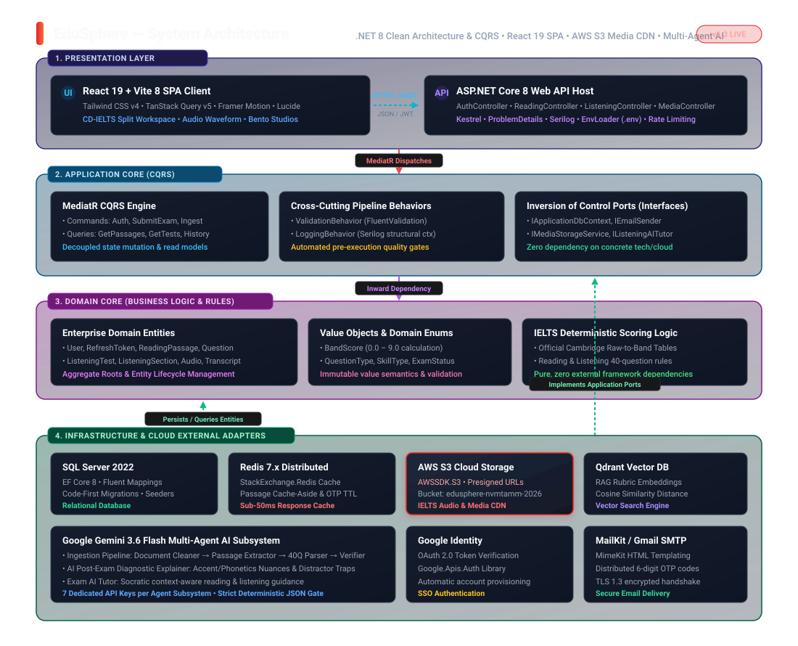
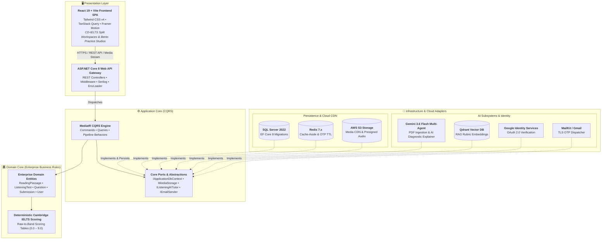

# 🎓 EduSphere - Enterprise AI-Powered IELTS Preparation Platform

<div align="center">

[](https://dotnet.microsoft.com/)
[](https://react.dev/)
[](https://www.typescriptlang.org/)
[](https://vitejs.dev/)
[](https://tailwindcss.com/)
[](https://aws.amazon.com/s3/)
[](https://www.docker.com/)
[](https://github.com/nvmtamm/EduSphereIELTS)
[](LICENSE)

<p align="center">
  <b>An enterprise-grade, high-concurrency IELTS preparation ecosystem combining Clean Architecture, CQRS, Multi-Agent AI document ingestion (Gemini 3.6 Flash), RAG-driven AI grading (Semantic Kernel + Qdrant), AWS S3 Cloud Media CDN, official Google OAuth 2.0, MailKit SMTP OTP delivery, and an authentic Cambridge Computer-Delivered IELTS pure design system.</b>
</p>

[Explore Roadmap](#-development-roadmap--sprint-status) • [System Architecture](#-system-architecture) • [Quick Start](#-getting-started) • [API Specification](#-api-surface--endpoint-matrix)

</div>

---

## 📌 Executive Overview

**EduSphere** is a modern, production-grade learning management and automated examination platform engineered specifically for the International English Language Testing System (**IELTS**). 

The platform bridges deterministic examination scoring (Reading & Listening) with non-deterministic, generative AI assessment (Writing & Speaking) governed by official IELTS public band descriptors. Built from the ground up on **.NET 8 Clean Architecture** and **React 19**, it guarantees sub-50ms cache response times, zero credential leakage via a unified root environment loader, seamless real-time student synchronization, high-throughput audio streaming via **AWS S3 Media CDN**, and an autonomous **Multi-Agent Ingestion Pipeline** converting raw PDFs into authentic Computer-Delivered IELTS practice tests.

---

## 🏛 System Architecture

EduSphere is architected following the **Clean Architecture** paradigm and **CQRS (Command Query Responsibility Segregation)** pattern, enforcing unidirectional inward dependency rules and isolating core business domain logic from infrastructure and external cloud service details.

### Clean Architecture Blueprint

<div align="center">



</div>

<details>
<summary><b>🔍 Click to view interactive Mermaid Architecture Flowchart</b></summary>



</details>

### Architectural Layer Responsibilities

| Layer | Responsibility | Key Technologies |
| :--- | :--- | :--- |
| **Presentation (Client)** | Single-page application rendering authentic Cambridge CD-IELTS workspaces, interactive audio waveform player, real-time transcript synchronization, and student dashboards. | React 19, TypeScript, Vite 8, Tailwind CSS v4, TanStack Query v5, Framer Motion |
| **Presentation (API)** | High-throughput HTTP gateway, route controllers, JWT/OAuth authentication middleware, rate limiting, and centralized ProblemDetails error handling. | ASP.NET Core 8 Web API, Kestrel, Serilog, EnvLoader |
| **Application Core** | Orchestrates business use cases using CQRS. Contains Commands, Queries, MediatR pipeline behaviors (validation, logging, performance), and port interfaces. Has zero external technology dependencies. | MediatR, FluentValidation |
| **Domain Core** | The heart of Clean Architecture. Contains enterprise entities, value objects, domain enums, and deterministic Cambridge IELTS band scoring rules. Zero external dependencies. | C# 12 Pure Domain Logic |
| **Infrastructure** | Concrete implementations of application ports: relational database mapping, distributed caching, S3 presigned URL generation, multi-agent AI ingestion, and vector search. | EF Core 8, SQL Server 2022, StackExchange.Redis, AWSSDK.S3, Gemini 3.6 Flash, Qdrant, MailKit |

---

## ⚡ Key Architectural Highlights

- **Clean Architecture & Strict Inward Dependency:** Unidirectional inward dependency flow (`API` $\rightarrow$ `Infrastructure` $\rightarrow$ `Application` $\rightarrow$ `Domain`). Domain and Application remain 100% framework-agnostic.
- **CQRS Pattern via MediatR:** Decouples state-modifying operations (Commands) from read-only data retrievals (Queries) for high scalability.
- **AWS S3 Cloud Media CDN:** Direct client-to-S3 presigned PUT URL pattern for large audio uploads; high-throughput streaming for authentic Cambridge listening audio recordings.
- **Autonomous Multi-Agent AI Ingestion Pipeline (Gemini 3.6 Flash):** 4-stage pipeline that cleans raw PDFs, removes watermarks, extracts reading passages, and structures all 40 questions across standard IELTS types.
- **AI Post-Exam Diagnostic Explainer:** Deep diagnostic review engine analyzing phonetics/accents, signposting cues, and distractor traps per question.
- **Official Cambridge CD-IELTS Workspaces:**
  - **Reading:** Split-screen resizable layout with 3-part partition navigation, interactive text highlighter, paragraph letter badges (`A`–`J`), and live question palette.
  - **Listening:** Audio waveform player with single-play constraint, real-time synchronized transcript with question anchor navigation, bottom CBT dock, and interactive Dictation Studio.
- **Single Root `.env` Architecture:** Unified environment management across Docker, ASP.NET Core (`EnvLoader.cs`), and Vite (`envDir: '../'`). Zero hardcoded secrets in code or git.
- **Hybrid Multi-Factor Authentication:**
  - Standard JWT with cryptographic Refresh Token rotation.
  - Native Google OAuth 2.0 with `@react-oauth/google` and server-side verification via `Google.Apis.Auth`.
  - Self-service password recovery with distributed 6-digit OTP caching in Redis (15-min TTL) and HTML email dispatch via `MailKit`.
- **Cache-Aside Strategy:** Redis distributed caching (`IDistributedCache`) for catalogs, reading passages, and short-lived OTP verification sessions.
- **100% English Cambridge Academic Standard:** All frontend UI elements, badges, navigation, and modal forms strictly comply with official Cambridge Academic English standards.

---

## 🛠 Technology Matrix

### Backend Engineering
| Layer / Component | Technology | Description |
| :--- | :--- | :--- |
| **Framework** | .NET 8 (C# 12) | ASP.NET Core Web API with Kestrel high-throughput engine |
| **Architecture** | Clean Architecture + CQRS | MediatR pipeline behaviors (Logging, Validation, Performance) |
| **ORM & Database** | EF Core 8 + SQL Server 2022 | Code-First migrations, Fluent API relationships, soft deletes |
| **Media Cloud Storage** | AWS S3 (`AWSSDK.S3`) | Presigned PUT URLs, public audio streaming, Cambridge audio CDN |
| **AI Ingestion & Tutor** | Gemini 3.6 Flash (32k Tokens) | Multi-Agent PDF digitization pipeline and AI Diagnostic Explainer |
| **Caching Layer** | Redis 7 + StackExchange.Redis | Cache-aside for static tests and temporary OTP verification tokens |
| **Security & Auth** | JWT + BCrypt + Google.Apis.Auth | Secure password hashing, token rotation, and Google OAuth2 verification |
| **Email Service** | MailKit + MimeKit | Robust SMTP client with TLS handshake compatibility for macOS/Linux |
| **Testing** | xUnit + FluentAssertions + Moq | **88/88 automated unit test suites** with in-memory DB isolation |

### Frontend Engineering
| Component | Technology | Description |
| :--- | :--- | :--- |
| **Framework** | React 19 + TypeScript (Strict) | Modern component architecture with type-safe state contracts |
| **Build Tool** | Vite 8 + Rolldown Engine | Sub-second HMR and optimized production bundling |
| **Styling** | Tailwind CSS v4 + Lucide Icons | Official IELTS Pure Tri-tone (`#DC2626` Red, Pure White, `#0A0A0A` Black) |
| **Motion & FX** | `framer-motion` + `canvas-confetti` | Staggered studio entrances and band score celebration bursts |
| **Exam Workspaces** | `react-resizable-panels` | Split-screen with drag divider, CBT navigation dock, and question palette |
| **State & Server Sync** | TanStack Query v5 (React Query) | Declarative caching, background prefetching, and query invalidation |
| **Routing** | React Router v7 | Protected route wrappers, dynamic parameter matching, nested layouts |
| **OAuth Integration** | `@react-oauth/google` v0.13.5 | Google Identity Services OAuth 2.0 Account Chooser modal |

---

## 📁 Repository Structure

```
EduSphere/
├── .env.example                         # Comprehensive environment variable template
├── .gitignore                           # Git ignore rules for OS, build, and environment secrets
├── AGENTS.md                            # Centralized repository guidelines & standards
├── docker-compose.yml                   # Multi-container orchestration (SQL, Redis, Qdrant)
├── README.md                            # Primary project documentation
├── docs/
│   ├── assets/                          # Architectural graphics (architecture.svg)
│   └── SRS.md                           # Software Requirements Specification
├── backend/
│   ├── EduSphere.sln                   # .NET Solution file
│   ├── src/
│   │   ├── EduSphere.Domain/           # Enterprise entities (User, Passage, ListeningTest, Question, Submission)
│   │   ├── EduSphere.Application/      # CQRS Commands, Queries, Interfaces, Behaviors
│   │   │   ├── Common/                 # Result<T>, Error, Interfaces (IApplicationDbContext, IMediaStorageService)
│   │   │   └── Features/               # Auth, Reading, Listening (Ingestion, Submissions, Roadmaps, AI Tutor)
│   │   ├── EduSphere.Infrastructure/   # EF Core DbContext, Redis, AWS S3 Service, Multi-Agent Ingestion, Google Auth
│   │   ├── EduSphere.API/              # Controllers (Auth, Reading, Listening, Media), Program.cs, EnvLoader
│   │   └── EduSphere.Shared/           # Shared models and data transfer contracts
│   └── tests/
│       ├── EduSphere.UnitTests/        # 88 unit test suites for Domain, Handlers, Ingestion, and Listening
│       └── EduSphere.IntegrationTests/ # End-to-end API integration tests
├── frontend/
│   ├── vite.config.ts                  # Vite configuration with envDir pointing to root .env
│   ├── package.json                    # Frontend dependencies and npm scripts
│   ├── index.html                      # HTML5 entry with Google Identity Services script
│   └── src/
│       ├── app/                        # Router, App entry, GoogleOAuthProvider & TanStack Providers
│       ├── features/                   # Modular feature domains
│       │   ├── auth/                   # Login, Register, Forgot/Reset Password, ProfileModal, GoogleLogin
│       │   ├── dashboard/              # Dashboard metrics, practice history, skill radar
│       │   ├── reading/                # CD-IELTS workspace, PassagePanel, QuestionPalette, Renderers, Upload
│       │   └── listening/              # Bento studio, CD-IELTS listening exam, AudioPlayer, Dictation, AI Explainer
│       └── shared/                     # Contexts (AuthContext, ThemeContext), Header, Sidebar, Axios API
└── plan/                               # Complete engineering roadmaps & architectural sprint specs
```

---

## 🚦 Development Roadmap & Sprint Status

| Sprint | Module | Focus Area | Status |
| :---: | :--- | :--- | :---: |
| **Sprint 0** | **Foundations** | Clean Architecture setup, EF Core 8, Docker compose, Git workflow | ✅ **Completed** |
| **Sprint 1** | **Auth & UI Layout** | JWT Auth, Google OAuth2, Gmail OTP Reset, Profile Modal, Responsive Sidebar | ✅ **Completed** |
| **Sprint 2** | **Reading Engine** | CD-IELTS split workspace, Multi-Agent AI PDF Ingestion (Gemini 3.6 Flash), 40Q grading, Band Roadmap | ✅ **Completed** |
| **Sprint 3** | **Listening Engine** | Bento studio, CBT exam workspace, AWS S3 audio CDN, real-time transcript sync, dictation mode, AI diagnostic explainer | ✅ **Completed** |
| **Sprint 4** | **Writing AI Engine** | RAG-based Task 1 & Task 2 grading, lexical & grammar replacement analysis | ⏳ **Upcoming** |
| **Sprint 5** | **Speaking & SM-2** | Web Audio API recorder, pronunciation metrics, SuperMemo SM-2 flashcards | ⏳ **Upcoming** |
| **Sprint 6** | **AI Tutor & Dashboard**| Comprehensive mock test engine, radar skill progression, personalized study path | ⏳ **Upcoming** |
| **Sprint 7** | **DevOps & QA** | E2E Playwright tests, load testing, CI/CD GitHub Actions, Azure containerization | ⏳ **Upcoming** |

---

## 🚀 Getting Started

### Prerequisites
- [.NET 8.0 SDK](https://dotnet.microsoft.com/download/dotnet/8.0)
- [Node.js (v20+ LTS)](https://nodejs.org/) & `npm`
- [Docker Engine & Docker Compose](https://www.docker.com/)

---

### Step 1: Clone Repository & Configure `.env`

```bash
git clone https://github.com/nvmtamm/EduSphereIELTS.git
cd EduSphereIELTS

# Copy example environment configuration
cp .env.example .env
```

Open `.env` and configure your credentials:
```env
# 1. Database & Docker
SA_PASSWORD=EduSphere@2026StrongPass!

# 2. JWT Security
JWT_SECRET=EduSphereSuperSecureSecretKeyForSigningJwtTokens2026!
JWT_ISSUER=https://api.edusphere.io
JWT_AUDIENCE=https://edusphere.io

# 3. Google OAuth 2.0 (Backend & Frontend)
GOOGLE_CLIENT_ID=your-google-client-id.apps.googleusercontent.com
VITE_GOOGLE_CLIENT_ID=your-google-client-id.apps.googleusercontent.com

# 4. Gmail SMTP Service (Password Reset OTP)
SMTP_SERVER=smtp.gmail.com
SMTP_PORT=587
SMTP_SENDER_NAME=EduSphere IELTS Official
SMTP_SENDER_EMAIL=your-email@gmail.com
SMTP_USERNAME=your-email@gmail.com
SMTP_PASSWORD=your-gmail-16-char-app-password
SMTP_ENABLE=true

# 5. Gemini AI Multi-Agent Ingestion Keys
GEMINI_API_KEY=your-gemini-api-key
GEMINI_API_KEY_INGESTION=your-gemini-api-key
GEMINI_CHAT_MODEL=gemini-1.5-flash

# 6. AWS S3 Media & Audio Cloud Storage (Listening Engine)
AWS_REGION=ap-southeast-1
AWS_BUCKET_NAME=edusphere-nvmtamm-2026
AWS_ACCESS_KEY_ID=your-aws-access-key-id
AWS_SECRET_ACCESS_KEY=your-aws-secret-access-key

# 7. Frontend API Endpoint
VITE_API_BASE_URL=http://localhost:5005/api
```

---

### Step 2: Launch Supporting Infrastructure (Docker)

```bash
docker compose up -d
```
*Spins up SQL Server (Port 1433), Redis (Port 6379), and Qdrant Vector Database (Port 6333).*

---

### Step 3: Run Backend API

```bash
cd backend/src/EduSphere.API
dotnet run
```
*Backend initializes, applies EF Core migrations, seeds sample IELTS reading & listening tests, and listens on `http://localhost:5005` (Swagger at `http://localhost:5005/swagger`).*

---

### Step 4: Run Frontend Client

```bash
# In a new terminal window
cd frontend
npm install
npm run dev
```
*Frontend application launches instantly at `http://localhost:5173`.*

---

## 🧪 Testing & Verification

The solution enforces automated testing across use cases, command validators, domain entities, multi-agent AI pipelines, and listening scoring engines:

```bash
# Execute all 88 automated unit test suites
dotnet test backend/EduSphere.sln

# Build and validate frontend TypeScript bundle
cd frontend && npm run build
```

---

## 📡 API Surface & Endpoint Matrix

### 🔐 Authentication & User Profile (`/api/auth`)
| Method | Endpoint | Authorization | Description |
| :--- | :--- | :---: | :--- |
| `POST` | `/api/auth/register` | Public | Register new student or instructor account |
| `POST` | `/api/auth/login` | Public | Authenticate via email/password $\rightarrow$ JWT + Refresh Token |
| `POST` | `/api/auth/google` | Public | Authenticate via Google ID Token $\rightarrow$ JWT + Refresh Token |
| `POST` | `/api/auth/forgot-password` | Public | Send 6-digit OTP code to registered Gmail address |
| `POST` | `/api/auth/reset-password` | Public | Verify OTP code and reset account password |
| `POST` | `/api/auth/refresh-token` | Public | Rotate refresh token and obtain new JWT access token |
| `GET` | `/api/auth/me` | `Bearer JWT` | Retrieve current authenticated user profile |
| `PUT` | `/api/auth/profile` | `Bearer JWT` | Update user full name and Target Band Score (4.0–9.0) |
| `POST` | `/api/auth/change-password` | `Bearer JWT` | Change account password using current password verification |

### 📖 Reading Practice & AI Ingestion (`/api/reading`)
| Method | Endpoint | Authorization | Description |
| :--- | :--- | :---: | :--- |
| `GET` | `/api/reading/passages` | Public / Cached | Get paginated IELTS reading passages with filter by topic/difficulty/source |
| `GET` | `/api/reading/passages/{id}` | Public | Get full passage text with all associated question groups & active sections |
| `POST` | `/api/reading/ingest-document` | `Bearer JWT` | Multi-Agent AI ingestion pipeline converting PDF/text to 40Q IELTS test |
| `POST` | `/api/reading/submissions` | `Bearer JWT` | Submit answers $\rightarrow$ deterministic auto-grading $\rightarrow$ Band Score |
| `GET` | `/api/reading/submissions/{id}`| `Bearer JWT` | Review submission with detailed explanations per question |
| `GET` | `/api/reading/roadmaps` | Public | Retrieve 6 Band Roadmaps (Pre-IELTS to Band 8.5+) with progress tracking |
| `GET` | `/api/reading/vocabularies` | Public | Retrieve curated Academic vocabulary by target Band Tier |
| `POST` | `/api/reading/ai-tutor` | Public | Interactive RAG AI Tutor assisting students with passage reading |

### 🎧 Listening Practice & AI Diagnostic (`/api/listening`)
| Method | Endpoint | Authorization | Description |
| :--- | :--- | :---: | :--- |
| `GET` | `/api/listening/tests` | Public | Get paginated IELTS listening tests with filter by section, accent, topic, difficulty |
| `GET` | `/api/listening/tests/{id}` | Public | Get full listening test details, audio streaming URL, questions, and synced transcript |
| `POST` | `/api/listening/tests/{id}/submit` | `Bearer JWT` | Submit completed exam answers $\rightarrow$ automated Cambridge Band score calculation |
| `GET` | `/api/listening/submissions/{id}` | `Bearer JWT` | Review submitted listening test attempt with detailed per-question answers |
| `GET` | `/api/listening/history` | `Bearer JWT` | Retrieve user listening practice history, band scores, and attempt timestamps |
| `POST` | `/api/listening/explain` | `Bearer JWT` | AI Diagnostic Explainer analyzing phonetics/accent, signposts, and distractor traps |

### ☁️ Cloud Media & Audio Storage (`/api/media`)
| Method | Endpoint | Authorization | Description |
| :--- | :--- | :---: | :--- |
| `POST` | `/api/media/presigned-url` | `Bearer JWT` | Generate presigned PUT URL for direct client-to-S3 audio/image uploads |
| `GET` | `/api/media/url/{key}` | `Bearer JWT` | Retrieve public streaming URL for an uploaded media key |
| `DELETE` | `/api/media/{key}` | `Bearer JWT (Admin)`| Delete a media asset from AWS S3 storage |

---

## 🛡 Security & Best Practices

- **Zero Secret Exposure:** Credentials, JWT secret keys, and SMTP app passwords exist solely in `.env` (ignored by Git) and are loaded at runtime.
- **Strict CORS Policy:** Restricted to authorized client origins (`http://localhost:5173`, `http://localhost:3000`).
- **Input Sanitization & Validation:** All incoming CQRS commands pass through `FluentValidation` pipeline validators before execution.
- **Password Security:** Salted BCrypt password hashing with high work factor.
- **Media Pre-Signed Security:** AWS S3 uploads use short-lived presigned URLs with strict Content-Type and size boundaries.

---

## 📄 License

This project is open-source software licensed under the **[MIT License](LICENSE)**.

---

<div align="center">
  <sub>Crafted with passion for scalable software engineering and AI-driven education.</sub>
</div>
