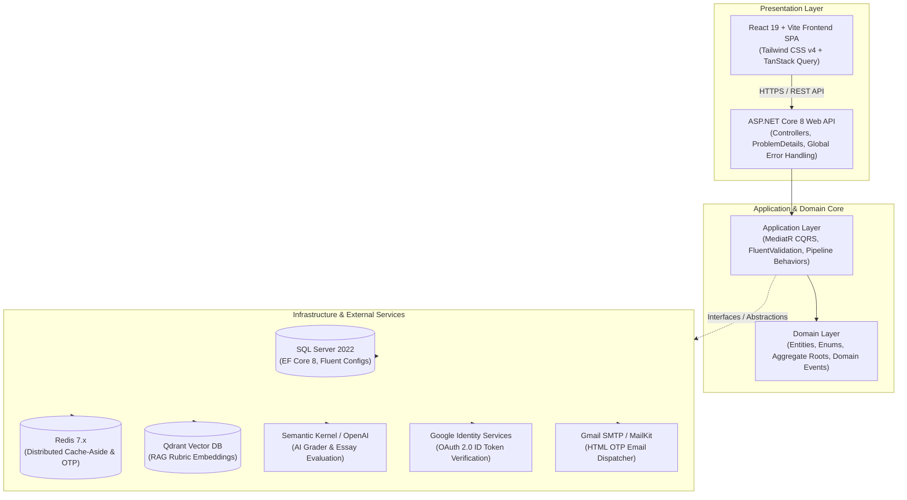

# 🎓 EduSphere - Enterprise AI-Powered IELTS Preparation Platform

<div align="center">

[](https://dotnet.microsoft.com/)
[](https://react.dev/)
[](https://www.typescriptlang.org/)
[](https://vitejs.dev/)
[](https://tailwindcss.com/)
[](https://www.docker.com/)
[](https://github.com/nvmtamm/EduSphereIELTS)
[](LICENSE)

<p align="center">
  <b>An enterprise-grade, high-concurrency IELTS preparation ecosystem combining Clean Architecture, CQRS, RAG-driven AI grading (Semantic Kernel + Qdrant), official Google OAuth 2.0, MailKit SMTP OTP delivery, and an official Cambridge IELTS Pure Tri-tone design system.</b>
</p>

[Explore Roadmap](#-development-roadmap--sprint-status) • [System Architecture](#-architectural-design) • [Quick Start](#-getting-started) • [API Specification](#-api-surface--endpoint-matrix)

</div>

---

## 📌 Executive Overview

**EduSphere** is a modern, production-grade learning management and automated examination platform engineered specifically for the International English Language Testing System (**IELTS**). 

The platform bridges deterministic examination scoring (Reading & Listening) with non-deterministic, generative AI assessment (Writing & Speaking) governed by official IELTS public band descriptors. Built from the ground up on **.NET 8 Clean Architecture** and **React 19**, it guarantees sub-50ms cache response times, zero credential leakage via a unified root environment loader, and seamless real-time student synchronization.

---

## 🏛 System Architecture

EduSphere is architected following the **Clean Architecture** paradigm and **CQRS (Command Query Responsibility Segregation)** pattern, enforcing unidirectional inward dependency rules and isolating core business domain logic from infrastructure details.



---

## ⚡ Key Architectural Highlights

- **Clean Architecture & Strict Separation of Concerns:** Inward-only dependency flow (`API` $\rightarrow$ `Infrastructure` $\rightarrow$ `Application` $\rightarrow$ `Domain`).
- **CQRS Pattern via MediatR:** Decouples state-modifying operations (Commands) from read-only data retrievals (Queries).
- **Single Root `.env` Architecture:** Unified environment management across Docker, ASP.NET Core (`EnvLoader.cs`), and Vite (`envDir: '../'`). Zero hardcoded secrets in `appsettings.json`.
- **Hybrid Multi-Factor Authentication:**
  - Standard JWT with asymmetric-ready HMAC-SHA256 signature and cryptographic Refresh Token rotation.
  - Native Google OAuth 2.0 popup with `@react-oauth/google` and server-side token validation via `Google.Apis.Auth`.
  - Self-service password recovery with distributed 6-digit OTP caching (15-min TTL) and HTML email dispatch via `MailKit`.
- **Cache-Aside Strategy:** Integrated Redis distributed caching (`IDistributedCache`) for catalogs, reading passages, and short-lived OTP sessions.
- **RAG-Powered AI Evaluation:** Microsoft Semantic Kernel orchestrating vector searches in Qdrant against official IELTS rubrics for objective Writing and Speaking scoring.
- **Spaced Repetition Engine:** Implements the **SuperMemo SM-2** algorithmic interval scheduler for vocabulary retention.

---

## 🛠 Technology Matrix

### Backend Engineering
| Layer / Component | Technology | Description |
| :--- | :--- | :--- |
| **Framework** | .NET 8 (C# 12) | ASP.NET Core Web API with Kestrel high-throughput engine |
| **Architecture** | Clean Architecture + CQRS | MediatR pipeline behaviors (Logging, Validation, Performance) |
| **ORM & Database** | EF Core 8 + SQL Server 2022 | Code-First migrations, Fluent API relationships, soft deletes |
| **Caching Layer** | Redis 7 + StackExchange.Redis | Cache-aside for static tests and temporary OTP verification tokens |
| **Security & Auth** | JWT + BCrypt + Google.Apis.Auth | Secure password hashing, token rotation, and Google OAuth2 verification |
| **Email Service** | MailKit + MimeKit | Robust SMTP client with TLS handshake compatibility for macOS/Linux |
| **Testing** | xUnit + FluentAssertions + Moq | 56/56 automated unit test suites with in-memory DB isolation |

### Frontend Engineering
| Component | Technology | Description |
| :--- | :--- | :--- |
| **Framework** | React 19 + TypeScript (Strict) | Modern component architecture with type-safe state contracts |
| **Build Tool** | Vite 8 + Rolldown Engine | Sub-second HMR and optimized production bundling |
| **Styling** | Tailwind CSS v4 + Lucide Icons | Official IELTS Pure Tri-tone (`#E00034` Red, Pure White, `#0A0A0A` Black) |
| **State & Server Sync** | TanStack Query v5 (React Query) | Declarative caching, background prefetching, and query invalidation |
| **Routing** | React Router v7 | Protected route wrappers, dynamic parameter matching, nested layouts |
| **OAuth Integration** | `@react-oauth/google` v0.13.5 | Google Identity Services OAuth 2.0 Account Chooser modal |

---

## 📁 Repository Structure

```
EduSphere/
├── .env.example                         # Comprehensive environment variable template
├── .gitignore                           # Git ignore rules for OS, build, and environment secrets
├── docker-compose.yml                   # Multi-container orchestration (SQL, Redis, Qdrant)
├── README.md                            # Primary project documentation
├── backend/
│   ├── EduSphere.sln                   # .NET Solution file
│   ├── src/
│   │   ├── EduSphere.Domain/           # Enterprise entities (User, Passage, Question, Submission)
│   │   ├── EduSphere.Application/      # CQRS Commands, Queries, Interfaces, Behaviors
│   │   │   ├── Common/                 # Result<T>, Error, Interfaces (IApplicationDbContext, IEmailSender)
│   │   │   └── Features/Auth/          # Register, Login, Google, ForgotPassword, ResetPassword, Profile
│   │   ├── EduSphere.Infrastructure/   # EF Core DbContext, Redis Cache, GoogleAuthService, SmtpEmailSender
│   │   ├── EduSphere.API/              # Controllers, Program.cs, Extensions (EnvLoader), Middleware
│   │   └── EduSphere.Shared/           # Shared models and data transfer contracts
│   └── tests/
│       ├── EduSphere.UnitTests/        # 56 unit test suites for Domain and CQRS Handlers
│       └── EduSphere.IntegrationTests/ # End-to-end API integration tests
├── frontend/
│   ├── vite.config.ts                  # Vite configuration with envDir pointing to root .env
│   ├── package.json                    # Frontend dependencies and npm scripts
│   ├── index.html                      # HTML5 entry with Google Identity Services script
│   └── src/
│       ├── app/                        # Router, App entry, GoogleOAuthProvider & TanStack Providers
│       ├── features/                   # Modular feature domains
│       │   ├── auth/                   # Login, Register, Forgot/Reset Password, ProfileModal, GoogleLogin
│       │   └── reading/                # Exam workspace, split-screen viewer, timer, question forms
│       └── shared/                     # Contexts (AuthContext, ThemeContext), Header, Sidebar, Axios API
└── plan/                               # Complete 7-Sprint engineering roadmap & architectural specs
```

---

## 🚦 Development Roadmap & Sprint Status

| Sprint | Module | Focus Area | Status |
| :---: | :--- | :--- | :---: |
| **Sprint 0** | **Foundations** | Clean Architecture setup, EF Core 8, Docker compose, Git workflow | ✅ **Completed** |
| **Sprint 1** | **Auth & UI Layout** | JWT Auth, Google OAuth2, Gmail OTP Reset, Profile Modal, Responsive Sidebar | ✅ **Completed** |
| **Sprint 2** | **Reading Engine** | Split-screen passage viewer, 5 question types, auto-grading, Cambridge Band table | 🟡 **In Progress** |
| **Sprint 3** | **Listening Engine** | Audio player with single-play constraint, real-time waveform, transcript sync | ⏳ **Upcoming** |
| **Sprint 4** | **Writing AI Engine** | RAG-based Task 1 & Task 2 grading, lexical & grammar replacement analysis | ⏳ **Upcoming** |
| **Sprint 5** | **Speaking & SM-2** | Web Audio API recorder, pronunciation metrics, SuperMemo SM-2 flashcards | ⏳ **Upcoming** |
| **Sprint 6** | **AI Tutor & Dashboard**| Comprehensive mock test engine, radar skill progression, personalized study path | ⏳ **Upcoming** |
| **Sprint 7** | **DevOps & QA** | E2E Playwright tests, load testing, CI/CD GitHub Actions, Azure containerization | ⏳ **Upcoming** |

---

## 🚀 Getting Started

### Prerequisites
- [.NET 8.0 SDK](https://dotnet.microsoft.com/download/dotnet/8.0)
- [Node.js (v20+ LTS)](https://nodejs.org/) & `npm`
- [Docker Engine & Docker Compose](https://www.docker.com/)

---

### Step 1: Clone Repository & Configure `.env`

```bash
git clone https://github.com/nvmtamm/EduSphereIELTS.git
cd EduSphereIELTS

# Copy example environment configuration
cp .env.example .env
```

Open `.env` and configure your credentials:
```env
# 1. Database & Docker
SA_PASSWORD=EduSphere@2026StrongPass!

# 2. JWT Security
JWT_SECRET=EduSphereSuperSecureSecretKeyForSigningJwtTokens2026!
JWT_ISSUER=https://api.edusphere.io
JWT_AUDIENCE=https://edusphere.io

# 3. Google OAuth 2.0 (Backend & Frontend)
GOOGLE_CLIENT_ID=your-google-client-id.apps.googleusercontent.com
VITE_GOOGLE_CLIENT_ID=your-google-client-id.apps.googleusercontent.com

# 4. Gmail SMTP Service (Password Reset OTP)
SMTP_SERVER=smtp.gmail.com
SMTP_PORT=587
SMTP_SENDER_NAME=EduSphere IELTS Official
SMTP_SENDER_EMAIL=your-email@gmail.com
SMTP_USERNAME=your-email@gmail.com
SMTP_PASSWORD=your-gmail-16-char-app-password
SMTP_ENABLE=true

# 5. Frontend API Endpoint
VITE_API_BASE_URL=http://localhost:5000/api
```

---

### Step 2: Launch Supporting Infrastructure (Docker)

```bash
docker compose up -d
```
*Spins up SQL Server (Port 1433), Redis (Port 6379), and Qdrant Vector Database (Port 6333).*

---

### Step 3: Run Backend API

```bash
cd backend/src/EduSphere.API
dotnet run
```
*Backend initializes, applies EF Core migrations, seeds sample IELTS passages, and listens on `http://localhost:5000` (Swagger at `http://localhost:5000/swagger`).*

---

### Step 4: Run Frontend Client

```bash
# In a new terminal window
cd frontend
npm install
npm run dev
```
*Frontend application launches instantly at `http://localhost:5173`.*

---

## 🧪 Testing & Verification

The solution enforces automated testing across use cases, command validators, and domain entities:

```bash
# Execute all 56 unit test suites
dotnet test backend/EduSphere.sln

# Build and validate frontend TypeScript bundle
cd frontend && npm run build
```

---

## 📡 API Surface & Endpoint Matrix

### 🔐 Authentication & User Profile (`/api/auth`)
| Method | Endpoint | Authorization | Description |
| :--- | :--- | :---: | :--- |
| `POST` | `/api/auth/register` | Public | Register new student or instructor account |
| `POST` | `/api/auth/login` | Public | Authenticate via email/password $\rightarrow$ JWT + Refresh Token |
| `POST` | `/api/auth/google` | Public | Authenticate via Google ID Token $\rightarrow$ JWT + Refresh Token |
| `POST` | `/api/auth/forgot-password` | Public | Send 6-digit OTP code to registered Gmail address |
| `POST` | `/api/auth/reset-password` | Public | Verify OTP code and reset account password |
| `POST` | `/api/auth/refresh-token` | Public | Rotate refresh token and obtain new JWT access token |
| `GET` | `/api/auth/me` | `Bearer JWT` | Retrieve current authenticated user profile |
| `PUT` | `/api/auth/profile` | `Bearer JWT` | Update user full name and Target Band Score (4.0–9.0) |
| `POST` | `/api/auth/change-password` | `Bearer JWT` | Change account password using current password verification |

### 📖 Reading Practice (`/api/reading`)
| Method | Endpoint | Authorization | Description |
| :--- | :--- | :---: | :--- |
| `GET` | `/api/reading/passages` | Public / Cached | Get paginated IELTS reading passages with filter by topic/difficulty |
| `GET` | `/api/reading/passages/{id}` | Public | Get full passage text with all associated question groups |
| `POST` | `/api/reading/submit` | `Bearer JWT` | Submit answers $\rightarrow$ deterministic auto-grading $\rightarrow$ Band Score |

---

## 🛡 Security & Best Practices

- **Zero Secret Exposure:** Credentials, JWT secret keys, and SMTP app passwords exist solely in `.env` (ignored by Git) and are loaded at runtime.
- **Strict CORS Policy:** Restricted to authorized client origins (`http://localhost:5173`, `http://localhost:3000`).
- **Input Sanitization & Validation:** All incoming CQRS commands pass through `FluentValidation` pipeline validators before execution.
- **Password Security:** Salted BCrypt password hashing with high work factor.

---

## 📄 License

This project is open-source software licensed under the **[MIT License](LICENSE)**.

---

<div align="center">
  <sub>Crafted with passion for scalable software engineering and AI-driven education.</sub>
</div>
