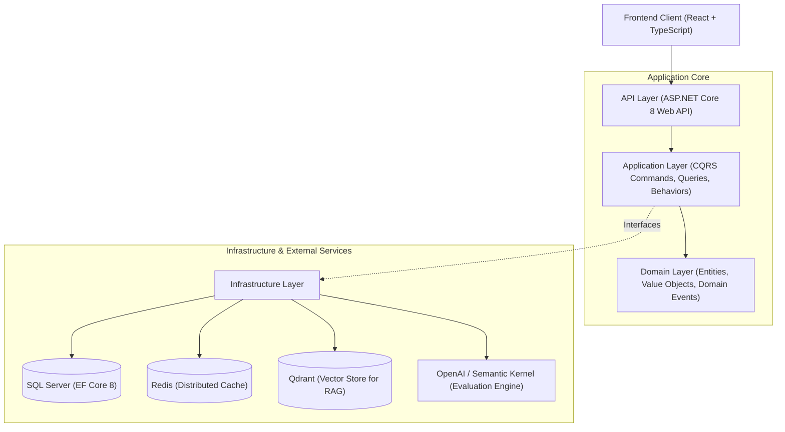

# EduSphere

An enterprise-grade, AI-powered IELTS preparation platform built with ASP.NET Core (.NET 8), React with TypeScript, Semantic Kernel, and distributed caching/vector infrastructure.

---

## Overview

**EduSphere** is a high-performance web platform designed for standardized English proficiency training (IELTS). The system provides full-cycle practice across all four test modules (Listening, Reading, Writing, Speaking), combining deterministic test evaluation with generative AI assessment based on official IELTS assessment criteria.

The application adheres to **Clean Architecture** and **CQRS** design patterns to maintain strict separation of concerns, high testability, and enterprise maintainability.

---

## Architectural Design

The backend is organized according to Clean Architecture principles, ensuring that core business rules remain decoupled from external frameworks, databases, and UI implementations.



### Key Architectural Patterns

- **Clean Architecture:** Strict inward dependency flow (`API` -> `Infrastructure` -> `Application` -> `Domain`).
- **CQRS (Command Query Responsibility Segregation):** Mediated by **MediatR** to decouple request handling into dedicated command and query pipelines.
- **Cross-Cutting Pipeline Behaviors:** Centralized validation (`FluentValidation`), structured logging (`Serilog`), and performance monitoring via MediatR pipeline decorators.
- **Cache-Aside Strategy:** Integrated with **Redis** (`IDistributedCache`) to minimize database contention on high-read endpoints (catalogs, vocabulary collections, static test passages).
- **Retrieval-Augmented Generation (RAG):** Powered by **Microsoft Semantic Kernel** and **Qdrant Vector Database**, retrieving official IELTS assessment rubrics to ensure grounded, consistent evaluation of subjective submissions (Writing and Speaking).
- **Spaced Repetition Algorithm:** Implements the **SuperMemo SM-2** algorithm for optimal vocabulary retention scheduling.

---

## Domain Capabilities

### 1. Automated Writing Evaluation (RAG Engine)
- **Task 1 & Task 2 Processing:** Evaluates essays against official IELTS band descriptors.
- **Criteria-Specific Scoring:** Computes individual band scores and actionable feedback across:
  - Task Achievement / Task Response
  - Coherence and Cohesion
  - Lexical Resource (with academic vocabulary replacement suggestions)
  - Grammatical Range and Accuracy (with syntactic corrections)
- **Deterministic Structured Output:** Schema-validated JSON response generation using OpenAI models.

### 2. Reading Examination Engine
- Split-screen document viewer with timed session controls.
- Dynamic question parsing supporting all standard IELTS question types:
  - True / False / Not Given & Yes / No / Not Given
  - Multiple Choice (Single & Multi-Select)
  - Matching Headings & Information
  - Sentence & Summary Completion
- Instant evaluation with answer key explanations and passage source highlighting.

### 3. Listening Examination Engine
- Multi-section audio streaming with playback controls and playback limits simulating exam constraints.
- Real-time response persistence with auto-grading and transcript cross-referencing.

### 4. Speaking Practice Engine
- Part 1, 2 (Cue Card), and Part 3 topic catalog with countdown and preparation timers.
- Speech analysis assessing lexical complexity, fluency metrics, and grammatical accuracy.

### 5. Vocabulary Acquisition (SM-2 Engine)
- Contextual flashcards linked directly to reading comprehension passages.
- Dynamic interval scheduling based on user recall quality metrics (0–5 grading scale).

### 6. Analytics & Progress Tracking
- Aggregate Overall Band Score calculation using official rounding logic (to the nearest half-band).
- Multi-dimensional skill balance visualization (Radar chart) and longitudinal score progression tracking.

---

## Technology Stack

### Backend
- **Framework:** .NET 8 (ASP.NET Core Web API)
- **Architecture & Patterns:** Clean Architecture, CQRS, MediatR, Domain-Driven Design (DDD) primitives
- **ORM & Data Access:** Entity Framework Core 8, Fluent API Configuration, EF Core Migrations
- **Database:** Microsoft SQL Server 2022
- **Caching:** Redis 7 (StackExchange.Redis, IDistributedCache)
- **AI Orchestration & Vector Search:** Microsoft Semantic Kernel, Qdrant Vector DB
- **Validation & Mapping:** FluentValidation, Mapster
- **Logging & Diagnostics:** Serilog, OpenTelemetry-ready Health Checks
- **Testing:** xUnit, Moq, Respawn, FluentAssertions

### Frontend
- **Framework:** React 18+ (Vite)
- **Language:** TypeScript (Strict Mode)
- **Styling & Components:** Tailwind CSS v4, shadcn/ui, Lucide Icons
- **State Management & Data Fetching:** TanStack Query v5 (React Query)
- **Data Visualization:** Recharts
- **Routing:** React Router v6

### DevOps & Infrastructure
- **Containerization:** Docker, Docker Compose (Multi-stage builds)
- **CI/CD:** GitHub Actions (Build, Lint, Unit & Integration Test Automation)
- **Hosting Targets:** Azure App Services / Container Apps, Dockerized VPS

---

## Project Structure

```
EduSphere/
├── .github/
│   └── workflows/              # CI/CD pipelines (build, test, containerize)
├── docs/                       # Architectural records, API specifications, ERD
├── plan/                       # Project milestones, development roadmap
├── src/
│   ├── EduSphere.Domain/       # Enterprise entities, value objects, domain events
│   ├── EduSphere.Application/  # Use cases, CQRS commands/queries, interfaces, behaviors
│   ├── EduSphere.Infrastructure/# EF Core context, Redis, Qdrant, Semantic Kernel services
│   ├── EduSphere.API/          # Controllers, Hubs, Middlewares, Dependency Injection
│   └── EduSphere.Shared/       # DTOs, constants, shared contracts
├── client/                     # React + TypeScript + Vite frontend application
│   ├── src/
│   │   ├── app/                # Application entry, router, global providers
│   │   ├── components/ui/      # shadcn/ui component primitives
│   │   ├── features/           # Modular feature domains (auth, reading, writing, etc.)
│   │   └── shared/             # Reusable hooks, API clients, utilities
├── tests/
│   ├── EduSphere.UnitTests/    # Application & Domain unit test suites
│   └── EduSphere.IntegrationTests/ # API & Database integration tests
└── docker-compose.yml          # Container orchestration for local development
```

---

## Getting Started

### Prerequisites

Ensure you have the following installed on your development machine:
- [.NET 8 SDK](https://dotnet.microsoft.com/download/dotnet/8.0)
- [Node.js (LTS v20+)](https://nodejs.org/) and npm
- [Docker Engine & Docker Compose](https://www.docker.com/)

### Quick Start (Docker Environment)

To spin up the entire infrastructure (SQL Server, Redis, Qdrant, Backend API, and Frontend Client):

1. **Clone the repository:**
   ```bash
   git clone https://github.com/nvmtamm/EduSphere.git
   cd EduSphere
   ```

2. **Configure Environment Variables:**
   Create an `.env` file in the root directory:
   ```env
   SA_PASSWORD=YourStrong@Password123!
   OPENAI_API_KEY=your-openai-api-key
   JWT_SECRET=your-secure-256-bit-secret-key-here
   ```

3. **Start all services:**
   ```bash
   docker compose up -d --build
   ```

4. **Access the services:**
   - Web Application: `http://localhost:3000`
   - REST API (Swagger Documentation): `http://localhost:5000/swagger`
   - Qdrant Dashboard: `http://localhost:6333/dashboard`

---

### Manual Development Setup

#### Backend Setup

```bash
# Navigate to the API project
cd src/EduSphere.API

# Restore dependencies
dotnet restore

# Apply EF Core migrations to database
dotnet ef database update --project ../EduSphere.Infrastructure

# Run the API
dotnet run
```

#### Frontend Setup

```bash
# Navigate to the frontend directory
cd client

# Install dependencies
npm install

# Start Vite development server
npm run dev
```

---

## Testing & Quality Assurance

The codebase maintains automated test coverage focusing on domain logic, request pipelines, and complex business workflows (such as SM-2 calculations and criteria aggregation).

```bash
# Run all unit and integration test suites
dotnet test --verbosity normal

# Run tests with code coverage collection
dotnet test /p:CollectCoverage=true /p:CoverletOutputFormat=opencover
```

---

## License

This project is licensed under the MIT License - see the [LICENSE](LICENSE) file for details.
