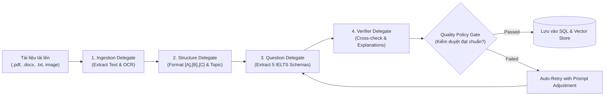

# 🤖 EduSphere Agentic AI Engine (Harness-Core Multi-Agent Architecture)

Chào mừng bạn đến với phân hệ **Agentic AI** của EduSphere! Thư mục này chịu trách nhiệm điều phối toàn bộ các **AI Agents**, **Pipeline Xử Lý Tài Liệu Tự Động (Document-to-Exam Ingestion)**, và **Trợ Lý RAG AI Tutor**.

---

## 🏛️ Kiến Trúc Khối Agentic (Harness Core Engine)

Áp dụng mô hình kiến trúc của **[Harness Core](https://github.com/harness/harness.git)**:

```
agentic/
├── harness/                           # Lõi điều phối Pipeline Orchestration Engine
│   ├── PipelineExecutionContext.cs   # Quản lý Context, State & Artifacts giữa các bước
│   ├── IAgentDelegate.cs             # Interface chuẩn hóa cho từng Agent Delegate
│   ├── PipelineHarnessEngine.cs      # Bộ điều phối DAG Step Graph & Retry Policy
│   └── QualityPolicyGate.cs          # Cổng kiểm định chất lượng đề thi & chống Hallucination
│
├── delegates/                         # 4 Agent Delegates chuyên trách
│   ├── DocumentIngestionDelegate.cs   # 1. Bóc tách text thô từ PDF, DOCX, TXT, OCR ảnh scan
│   ├── PassageStructuringDelegate.cs  # 2. Chia đoạn [A],[B],[C], gán Topic & CEFR Level
│   ├── QuestionParserDelegate.cs      # 3. Bóc tách 5 dạng câu hỏi IELTS & số thứ tự 1-13/40
│   └── VerificationExplainerDelegate.cs# 4. So khớp đáp án & sinh lời giải trích dẫn đoạn văn
│
├── rag/                               # Phân hệ RAG (Retrieval-Augmented Generation)
│   ├── ReadingAITutorEngine.cs        # Trợ lý Socratic Hint & Deep Review trong phòng thi
│   └── VectorStoreManager.cs          # Quản lý Embeddings bài đọc trên Qdrant / Memory Store
│
├── prompts/                           # Kho System Prompts tối ưu hóa cho từng Agent
│   ├── doc_ingestion_prompt.md        # Prompt bóc tách và làm sạch văn bản
│   ├── passage_structuring_prompt.md  # Prompt phân đoạn và ước tính độ khó
│   ├── question_parser_prompt.md      # Prompt nhận diện schema 5 dạng câu hỏi IELTS
│   ├── quality_verifier_prompt.md     # Prompt kiểm tra logic đáp án
│   └── ai_tutor_socratic_prompt.md    # Prompt gợi ý tư duy Socratic không lộ đáp án
│
└── workflows/                         # Định nghĩa quy trình xử lý theo loại tài liệu
    ├── standard_exam_ingestion.json   # Workflow xử lý đề thi chuẩn 3 Passages 40 câu
    └── quick_passage_ingestion.json   # Workflow xử lý 1 bài đọc ngắn mini test
```

---

## ⚡ 4 Giai Đoạn Thực Thi (4-Stage Pipeline):



---

## 🚀 Tính Năng Nổi Bật:

1. **Khả Năng Phục Hồi (Resilience & Retry Policies)**: Khi một LLM Agent gặp lỗi định dạng hoặc timeout, Harness Engine sẽ tự động kích hoạt thử lại với prompt được điều chỉnh mà không làm dừng cả pipeline.
2. **Quality Policy Gate (Cổng Kiểm Duyệt Chất Lượng)**: Đề thi sau khi qua 4 Agents phải vượt qua các quy tắc (đủ 13-14 câu hỏi, đáp án nằm chính xác trong bài đọc, không có câu hỏi trùng lặp) mới được lưu vào CSDL.
3. **Trợ Lý RAG AI Tutor Trong Phòng Thi**: Trò chuyện theo ngữ cảnh với 2 chế độ: *Socratic Hint Mode* (Gợi ý tư duy) và *Deep Review Mode* (Giải thích ngữ pháp chuyên sâu).
