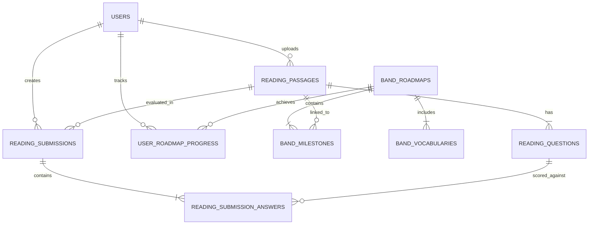

# 🗄️ EduSphere Database & IELTS Resource Repository

Thư mục này quản lý tập trung toàn bộ **Cơ sở dữ liệu**, **Kho tài liệu đề thi IELTS chuẩn hóa**, **Dữ liệu hạt giống (Seed Data)**, **Từ điển 6 phân khúc Band**, và **Scripts Khởi tạo & Vận hành**.

---

## 📁 Cấu Trúc Thư Mục `database/`:

```
database/
├── README.md                          # Tài liệu tổng quan kiến trúc CSDL & Seed Data
│
├── seeds/                             # Dữ liệu hạt giống khởi tạo hệ thống
│   ├── band_roadmaps/                 # 1. Dữ liệu 6 Lộ trình Band (Pre-IELTS -> Band 8.5+)
│   │   ├── pre_ielts_roadmap.json     # Lộ trình Pre-IELTS (Band 0 - 3.5)
│   │   ├── band_4_roadmap.json        # Lộ trình Band 4.0 - 4.5
│   │   ├── band_5_roadmap.json        # Lộ trình Band 5.0 - 5.5
│   │   ├── band_6_roadmap.json        # Lộ trình Band 6.0 - 6.5
│   │   ├── band_7_roadmap.json        # Lộ trình Band 7.0 - 7.5
│   │   └── band_8_roadmap.json        # Lộ trình Band 8.0 - 8.5+
│   │
│   ├── vocabularies/                  # 2. Kho Từ Vựng Chuyên Biệt Theo Từng Band
│   │   ├── pre_ielts_vocab.json       # 500 từ vựng căn bản A1-A2
│   │   ├── band_4_vocab.json          # 600 từ vựng B1 cơ bản
│   │   ├── band_5_vocab.json          # 800 từ vựng B1 Core + Bảng Paraphrase bẫy
│   │   ├── band_6_vocab.json          # 1,000 từ vựng B2 (AWL 1-5)
│   │   ├── band_7_vocab.json          # 1,200 từ vựng C1 (AWL 6-10) + Collocations
│   │   └── band_8_vocab.json          # 1,500 từ vựng C2 tinh hoa (Gốc Hy Lạp/La-tinh)
│   │
│   └── ielts_passages/                # 3. Kho Đề Thi IELTS Chuẩn Hóa
│       ├── cambridge_vol_18/          # Đề thi chính thức Cambridge IELTS 18
│       ├── cambridge_vol_19/          # Đề thi chính thức Cambridge IELTS 19
│       └── past_actual_tests/         # Đề thi thật IDP & British Council 2024-2026
│
├── migrations/                        # Các bản Migration SQL & EF Core
│   └── 20260825_Add_Reading_Sprint2.sql
│
├── scripts/                           # Script khởi tạo, backup & tối ưu hiệu năng
│   ├── init_db.sh                     # Script khởi tạo SQL Server trên Docker
│   ├── backup_db.sh                   # Script sao lưu CSDL tự động
│   └── create_vector_indexes.sql      # Tạo chỉ mục Full-text search & Vector Index
│
└── docs/                              # Tài liệu ERD & Đặc tả Quan hệ
    └── edusphere_erd_diagram.png
```

---

## 📊 Sơ Đồ Thực Thể Quan Hệ (ERD Entities Overview):



---

## 🚀 Cách Nạp Dữ Liệu Hạt Giống (Seeding):

Khi Backend khởi động (`dotnet run`), `ReadingDataSeeder.cs` sẽ tự động đọc các file JSON trong `database/seeds/` và nạp vào SQL Server & Redis Cache nếu cơ sở dữ liệu chưa có dữ liệu.
