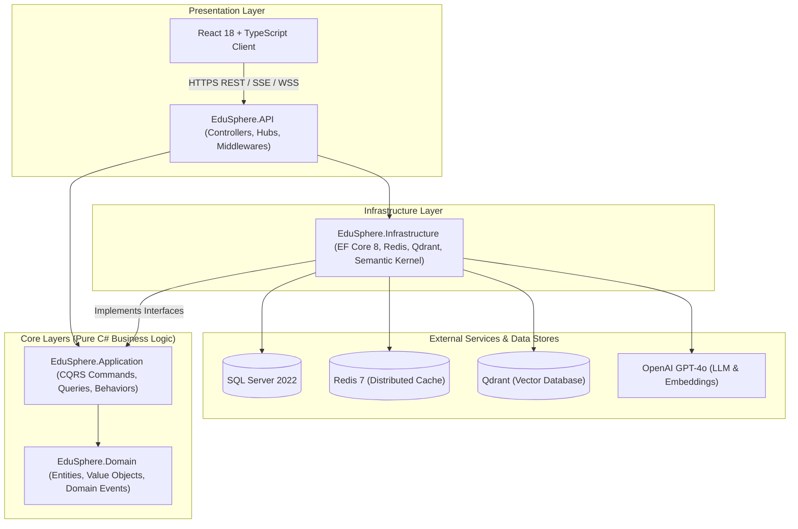
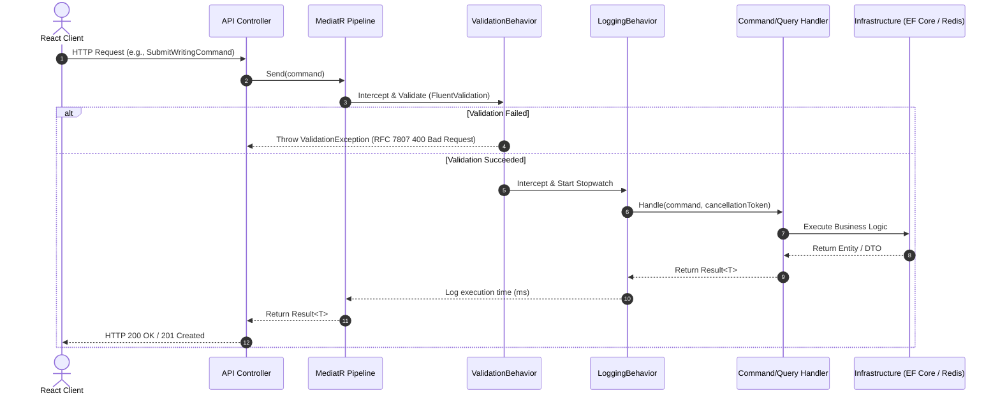
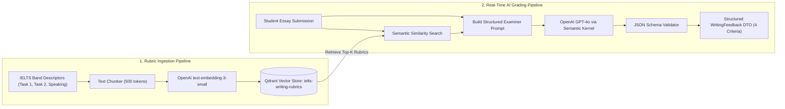
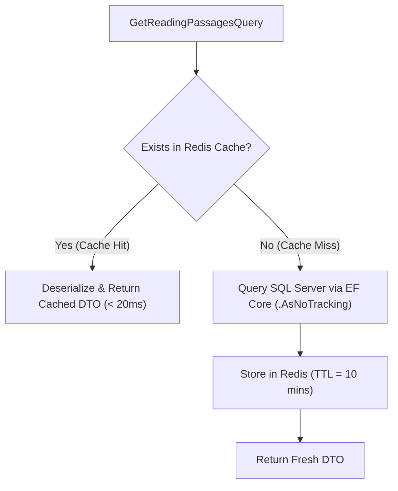

# EduSphere Architecture Documentation

- **System:** EduSphere — AI-Powered IELTS Preparation Platform
- **Style:** Clean Architecture (Onion Architecture), CQRS, Event-Driven Primitives, RAG Vector Search
- **Framework:** .NET 8 (ASP.NET Core Web API) & React 18 (TypeScript)

---

## 1. Architectural Style & Principles

EduSphere follows the **Clean Architecture** paradigm, establishing strict boundaries between enterprise domain logic and external infrastructure/delivery mechanisms.

### Core Dependency Rules
1. **Domain Layer:** Outermost independence; contains zero external NuGet dependencies. All business entities, value objects, and domain events live here.
2. **Application Layer:** Depends exclusively on Domain. Houses use-case orchestration (CQRS), domain interfaces, pipeline behaviors, and business validation.
3. **Infrastructure Layer:** Implements interfaces defined in the Application layer (e.g., `IApplicationDbContext`, `ICacheService`, `IVectorStoreService`, `IAiGradingService`).
4. **API Layer:** Entry point for HTTP requests and WebSocket connections; configures Dependency Injection, middleware, and authentication.

---

## 2. Key Design Patterns & Technical Workflows

### 2.1 CQRS (Command Query Responsibility Segregation) & MediatR Pipeline

All business operations are separated into **Commands** (state modifications) and **Queries** (read-only operations):

---

### 2.2 Retrieval-Augmented Generation (RAG) AI Evaluation Engine

The Writing and Speaking evaluation pipeline utilizes **Semantic Kernel** combined with **Qdrant Vector Database** to ground LLM grading in official British Council / IDP IELTS Band Descriptors:

---

### 2.3 Cache-Aside Pattern with Redis

High-frequency read queries (e.g., Reading passage catalogs, vocabulary decks, user dashboard metrics) implement the **Cache-Aside pattern**:

---

### 2.4 Spaced Repetition Engine (SuperMemo SM-2)

The vocabulary module implements the algorithmic formula:
$$EF' = EF + (0.1 - (5 - q) \times (0.08 + (5 - q) \times 0.02))$$
where:
- $EF$ (Ease Factor) has a floor of $1.3$.
- $q$ is the user recall quality grade ($0$ to $5$).
- Interval progression: $I(1) = 1\text{ day}$, $I(2) = 6\text{ days}$, $I(n) = I(n-1) \times EF'$.

---

## 3. Technology Stack Reference

| Tier | Technology | Purpose |
| :--- | :--- | :--- |
| **Presentation (Web)** | React 18, TypeScript, Vite, Tailwind CSS v4, shadcn/ui | Modern, responsive, type-safe user interface |
| **API Framework** | ASP.NET Core 8 Web API | High-throughput, asynchronous REST endpoints |
| **Architecture / Mediator** | MediatR 12 | In-process messaging for CQRS decoupling |
| **Validation** | FluentValidation 11 | Strongly typed declarative validation rules |
| **ORM** | Entity Framework Core 8 | Object-relational mapping, migrations, LINQ |
| **Relational Database** | Microsoft SQL Server 2022 | ACID-compliant persistent relational storage |
| **Distributed Cache** | Redis 7 (StackExchange.Redis) | Sub-millisecond distributed in-memory cache |
| **Vector Database** | Qdrant | Dense vector index for semantic similarity search |
| **AI Orchestration** | Microsoft Semantic Kernel | AI prompt management, connectors, function calling |
| **Logging & Diagnostics** | Serilog, OpenTelemetry Health Checks | Structured logging and real-time health monitoring |
| **Testing** | xUnit, Moq, FluentAssertions, Respawn | Unit and integration test automation suites |
