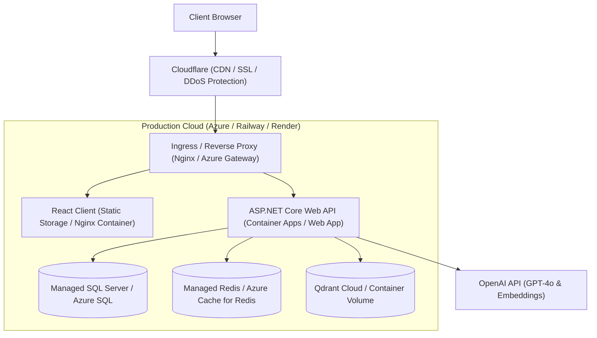

# EduSphere Deployment & Operations Guide

This guide details the containerization, environment configuration, and cloud deployment procedures for **EduSphere**.

---

## 1. Local Containerized Environment (Docker Compose)

### 1.1 Architecture
The local development environment orchestrates all system dependencies using `docker-compose.yml`:
- **API:** ASP.NET Core 8 Web API container (`http://localhost:5000`)
- **Client:** React + Vite / Nginx frontend container (`http://localhost:3000`)
- **SQL Server 2022:** Persistent relational database (`localhost:1433`)
- **Redis 7 Alpine:** Distributed in-memory cache (`localhost:6379`)
- **Qdrant:** Vector database with REST/gRPC endpoints (`localhost:6333`, `localhost:6334`)

### 1.2 Quick Launch Command

```bash
# 1. Clone repository and create local .env file
cp .env.example .env

# 2. Build and start all services in detached mode
docker compose up -d --build

# 3. View running container logs
docker compose logs -f api
```

---

## 2. Environment Variables Configuration

| Variable Name | Description | Example / Default |
| :--- | :--- | :--- |
| `ConnectionStrings__DefaultConnection` | SQL Server connection string | `Server=sqlserver;Database=EduSphere;User Id=sa;Password=YourPass;TrustServerCertificate=True;` |
| `ConnectionStrings__Redis` | Redis host & port | `redis:6379,abortConnect=false` |
| `Qdrant__Endpoint` | Qdrant vector database URL | `http://qdrant:6334` |
| `OpenAI__ApiKey` | OpenAI API Secret Key for Semantic Kernel | `sk-proj-...` |
| `OpenAI__ChatModel` | Chat completion model identifier | `gpt-4o` |
| `OpenAI__EmbeddingModel` | Embedding model identifier | `text-embedding-3-small` |
| `Jwt__Secret` | 256-bit secret key for signing tokens | `AtLeast32CharactersLongSecretKeyForJwtSigning!` |
| `Jwt__Issuer` | JWT Token Issuer claim | `https://api.edusphere.io` |
| `Jwt__Audience` | JWT Token Audience claim | `https://edusphere.io` |

---

## 3. Production Deployment Topologies



---

## 4. Health Checks & Diagnostics

EduSphere exposes comprehensive health probes configured in `Program.cs` under the `/health` endpoint:

- **Liveness Probe (`/health`):** Verifies the Web API host is running.
- **Readiness Probe (`/health/ready`):** Evaluates live connectivity across all dependent infrastructure:
  - SQL Server database connection check.
  - Redis cache ping check.
  - Qdrant vector store HTTP health status.

### Sample Response (`GET /health`)
```json
{
  "status": "Healthy",
  "totalDuration": "00:00:00.0423180",
  "entries": {
    "sqlserver": {
      "status": "Healthy",
      "duration": "00:00:00.0210400"
    },
    "redis": {
      "status": "Healthy",
      "duration": "00:00:00.0051200"
    },
    "qdrant": {
      "status": "Healthy",
      "duration": "00:00:00.0151120"
    }
  }
}
```
