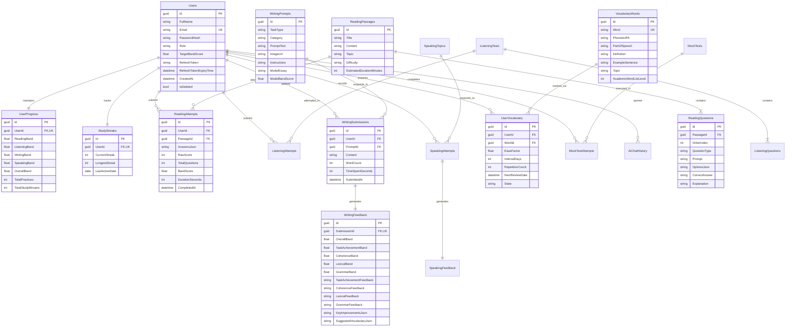

# EduSphere Entity Relationship Diagram (ERD)

This document illustrates the logical data model and relational schema for the **EduSphere** platform.

---

## 1. Visual Entity Relationship Diagram

---

## 2. Cardinality & Key Relationships

| Parent Entity | Child Entity | Cardinality | Cascade Action | Business Rule |
| :--- | :--- | :---: | :---: | :--- |
| `Users` | `UserProgress` | 1 : 1 | `CASCADE` | Each user has exactly one aggregate performance record. |
| `Users` | `StudyStreaks` | 1 : 1 | `CASCADE` | Each user has one streak tracker created upon registration. |
| `Users` | `ReadingAttempts` | 1 : N | `CASCADE` | User deletion clears historical reading attempts. |
| `ReadingPassages` | `ReadingQuestions` | 1 : N | `CASCADE` | Deleting a passage removes all associated questions. |
| `WritingSubmissions` | `WritingFeedback` | 1 : 1 | `CASCADE` | Each submission has exactly one official AI feedback record. |
| `Users` | `UserVocabulary` | 1 : N | `CASCADE` | Tracks individual SM-2 flashcard parameters per user. |
| `VocabularyWords` | `UserVocabulary` | 1 : N | `CASCADE` | Deleting a global word removes it from all personal decks. |
