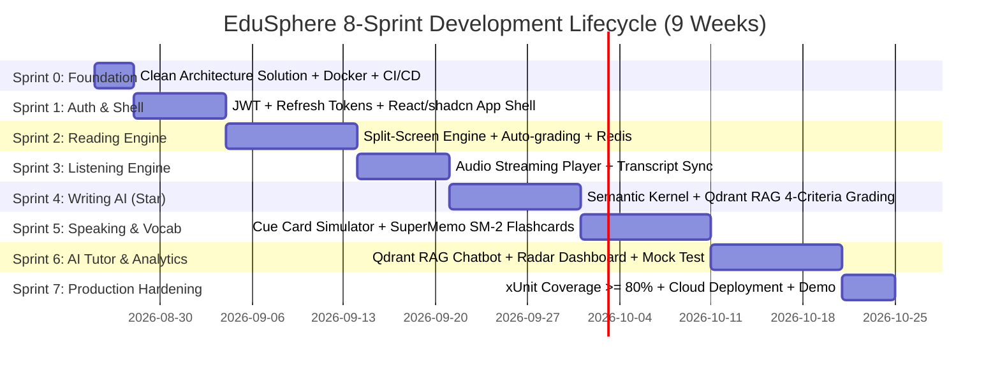

# EduSphere Product Roadmap & Delivery Schedule

This roadmap outlines the 8-sprint development lifecycle for the **EduSphere** platform.

---

## 1. Master Development Gantt Chart

---

## 2. Sprint Milestones Matrix

| Sprint | Milestone / Scope | Key Deliverables & Showcase Capabilities | Target Timeline |
| :--- | :--- | :--- | :---: |
| **Sprint 0** | **Foundation & DevOps** | 5 Clean Arch projects, Docker Compose (SQL+Redis+Qdrant), Serilog, Problem Details, CI/CD workflow | 3 Days |
| **Sprint 1** | **Identity & UI Shell** | JWT Rotation, BCrypt, RBAC, Vite+TS+Tailwind v4+shadcn/ui, Protected Routes, Dark/Light Mode | 1 Week |
| **Sprint 2** | **Reading Engine** | Split-screen viewer, TFNG/MCQ/Matching renderers, auto-scoring, Redis Cache-Aside, 15 seeded passages | 1.5 Weeks |
| **Sprint 3** | **Listening Engine** | 4-section audio streaming player, playback rate control, auto-save state, timestamped transcript modal | 1 Week |
| **Sprint 4** | **Writing AI Engine ⭐** | Real-time word counter, Semantic Kernel + Qdrant RAG against Band Descriptors, 4-criteria feedback | 1.5 Weeks |
| **Sprint 5** | **Speaking & Vocabulary** | 1m/2m sequential Cue Card timers, SuperMemo SM-2 Spaced Repetition engine, 3D flip flashcards | 1.5 Weeks |
| **Sprint 6** | **AI Tutor & Dashboard** | RAG streaming chatbot (< 2s latency), Recharts Radar skill chart, Study Streak (🔥), Mock Test flow | 1.5 Weeks |
| **Sprint 7** | **Testing & Deploy** | xUnit/Moq test suites (>=80% coverage), Docker multi-stage optimization, Cloud Deploy, Demo media | 4 Days |
