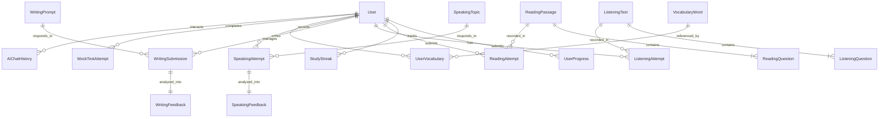

# Software Requirements Specification (SRS)
## Project: EduSphere — AI-Powered IELTS Preparation Platform

- **Document Version:** 1.0.0
- **Status:** Approved / Baseline
- **Date:** August 2026
- **Architecture Standard:** Clean Architecture, CQRS, Event-Driven & RAG Infrastructure

---

## 1. Introduction (Giới thiệu)

### 1.1 Purpose (Mục đích tài liệu)
Tài liệu Đặc tả Yêu cầu Phần mềm (SRS - Software Requirements Specification) này mô tả chi tiết và toàn diện các yêu cầu chức năng (Functional Requirements), phi chức năng (Non-Functional Requirements), thiết kế hệ thống và tiêu chuẩn bàn giao cho dự án **EduSphere**. Tài liệu đóng vai trò là kim chỉ nam kỹ thuật cho đội ngũ phát triển, kiểm thử, quản lý dự án và các bên liên quan (nhà tuyển dụng, tổ chức giáo dục).

### 1.2 Product Scope & Vision (Phạm vi & Tầm nhìn sản phẩm)
**EduSphere** là nền tảng trực tuyến chuyên sâu phục vụ nhu cầu luyện thi chứng chỉ Anh ngữ quốc tế **IELTS** (International English Language Testing System). 

Khác với các hệ thống LMS (Learning Management System) truyền thống chỉ quản lý khóa học dạng CRUD, EduSphere giải quyết bài toán cốt lõi của người học IELTS:
1. **Luyện tập toàn diện 4 kỹ năng (Listening, Reading, Writing, Speaking)** theo đúng format đề thi chuẩn quốc tế.
2. **Tự động hóa đánh giá kỹ năng khó (Writing & Speaking)** thông qua Trí tuệ nhân tạo (Generative AI & RAG) đối chiếu trực tiếp với thang tiêu chí chấm thi chính thức (IELTS Band Descriptors).
3. **Tối ưu hóa khả năng ghi nhớ từ vựng học thuật** bằng thuật toán lặp lại ngắt quãng khoa học (**SuperMemo SM-2 Spaced Repetition**).
4. **Phân tích dữ liệu học tập thông minh**, trực quan hóa lộ trình nâng band điểm và cung cấp trợ lý ảo AI Tutor hỗ trợ học thuật 24/7.

### 1.3 Target Audience & Value Proposition (Mục đích phục vụ & Đối tượng người dùng)

| Nhóm đối tượng | Nhu cầu & Vấn đề thực tế | Giải pháp EduSphere mang lại |
| :--- | :--- | :--- |
| **Học viên luyện thi IELTS (Students/Learners)** | Chi phí sửa bài Writing/Speaking rất đắt đỏ; thiếu phản hồi tức thì; học từ vựng nhanh quên; khó đánh giá năng lực thực tế. | Chấm Writing/Speaking tức thì với phản hồi chi tiết 4 tiêu chí; Flashcard SM-2 nhớ từ lâu; Mock test tính giờ chuẩn thi; AI Tutor giải đáp 24/7. |
| **Giáo viên & Tổ chức Giáo dục (Instructors / Institutions)** | Mất nhiều giờ chấm bài thủ công; khó theo dõi sự tiến bộ chi tiết của từng kỹ năng của học viên. | Hệ thống hỗ trợ chấm tự động, báo cáo phân tích năng lực học viên qua biểu đồ Radar, quản lý ngân hàng đề chuẩn hóa. |
| **Nhà tuyển dụng & Đánh giá Kỹ thuật (Technical Recruiters)** | Cần đánh giá năng lực thực chiến của ứng viên Fullstack (.NET + React). | Chứng minh năng lực kiến trúc Clean Architecture, CQRS, xử lý AI/RAG thực tế, thuật toán tối ưu, Caching, Containerization và DevOps CI/CD. |

---

## 2. Overall Description (Mô tả tổng quan hệ thống)

### 2.1 System Architecture Overview (Tổng quan kiến trúc)
Hệ thống được thiết kế theo mô hình **Clean Architecture (Onion Architecture)** phân tách 4 tầng độc lập kết hợp mẫu kiến trúc **CQRS (Command Query Responsibility Segregation)**:

```
[ Frontend: React 18 + TypeScript + Tailwind v4 + shadcn/ui ]
                           │ HTTP / REST / SSE / SignalR
                           ▼
┌─────────────────────────────────────────────────────────────┐
│ API Layer (ASP.NET Core 8 Web API, Middlewares, Hubs)       │
├─────────────────────────────────────────────────────────────┤
│ Application Layer (MediatR CQRS, FluentValidation Pipeline) │
├─────────────────────────────────────────────────────────────┤
│ Domain Layer (Entities, Value Objects, Domain Events)       │
├─────────────────────────────────────────────────────────────┤
│ Infrastructure Layer (EF Core 8, Redis, Qdrant, Semantic SK)│
└─────────────────────────────────────────────────────────────┘
          │                   │                    │
          ▼                   ▼                    ▼
   [ SQL Server 2022 ]   [ Redis 7 ]    [ Qdrant Vector DB ]
                                                   │
                                                   ▼
                                         [ OpenAI GPT-4o ]
```

### 2.2 User Classes and Roles (Phân quyền người dùng)
1. **Student (Học viên):**
   - Đăng ký, đăng nhập, thiết lập mục tiêu Band Score cá nhân.
   - Làm bài luyện tập 4 kỹ năng (Reading, Listening, Writing, Speaking).
   - Nhận phản hồi chấm điểm chi tiết từ AI và hệ thống.
   - Quản lý và ôn tập từ vựng cá nhân qua Flashcard SM-2.
   - Tham gia thi thử (Mock Test) và theo dõi tiến độ trên Dashboard.
   - Chat tương tác với trợ lý học thuật AI Tutor.
2. **Administrator (Quản trị viên hệ thống):**
   - Quản lý người dùng và phân quyền.
   - Quản lý ngân hàng đề thi (Passages, Audio tests, Writing prompts, Speaking topics).
   - Giám sát tình trạng sức khỏe hệ thống (Health Checks, Log metrics).

---

## 3. Functional Requirements (Yêu cầu chức năng chi tiết)

### 3.1 Module Xác thực & Phân quyền (Authentication & Authorization)
- **FR-AUTH-01 (Đăng ký tài khoản):** Cho phép người dùng đăng ký với Họ tên, Email, Mật khẩu và Mục tiêu Band Score (5.0 - 9.0). Kiểm tra tính duy nhất của Email.
- **FR-AUTH-02 (Bảo mật mật khẩu):** Mật khẩu bắt buộc mã hóa bằng thuật toán băm an toàn **BCrypt** trước khi lưu vào cơ sở dữ liệu.
- **FR-AUTH-03 (Đăng nhập & Cấp phát Token):** Xác thực thông tin đăng nhập và cấp phát cặp **JWT Access Token** (thời hạn 15 phút) và **Refresh Token** (thời hạn 7 ngày).
- **FR-AUTH-04 (Xoay vòng Refresh Token):** Tự động cấp phát Access Token mới khi hết hạn mà không làm gián đoạn phiên làm việc của người dùng; vô hiệu hóa Refresh Token cũ để chống tấn công replay.
- **FR-AUTH-05 (Phân quyền theo vai trò - RBAC):** Kiểm soát quyền truy cập endpoint dựa trên vai trò (`Student`, `Admin`).

---

### 3.2 Module Luyện thi Reading (Reading Examination Engine)
- **FR-READ-01 (Duyệt ngân hàng đề đọc):** Hiển thị danh sách bài đọc được phân loại theo chủ đề (Environment, Science, History, v.v.) và độ khó (Band 5-6, 6-7, 7-8, 8-9), hỗ trợ phân trang và tìm kiếm.
- **FR-READ-02 (Bộ đệm dữ liệu Redis):** Danh sách bài đọc và nội dung chi tiết bài đọc được lưu vào Redis Cache (TTL 10 phút) để tối ưu tốc độ tải trang.
- **FR-READ-03 (Giao diện Split-Screen):** Màn hình chia đôi: bên trái hiển thị văn bản bài đọc (hỗ trợ điều chỉnh cỡ chữ), bên phải hiển thị bảng câu hỏi và bộ điều khiển.
- **FR-READ-04 (Hỗ trợ đa dạng loại câu hỏi IELTS):**
  - True / False / Not Given (TFNG) & Yes / No / Not Given (YNNG).
  - Trắc nghiệm đơn và trắc nghiệm nhiều lựa chọn (Multiple Choice).
  - Nối tiêu đề đoạn văn (Matching Headings).
  - Điền từ vào chỗ trống / Tóm tắt (Sentence & Summary Completion).
- **FR-READ-05 (Chế độ thi tính giờ):** Bộ đếm thời gian ngược (mặc định 20 phút/passage hoặc 60 phút/full test). Tự động nộp bài khi hết giờ.
- **FR-READ-06 (Chấm điểm tự động & Quy đổi Band điểm):** Tự động so khớp câu trả lời của người dùng với đáp án chuẩn, tính điểm thô (Raw Score) và quy đổi sang thang điểm 9.0 chuẩn Academic IELTS.
- **FR-READ-07 (Giải thích chi tiết & Tra cứu từ vựng):** Hiển thị lời giải thích cho từng câu hỏi sau khi nộp bài, đánh dấu đoạn văn chứa bằng chứng trả lời. Cho phép bôi đen từ mới để thêm trực tiếp vào sổ từ vựng cá nhân.

---

### 3.3 Module Luyện thi Listening (Listening Examination Engine)
- **FR-LIST-01 (Trình phát Audio chuyên dụng):** Tích hợp Audio Player hỗ trợ phát/dừng, tua, thanh tiến trình, điều chỉnh tốc độ (0.75x, 1.0x, 1.25x).
- **FR-LIST-02 (Cấu trúc 4 Sections):** Phân chia đề thi theo đúng 4 phần chuẩn quốc tế từ ngữ cảnh giao tiếp thường ngày (Section 1) đến bài giảng học thuật (Section 4).
- **FR-LIST-03 (Tự động lưu tạm thời):** Câu trả lời của người dùng được tự động lưu vào Local State theo thời gian thực để chống mất dữ liệu khi mất kết nối mạng.
- **FR-LIST-04 (Chấm điểm & Đối chiếu Transcript):** Chấm điểm tự động theo thang điểm chuẩn; hiển thị toàn bộ Transcript bài nghe có đánh dấu mốc thời gian (timestamps) liên kết với vị trí đáp án.
- **FR-LIST-05 (Bảng ghi chú Scratchpad):** Cung cấp khung ghi chú nhanh bên cạnh bài làm giúp học viên note thông tin quan trọng trong khi nghe.

---

### 3.4 Module Chấm bài Writing bằng AI (Writing Practice & AI Evaluation) — *Tính năng Cốt lõi*
- **FR-WRIT-01 (Ngân hàng đề Writing chuẩn):** Cung cấp đề bài cho cả **Task 1** (miêu tả biểu đồ đường, cột, tròn, bản đồ, quy trình) và **Task 2** (nghị luận xã hội, thảo luận quan điểm, nguyên nhân - giải pháp).
- **FR-WRIT-02 (Trình soạn thảo chuyên biệt):** Bộ soạn thảo văn bản tích hợp bộ đếm số từ thời gian thực (Real-time Word Counter), cảnh báo màu sắc khi chưa đủ độ dài quy định (150 từ cho Task 1, 250 từ cho Task 2), và đồng hồ đếm giờ làm bài.
- **FR-WRIT-03 (Kiến trúc Đánh giá AI + RAG):** 
  - Hệ thống sử dụng **Microsoft Semantic Kernel** kết nối mô hình OpenAI GPT-4o.
  - Sử dụng cơ sở dữ liệu vector **Qdrant** để truy xuất tài liệu chuẩn **IELTS Band Descriptors** (Tiêu chí chấm thi chính thức) làm ngữ cảnh (Context) trước khi chấm.
- **FR-WRIT-04 (Chấm điểm chi tiết 4 tiêu chí chuẩn IELTS):**
  - **Task Achievement / Response:** Đánh giá mức độ giải quyết yêu cầu đề bài.
  - **Coherence & Cohesion:** Đánh giá tính mạch lạc, cấu trúc đoạn và liên kết câu.
  - **Lexical Resource:** Đánh giá độ phong phú và chính xác của từ vựng.
  - **Grammatical Range & Accuracy:** Đánh giá cấu trúc ngữ pháp và độ chính xác.
- **FR-WRIT-05 (Gợi ý nâng cấp từ vựng & Sửa lỗi ngữ pháp):**
  - AI chỉ ra các từ vựng đơn giản/lặp lại và đề xuất các cụm từ học thuật (Academic Collocations) tương ứng cho band 7.0+.
  - Phát hiện lỗi sai ngữ pháp, giải thích nguyên tắc và cung cấp câu sửa hoàn chỉnh.
- **FR-WRIT-06 (Đối chiếu bài viết mẫu):** Cung cấp bài viết mẫu (Model Essay Band 8.0+) kèm phân tích để học viên so sánh, rút kinh nghiệm.

---

### 3.5 Module Luyện nói Speaking (Speaking Simulator)
- **FR-SPEA-01 (Ngân hàng chủ đề Speaking):** Phân loại chủ đề theo 3 phần thi chính thức:
  - *Part 1:* Phỏng vấn các chủ đề quen thuộc (Work, Study, Hometown, Hobbies).
  - *Part 2:* Thẻ gợi ý (Cue Card) với thời gian chuẩn bị 1 phút và nói 2 phút.
  - *Part 3:* Thảo luận chuyên sâu mang tính trừu tượng.
- **FR-SPEA-02 (Bộ đếm thời gian tuần tự):** Tự động chuyển đổi giữa 1 phút chuẩn bị và 2 phút trả lời cho phần thi Part 2.
- **FR-SPEA-03 (Nhập liệu đa phương thức):** Cho phép học viên gõ câu trả lời dạng văn bản hoặc ghi âm giọng nói trực tiếp qua trình duyệt.
- **FR-SPEA-04 (Đánh giá năng lực Speaking bằng AI):** AI phân tích câu trả lời, đánh giá mức độ đa dạng từ vựng, tính liên kết mạch lạc và cấu trúc câu, đưa ra câu trả lời mẫu tối ưu.

---

### 3.6 Module Học từ vựng thông minh (Vocabulary Builder with SM-2)
- **FR-VOCAB-01 (Thuật toán lặp lại ngắt quãng SuperMemo SM-2):** Tự động tính toán chu kỳ ôn tập tiếp theo (`Interval`), hệ số dễ nhớ (`EaseFactor`), và số lần lặp (`RepetitionCount`) dựa trên điểm chất lượng ghi nhớ (0 đến 5) của học viên:
  - *Again (0 điểm):* Quên hoàn toàn, đặt lại chu kỳ ôn về ngày hôm sau.
  - *Hard (3 điểm):* Nhớ khó khăn, tăng chu kỳ chậm.
  - *Good (4 điểm):* Nhớ chuẩn xác, tăng chu kỳ theo hệ số.
  - *Easy (5 điểm):* Nhớ xuất sắc, tăng nhanh chu kỳ ngày ôn tập.
- **FR-VOCAB-02 (Thẻ lật Flashcard 3D):** Giao diện thẻ học sinh động (Mặt trước: Từ vựng, phiên âm IPA, nút phát âm; Mặt sau: Nghĩa tiếng Việt, Định nghĩa tiếng Anh, Collocations và Ví dụ câu trong bài thi IELTS).
- **FR-VOCAB-03 (Hàng đợi từ cần ôn trong ngày - Due Words):** Tự động lọc ra các từ vựng đến hạn cần ôn trong ngày hôm nay.
- **FR-VOCAB-04 (Sổ tay từ vựng theo chủ đề):** Cung cấp hơn 500+ từ vựng học thuật cốt lõi (Academic Word List) chia theo các chủ đề phổ biến trong đề thi IELTS.

---

### 3.7 Module Trợ lý AI Tutor & RAG Kiến thức IELTS (AI Tutor System)
- **FR-AITUTOR-01 (Cơ sở tri thức IELTS Vectorized):** Index toàn bộ tài liệu hướng dẫn thi, mẹo làm bài, cấu trúc bài viết và lỗi thường gặp vào cơ sở dữ liệu vector Qdrant.
- **FR-AITUTOR-02 (Hỏi đáp ngữ cảnh thông minh):** Khi học viên đặt câu hỏi, hệ thống tự động tìm kiếm các đoạn thông tin liên quan nhất từ Qdrant để làm Prompt Context cho AI trả lời chuẩn xác.
- **FR-AITUTOR-03 (Streaming Response):** Phản hồi câu trả lời từ AI theo dạng luồng ký tự (Streaming token) qua Server-Sent Events giúp giảm độ trễ hiển thị xuống dưới 2 giây.
- **FR-AITUTOR-04 (Lưu trữ lịch sử hội thoại):** Lưu lại lịch sử các phiên trao đổi để học viên xem lại khi cần.

---

### 3.8 Module Thống kê & Thi thử (Dashboard Analytics & Mock Test)
- **FR-DASH-01 (Tính toán Overall Band Score):** Tự động tính điểm tổng kết 4 kỹ năng theo đúng nguyên tắc làm tròn của IELTS:
  - Điểm trung bình kết thúc bằng `.25` được làm tròn lên `.5`.
  - Điểm trung bình kết thúc bằng `.75` được làm tròn lên điểm nguyên tiếp theo.
- **FR-DASH-02 (Biểu đồ Radar Năng lực 4 Kỹ năng):** Trực quan hóa mức độ cân bằng giữa 4 kỹ năng thông qua biểu đồ Radar (Recharts), giúp người học nhận biết điểm yếu cần cải thiện.
- **FR-DASH-03 (Biểu đồ Tiến độ thời gian):** Thể hiện sự tiến bộ của từng kỹ năng qua các lần luyện tập theo thời gian (Line Chart).
- **FR-DASH-04 (Study Streak):** Hệ thống theo dõi chuỗi ngày học liên tục (🔥 Streak) tạo động lực học tập.
- **FR-DASH-05 (Mô phỏng Thi thử Toàn diện - Full Mock Test):** Chế độ thi liên tục (Reading 60 phút + Writing 60 phút) trong môi trường nghiêm ngặt, xuất phiếu điểm tổng kết (Diagnostic Score Report).

---

## 4. External Interface Requirements (Yêu cầu giao diện bên ngoài)

### 4.1 User Interface (UI/UX)
- Thiết kế giao diện hiện đại, tối giản theo chuẩn **shadcn/ui** và **Tailwind CSS v4**.
- Hỗ trợ đầy đủ chế độ **Dark Mode / Light Mode**.
- Khả năng co giãn và đáp ứng (Responsive Design) mượt mà trên Desktop (tối ưu cho trải nghiệm làm bài thi), Tablet và Mobile.
- Giao diện phòng thi tập trung (Distraction-free Mode) ẩn các thanh điều hướng không cần thiết khi đang làm bài.

### 4.2 Software Interfaces & Third-Party APIs
- **Database:** Microsoft SQL Server 2022 kết nối qua Entity Framework Core 8.
- **Cache Engine:** Redis 7 kết nối qua `StackExchange.Redis` / `IDistributedCache`.
- **Vector Database:** Qdrant REST/gRPC API lưu trữ và truy vấn Embedding Vectors (1536 chiều từ OpenAI `text-embedding-3-small` / `text-embedding-3-large`).
- **AI Model Provider:** OpenAI API (GPT-4o) thông qua `Microsoft.SemanticKernel`.

---

## 5. Non-Functional Requirements (Yêu cầu phi chức năng)

### 5.1 Performance & Latency (Hiệu năng & Độ trễ)
- Thời gian phản hồi của các API đọc dữ liệu tĩnh (danh sách bài đọc, từ vựng) **< 150ms** nhờ cơ chế Redis Caching.
- Thời gian bắt đầu nhận luồng phản hồi đầu tiên từ AI Tutor **< 2.0s**.
- Database queries sử dụng index tối ưu, truy vấn phân trang (`Skip`/`Take`) và `.AsNoTracking()` cho các luồng Read-Only.

### 5.2 Security & Data Protection (Bảo mật)
- Mọi kết nối truyền tải dữ liệu bắt buộc qua giao thức **HTTPS**.
- Triển khai cơ chế phòng chống các lỗ hổng bảo mật phổ biến (OWASP Top 10):
  - SQL Injection: Ngăn chặn tuyệt đối nhờ EF Core Parameterized Queries.
  - XSS: Tự động encode output và kiểm tra đầu vào bằng FluentValidation.
  - CSRF: Bảo vệ bằng JWT Authentication không lưu cookie nhạy cảm không an toàn.
  - Rate Limiting: Giới hạn tần suất gọi API phòng chống DDoS và lạm dụng API AI.

### 5.3 Reliability & Fault Tolerance (Độ tin cậy & Sẵn sàng)
- Hệ thống áp dụng mẫu thiết kế **Result Pattern** (`Result<T>`) giúp xử lý lỗi nghiệp vụ rõ ràng, không phụ thuộc vào Exception ném ra ngoài luồng.
- Triển khai Global Exception Middleware bắt toàn bộ unhandled exceptions và trả về định dạng chuẩn **RFC 7807 Problem Details**.
- Health Checks API (`/health`) giám sát trạng thái hoạt động của Database, Redis và Qdrant theo thời gian thực.

### 5.4 Maintainability & Code Quality (Chất lượng mã nguồn)
- Tuân thủ nguyên lý **SOLID**, Clean Architecture và Domain-Driven Design (DDD) cơ bản.
- Độ phủ kiểm thử tự động (Unit Test Coverage) đạt tối thiểu **>= 80%** trên tầng Application và Domain.
- Sử dụng Pipeline CI/CD tự động build, lint và test trước khi cho phép merge code vào nhánh chính.

---

## 6. Data Architecture & Core Entities (Mô hình thực thể cốt lõi)



---

## 7. Deliverables & Final Product Definition (Sản phẩm bàn giao cuối cùng)

Khi hoàn thành toàn bộ lộ trình 8 Sprints, sản phẩm hoàn chỉnh bàn giao bao gồm:

1. **Source Code Repository Hoàn Chỉnh:**
   - **Backend (.NET 8):** Cấu trúc Clean Architecture chuẩn mực, tích hợp đầy đủ CQRS (MediatR), FluentValidation, Redis Caching, Qdrant Vector Store, Semantic Kernel AI Services.
   - **Frontend (React 18 + TS):** Giao diện chuẩn mực với Tailwind v4 và shadcn/ui, đầy đủ các phân hệ 4 kỹ năng, Flashcard 3D, Dashboard Charts và AI Chatbot.
2. **Containerized Infrastructure (Docker Compose):**
   - File `docker-compose.yml` cấu hình sẵn toàn bộ cụm dịch vụ (SQL Server 2022, Redis 7, Qdrant, Backend API, Frontend Client), chỉ cần chạy lệnh `docker compose up -d` là khởi chạy toàn bộ môi trường.
3. **Bộ Dữ Liệu Khởi Tạo (Seeded IELTS Data):**
   - 10–15 đề Reading đầy đủ phân loại và giải thích.
   - 5–8 đề Listening chuẩn 4 sections.
   - 20+ đề Writing (Task 1 & Task 2) kèm bài mẫu Band 8.0+.
   - 30+ chủ đề Speaking Part 1/2/3.
   - 500+ từ vựng học thuật kèm hệ thống dữ liệu mẫu SM-2.
4. **Bộ Kiểm Thử Tự Động (Automated Test Suite):**
   - Unit Tests và Integration Tests bao phủ toàn bộ logic chấm điểm, thuật toán SM-2, pipeline bảo mật và phân tích phản hồi AI.
5. **Tài Liệu Kỹ Thuật Chuyên Nghiệp:**
   - File `README.md` chuẩn Senior Engineer có sơ đồ kiến trúc, video/gif demo và hướng dẫn cài đặt.
   - Toàn bộ hồ sơ tài liệu kiến trúc, API docs, ERD và SRS lưu tại thư mục `docs/` và `plan/`.
6. **Môi Trường Live Production Deployment:**
   - Đường link ứng dụng trực tuyến hoạt động thực tế trên nền tảng Cloud (Azure / Railway / Render).
