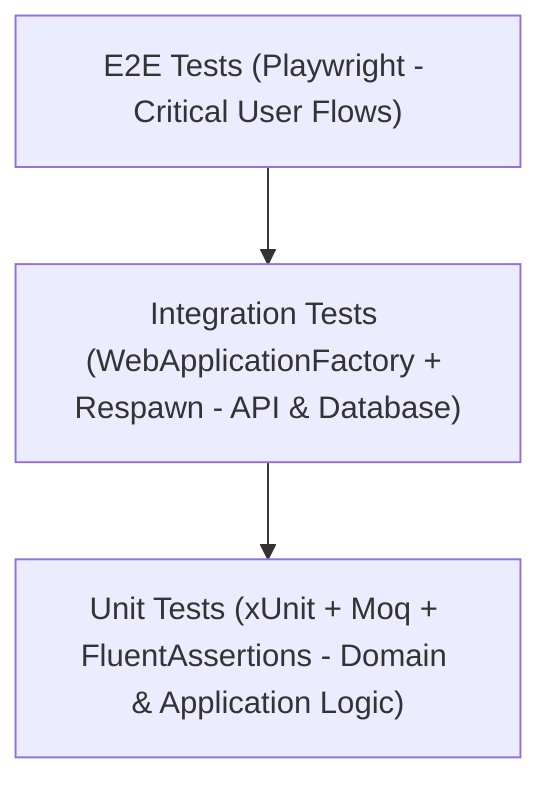

# EduSphere Quality Assurance & Automated Testing Strategy

This document outlines the testing pyramid, tools, coverage targets, and test execution standards for **EduSphere**.

---

## 1. Testing Pyramid & Objectives



- **Target Code Coverage:** `>= 80%` on `EduSphere.Domain` and `EduSphere.Application` layers.
- **Test Runner:** xUnit with parallel test execution enabled.
- **Assertion Library:** `FluentAssertions` for readable, expressive test assertions.
- **Mocking Library:** `Moq` for abstracting infrastructure interfaces (`ICacheService`, `IAiGradingService`, `IJwtService`).

---

## 2. Key Test Scenarios & Suites

### 2.1 Spaced Repetition Algorithm Unit Tests (`SpacedRepetitionServiceTests`)
- **Grade 0 (Again):** Verifies that a failed recall resets `RepetitionCount` to `0`, sets `IntervalDays` to `1`, and decreases `EaseFactor`.
- **Grade 3 (Hard):** Verifies interval calculation with smaller progression step.
- **Grade 4 (Good):** Verifies standard SM-2 expansion (`Interval * EaseFactor`).
- **Grade 5 (Easy):** Verifies accelerated interval expansion and EaseFactor increase.
- **Floor Boundary Check:** Asserts that `EaseFactor` never drops below the minimum bound of `1.3`.

```csharp
[Fact]
public void CalculateNext_WithGrade0Again_ShouldResetRepetitionAndInterval()
{
    // Arrange
    var card = new UserVocabulary { RepetitionCount = 5, IntervalDays = 24, EaseFactor = 2.5 };
    
    // Act
    var result = _sut.CalculateNext(card, quality: 0);
    
    // Assert
    result.RepetitionCount.Should().Be(0);
    result.IntervalDays.Should().Be(1);
    result.EaseFactor.Should().BeInRange(1.3, 2.5);
    result.NextReviewDate.Date.Should().Be(DateTime.UtcNow.AddDays(1).Date);
}
```

---

### 2.2 IELTS Band Score Conversion Tests (`IeltsScoringTests`)
- **Reading Boundary Scoring:** Validates exact mapping of raw scores (0–40) to IELTS Band Scale (0.0–9.0).
- **Rounding Logic:** Asserts that average band scores are rounded to the nearest half band according to official rules (e.g., `6.25` -> `6.5`, `6.75` -> `7.0`, `6.125` -> `6.0`).

---

### 2.3 AI Writing Response Parser Tests (`WritingFeedbackParserTests`)
- **JSON Schema Validation:** Verifies that LLM JSON output deserializes cleanly into `WritingFeedback` DTO.
- **Resilience:** Ensures that missing optional suggestions or partial markdown formatting inside JSON strings are handled gracefully without throwing unhandled exceptions.

---

### 2.4 Integration Tests (`EduSphere.IntegrationTests`)
- **Authentication Lifecycle:** Tests user registration -> login -> token refresh -> accessing protected endpoint.
- **Reading Attempt Submission:** Submits full answer payload through `WebApplicationFactory` and verifies that the database records the attempt and updates `UserProgress`.
- **Redis Cache Hit Verification:** Executes a query twice; validates that the second request hits the Redis distributed cache and skips database execution.

---

## 3. Test Execution Commands

```bash
# Run all unit test suites with detailed output
dotnet test tests/EduSphere.UnitTests/EduSphere.UnitTests.csproj --verbosity normal

# Run integration tests
dotnet test tests/EduSphere.IntegrationTests/EduSphere.IntegrationTests.csproj --verbosity normal

# Run all tests and generate OpenCover code coverage report
dotnet test EduSphere.sln /p:CollectCoverage=true /p:CoverletOutputFormat=opencover
```
