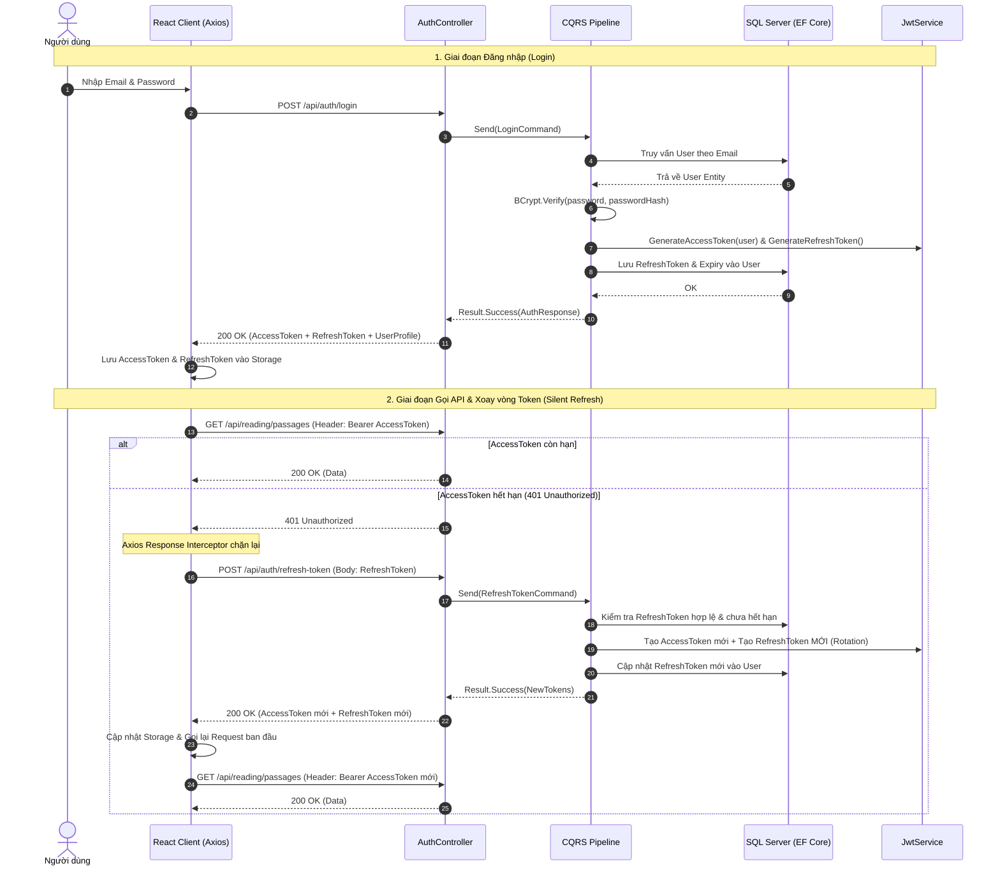

# Sprint 1: Authentication, Authorization & Frontend Foundation
## Chi Tiết Kế Hoạch Triển Khai Kỹ Thuật (Technical Execution Blueprint)

- **Thời gian thực hiện:** 1 tuần (7 ngày)
- **Mục tiêu cốt lõi:**
  1. **Backend:** Thiết lập hệ thống định danh bảo mật với **JWT Access Token (15 phút) + Refresh Token Rotation (7 ngày)**, mã hóa **BCrypt**, phân quyền **RBAC (Student / Admin)**, cấu hình **EF Core 8 Code-First Migrations** và triển khai các luồng CQRS hoàn chỉnh cho Auth.
  2. **Frontend:** Khởi tạo ứng dụng **React 18 + TypeScript (Strict Mode) + Vite + Tailwind CSS v4 + shadcn/ui** trong thư mục `frontend/`, tích hợp **Axios Interceptor** xử lý hàng đợi Refresh Token tự động khi gặp mã 401, xây dựng **Application Shell** (Collapsible Sidebar, Header, Dark/Light Mode) và hoàn thiện các màn hình **Login / Register**.
- **Trạng thái:** Ready for Execution (Sẵn sàng triển khai)

---

## 1. Kiến Trúc & Luồng Dữ Liệu (Architecture & Flow)

### 1.1 Luồng Xác Thực & Xoay Vòng Token (Authentication & Token Rotation Lifecycle)



---

## 2. Chi Tiết Các Thành Phần Cần Xây Dựng

### 2.1 Backend (.NET 8 Clean Architecture)

```
backend/
├── src/
│   ├── EduSphere.Domain/
│   │   ├── Entities/
│   │   │   └── User.cs                        # Id, FullName, Email, PasswordHash, Role, RefreshToken, TargetBandScore
│   │   ├── Enums/
│   │   │   └── UserRole.cs                    # Student, Admin
│   │   └── ValueObjects/
│   │       └── Email.cs                       # Email validation logic & equality
│   │
│   ├── EduSphere.Application/
│   │   ├── Common/Interfaces/
│   │   │   ├── IApplicationDbContext.cs       # DbSet<User> abstraction
│   │   │   └── IJwtService.cs                 # GenerateAccessToken, GenerateRefreshToken, ValidateToken
│   │   └── Features/Auth/
│   │       ├── Commands/
│   │       │   ├── Register/                  # RegisterCommand, Handler, Validator
│   │       │   ├── Login/                     # LoginCommand, Handler, Validator
│   │       │   ├── RefreshToken/              # RefreshTokenCommand, Handler, Validator
│   │       │   └── UpdateTargetScore/         # UpdateTargetScoreCommand, Handler
│   │       ├── Queries/
│   │       │   └── GetProfile/                # GetProfileQuery, Handler
│   │       └── Models/
│   │           ├── AuthResponse.cs            # AccessToken, RefreshToken, ExpiresAt, UserDto
│   │           └── UserDto.cs                 # Id, FullName, Email, Role, TargetBandScore
│   │
│   ├── EduSphere.Infrastructure/
│   │   ├── Data/
│   │   │   ├── ApplicationDbContext.cs        # EF Core DbContext
│   │   │   ├── Configurations/
│   │   │   │   └── UserConfiguration.cs       # Fluent API mapping, Unique Index Email
│   │   │   └── Migrations/                    # InitialCreate_Users migration
│   │   └── Services/
│   │       ├── JwtService.cs                  # JWT creation, claims mapping, cryptographically secure refresh token
│   │       └── PasswordHasher.cs              # BCrypt wrapper
│   │
│   └── EduSphere.API/
│       ├── Controllers/
│       │   └── AuthController.cs              # REST endpoints for /api/auth/*
│       └── Program.cs                         # Authentication & Authorization middleware configuration
│
└── tests/
    └── EduSphere.UnitTests/
        └── Features/Auth/
            ├── RegisterCommandHandlerTests.cs
            ├── LoginCommandHandlerTests.cs
            └── JwtServiceTests.cs
```

---

### 2.2 Frontend (React 18 + TypeScript + Vite + shadcn/ui)

```
frontend/
├── src/
│   ├── app/
│   │   ├── App.tsx                            # Root component with Providers
│   │   ├── Router.tsx                         # React Router v6 routing definition
│   │   └── providers.tsx                      # QueryClientProvider, AuthProvider, ThemeProvider
│   │
│   ├── components/
│   │   └── ui/                                # shadcn/ui components (Button, Card, Input, Label, Form, Dropdown)
│   │
│   ├── shared/
│   │   ├── components/
│   │   │   ├── Layout.tsx                     # Shell: Sidebar + Header + Main Content Area
│   │   │   ├── Sidebar.tsx                    # Collapsible navigation menu
│   │   │   ├── Header.tsx                     # User dropdown, notifications, ThemeToggle
│   │   │   ├── ThemeToggle.tsx                # Dark/Light mode switcher
│   │   │   └── ProtectedRoute.tsx             # Auth guard redirecting to /login if unauthenticated
│   │   ├── context/
│   │   │   ├── AuthContext.tsx                # Auth state management (user, tokens, login, logout)
│   │   │   └── ThemeContext.tsx               # Dark/Light theme state
│   │   ├── hooks/
│   │   │   ├── useAuth.ts                     # Custom hook to access AuthContext
│   │   │   └── useTheme.ts                    # Custom hook to access ThemeContext
│   │   ├── lib/
│   │   │   ├── axios.ts                       # Axios instance with JWT interceptor & 401 retry queue
│   │   │   └── utils.ts                       # cn() class utility
│   │   └── types/
│   │       └── auth.types.ts                  # User, AuthResponse, LoginRequest, RegisterRequest
│   │
│   ├── features/
│   │   └── auth/
│   │       ├── api/
│   │       │   └── authApi.ts                 # Axios API calls (login, register, refreshToken, getMe)
│   │       ├── components/
│   │       │   ├── LoginForm.tsx              # Form đăng nhập với validation
│   │       │   └── RegisterForm.tsx           # Form đăng ký với chọn Target Band Score
│   │       └── pages/
│   │           ├── LoginPage.tsx              # Màn hình Login
│   │           └── RegisterPage.tsx           # Màn hình Register
│   │
│   ├── index.css                              # Tailwind CSS v4 setup & theme variables
│   └── main.tsx                               # Application entry point
│
├── components.json                            # shadcn/ui configuration
├── package.json
├── tsconfig.json
└── vite.config.ts                             # Path aliases (@/* -> src/*)
```

---

## 3. Đặc Tả Chi Tiết API Contracts

### 3.1 `POST /api/auth/register`
- **Mục đích:** Đăng ký tài khoản học viên mới.
- **Request Body:**
  ```json
  {
    "fullName": "Nguyen Van A",
    "email": "student@edusphere.io",
    "password": "Password123@",
    "targetBandScore": 7.5
  }
  ```
- **Response `201 Created`:**
  ```json
  {
    "accessToken": "eyJhbGciOiJIUzI1NiIsInR5cCI...",
    "refreshToken": "4f9d2a1b-3c8e-4a7f-9b0d-1e2f3a4b5c6d",
    "expiresAt": "2026-08-24T00:30:00Z",
    "user": {
      "id": "e3b0c442-98fc-1c14-9afb-4c8996fb9242",
      "fullName": "Nguyen Van A",
      "email": "student@edusphere.io",
      "role": "Student",
      "targetBandScore": 7.5
    }
  }
  ```
- **Error Response `400 Bad Request` (Problem Details):**
  ```json
  {
    "type": "https://tools.ietf.org/html/rfc7231#section-6.5.1",
    "title": "Validation Error",
    "status": 400,
    "detail": "One or more validation errors occurred.",
    "errors": {
      "Email": ["The email address is already registered."],
      "Password": ["Password must contain at least one uppercase letter and one special character."]
    }
  }
  ```

---

### 3.2 `POST /api/auth/login`
- **Mục đích:** Xác thực người dùng và cấp phát JWT.
- **Request Body:**
  ```json
  {
    "email": "student@edusphere.io",
    "password": "Password123@"
  }
  ```
- **Response `200 OK`:** Cấu trúc tương tự `AuthResponse`.

---

### 3.3 `POST /api/auth/refresh-token`
- **Mục đích:** Xoay vòng Refresh Token (Token Rotation) khi Access Token hết hạn.
- **Request Body:**
  ```json
  {
    "refreshToken": "4f9d2a1b-3c8e-4a7f-9b0d-1e2f3a4b5c6d"
  }
  ```
- **Response `200 OK`:** Cấp phát cặp Access Token mới và Refresh Token MỚI.
- **Error Response `401 Unauthorized`:** Nếu Refresh Token không hợp lệ hoặc đã hết hạn (buộc người dùng đăng nhập lại).

---

### 3.4 `GET /api/auth/me`
- **Mục đích:** Lấy thông tin người dùng hiện tại qua Access Token.
- **Header:** `Authorization: Bearer <accessToken>`
- **Response `200 OK`:** Trả về `UserDto`.

---

### 3.5 `PUT /api/auth/target-score`
- **Mục đích:** Cập nhật mục tiêu điểm IELTS của học viên.
- **Header:** `Authorization: Bearer <accessToken>`
- **Request Body:** `{ "targetBandScore": 8.0 }`
- **Response `200 OK`:** `{ "success": true, "targetBandScore": 8.0 }`

---

## 4. Phân Rã Kế Hoạch Thực Hiện 7 Ngày (Day-by-Day Task Breakdown)

### 📅 Ngày 1: Backend Domain Models, EF Core DbContext & Migrations
- [ ] Xây dựng Entity `User.cs` trong `EduSphere.Domain/Entities/` kế thừa `BaseEntity`.
- [ ] Xây dựng Enum `UserRole.cs` (`Student`, `Admin`) và Value Object `Email.cs`.
- [ ] Thiết lập Interface `IApplicationDbContext.cs` trong `EduSphere.Application/Common/Interfaces/`.
- [ ] Tạo `ApplicationDbContext.cs` và `UserConfiguration.cs` (Fluent API, Index Unique Email) trong `EduSphere.Infrastructure/Data/`.
- [ ] Chạy lệnh `dotnet ef migrations add InitialCreate_Users` tạo migration đầu tiên.

### 📅 Ngày 2: Dịch Vụ Bảo Mật (BCrypt & JwtService with Token Rotation)
- [ ] Tạo interface `IJwtService.cs` (GenerateAccessToken, GenerateRefreshToken, GetPrincipalFromExpiredToken).
- [ ] Cài đặt `JwtService.cs` trong `EduSphere.Infrastructure/Services/`:
  - Access Token chứa Claims: `UserId`, `Email`, `FullName`, `Role`.
  - Refresh Token sinh ngẫu nhiên qua `RandomNumberGenerator` an toàn mã hóa (32 bytes Base64).
- [ ] Cài đặt `PasswordHasher.cs` sử dụng `BCrypt.Net-Next`.
- [ ] Cấu hình Authentication JwtBearer trong `EduSphere.API/Program.cs`.

### 📅 Ngày 3: Application CQRS Commands/Queries & AuthController
- [ ] Viết `RegisterCommand` + `RegisterCommandHandler` + `RegisterCommandValidator`.
- [ ] Viết `LoginCommand` + `LoginCommandHandler` + `LoginCommandValidator`.
- [ ] Viết `RefreshTokenCommand` + `RefreshTokenCommandHandler` (Kiểm tra hết hạn, lưu token mới).
- [ ] Viết `GetProfileQuery` và `UpdateTargetScoreCommand`.
- [ ] Viết `AuthController.cs` trong `EduSphere.API` đầy đủ Swagger annotations và HTTP responses.
- [ ] Viết bộ Unit Tests `EduSphere.UnitTests` cho các Handlers và `JwtService` (Đạt >= 85% coverage).

### 📅 Ngày 4: Khởi Tạo Frontend React 18, Tailwind CSS v4 & shadcn/ui
- [ ] Khởi tạo dự án `frontend/` bằng `npm create vite@latest frontend -- --template react-ts`.
- [ ] Cài đặt Tailwind CSS v4 và `@tailwindcss/vite`.
- [ ] Khởi tạo `shadcn/ui` (`npx shadcn@latest init`) và cài đặt các components cốt lõi: `button`, `card`, `input`, `label`, `dropdown-menu`, `avatar`, `badge`, `skeleton`, `toast`.
- [ ] Cài đặt `@tanstack/react-query`, `axios`, `react-router-dom`, `lucide-react`.
- [ ] Cấu hình file `vite.config.ts` hỗ trợ path alias `@/*`.

### 📅 Ngày 5: Axios Interceptors với 401 Refresh Queue & AuthContext
- [ ] Xây dựng `frontend/src/shared/lib/axios.ts`:
  - Request Interceptor: Tự động đính kèm `Authorization: Bearer <token>`.
  - Response Interceptor: Bắt lỗi `401 Unauthorized`, đưa các request bị nghẽn vào hàng đợi (`failedQueue`), gọi API `/api/auth/refresh-token` lấy token mới và retry toàn bộ request trong hàng đợi.
- [ ] Xây dựng `AuthContext.tsx` và custom hook `useAuth()`:
  - Quản lý trạng thái: `user`, `isAuthenticated`, `isLoading`.
  - Các hàm: `login()`, `register()`, `logout()`, `updateTargetScore()`.
- [ ] Tạo API Service `authApi.ts` tương tác với Backend.

### 📅 Ngày 6: Xây Dựng Application Shell & Layout Chuyên Nghiệp
- [ ] Xây dựng `ThemeContext.tsx` & `ThemeToggle.tsx` hỗ trợ Dark Mode / Light Mode hoàn chỉnh.
- [ ] Xây dựng `Sidebar.tsx`:
  - Logo EduSphere, nút thu gọn / mở rộng (collapsible).
  - Navigation Links với Icons: Dashboard, Reading, Listening, Writing, Speaking, Vocabulary, Mock Test, AI Tutor.
  - Active route highlighting.
- [ ] Xây dựng `Header.tsx`:
  - Breadcrumb navigation, Target Band Score Badge, Theme Toggle, User Avatar & Dropdown (Profile, Settings, Logout).
- [ ] Xây dựng `ProtectedRoute.tsx` bảo vệ các route yêu cầu đăng nhập.

### 📅 Ngày 7: Hoàn Thiện Màn Hình Login / Register, Kiểm Thử & Tích Hợp
- [ ] Xây dựng `LoginPage.tsx` & `LoginForm.tsx`:
  - Form validation phía client, hiển thị lỗi API theo RFC 7807, nút đăng nhập kèm loading spinner.
- [ ] Xây dựng `RegisterPage.tsx` & `RegisterForm.tsx`:
  - Các trường Họ tên, Email, Mật khẩu, Chọn mục tiêu Band Score (Slider / Select từ 5.0 đến 9.0).
- [ ] Kiểm thử luồng End-to-End (E2E):
  - Đăng ký tài khoản $\rightarrow$ Tự động đăng nhập $\rightarrow$ Chuyển hướng vào Dashboard $\rightarrow$ Reload trang giữ nguyên phiên đăng nhập $\rightarrow$ Đăng xuất.
- [ ] Chạy toàn bộ Unit Tests phía Backend (`dotnet test`) và kiểm tra Frontend build (`npm run build`).

---

## 5. Tiêu Chí Nghiệm Thu Sprint 1 (Acceptance Criteria)

1. **Bảo mật & Mã hóa:** Mật khẩu lưu trong database được băm bằng BCrypt; JWT Access Token có thời hạn 15 phút; Refresh Token được xoay vòng an toàn sau mỗi lần cấp phát mới.
2. **Cơ chế Silent Refresh:** Khi Access Token hết hạn, Axios Interceptor tự động refresh token ngầm mà người dùng không bị gián đoạn trải nghiệm hoặc bị đá ra màn hình login.
3. **UI/UX Chuẩn mực:** Giao diện Responsive mượt mà trên cả Desktop và Mobile; Dark Mode hoạt động trơn tru; các lỗi validation hiển thị rõ ràng tại từng trường dữ liệu.
4. **Bảo vệ Route:** Người dùng chưa đăng nhập khi truy cập `/dashboard` hoặc các trang luyện thi sẽ bị chuyển hướng về `/login`.
5. **Code Quality & Testing:** Toàn bộ Unit Tests Auth Backend đạt `100% Passed`; mã nguồn Frontend không có lỗi TypeScript (`tsc --noEmit` pass).
