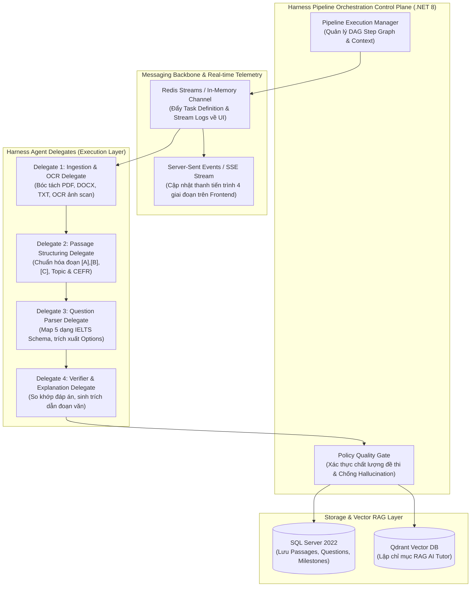

# Kế Hoạch Triển Khai Toàn Diện Sprint 2: Phân Hệ IELTS Reading Đột Phá

> **Phiên bản:** 2.2 (Ứng dụng Kiến trúc Harness Core vào Pipeline Multi-Agent & 6 Lộ Trình Band)  
> **Thời gian dự kiến:** 1.5 tuần  
> **Phân hệ:** IELTS Reading Engine + Harness-Core Multi-Agent Ingestion + Band Roadmaps + Dedicated Vocabulary + RAG AI Tutor

---

## 🎯 1. Tầm Nhìn & 3 Trụ Cột Đột Phá

### 1.1. 🗺️ Trụ Cột 1: Hệ Thống 6 Lộ Trình Riêng Biệt Cho Từng Phân Khúc Band (Pre-IELTS $\rightarrow$ Band 8.5+)

Mỗi phân khúc điểm sở hữu **1 Bản đồ lộ trình độc lập**, **khung kiến thức ngữ pháp/kỹ năng riêng**, và **kho từ vựng chuyên biệt (Dedicated Vocabulary Deck)**:

| Phân Khúc Band | Tên Lộ Trình & Mục Tiêu | Khung Kiến Thức & Kỹ Năng Trọng Tâm | Kho Từ Vựng Chuyên Biệt (Dedicated Vocabulary Deck) | Dạng Đề & Bài Đọc Tiêu Biểu |
| :--- | :--- | :--- | :--- | :--- |
| **Pre-IELTS (Band 0 – 3.5)** | *Essential Foundation (Khởi Động)* | Cấu trúc câu cơ bản (S+V+O), thì ngữ pháp nền tảng, định vị từ khóa danh từ/động từ chính. | **500 từ vựng căn bản A1-A2**: Đời sống hàng ngày, gia đình, sở thích, trường học. | Đoạn văn ngắn 150-250 từ, 4 câu hỏi trắc nghiệm/điền từ đơn giản. |
| **Band 4.0 – 4.5** | *Scanning & Skimming Bootcamp* | Kỹ thuật đọc lướt (Skimming) lấy ý chính, đọc quét (Scanning) ngày tháng/tên riêng/số liệu. | **600 từ vựng B1 cơ bản**: Giáo dục, du lịch, công nghệ đơn giản, cặp từ đồng nghĩa cơ bản. | Bài đọc ngắn 350-450 từ, Multiple Choice (1 đáp án), Short Answer. |
| **Band 5.0 – 5.5** | *TFNG Trap & Paraphrase Anchor* | Phân biệt triệt để **FALSE vs NOT GIVEN**, xử lý cụm từ đồng nghĩa cấp độ B1, cấu trúc đoạn văn. | **800 từ vựng B1 Core**: Môi trường, lối sống đô thị, lịch sử phát minh, bảng Paraphrase bẫy. | Passage 1 chuẩn (600-700 từ), True/False/Not Given, Table/Note Completion. |
| **Band 6.0 – 6.5** | *Matching Headings & Traps Mastery* | Chinh phục **Matching Headings**, bẫy từ khóa bề mặt, Summary Completion có bảng từ, tối ưu < 18m/passage. | **1,000 từ vựng B2 (AWL 1-5)**: Tâm lý học, kinh tế học, năng lượng tái tạo, liên từ tương phản. | Passage 2 chuẩn Cambridge (750-850 từ), Matching Headings, Information, Sentence Completion. |
| **Band 7.0 – 7.5** | *Academic Nuances & Speed Reading* | Câu phức đa mệnh đề, đảo ngữ, bẫy phủ định ngầm (*rarely, fail to*), nhận diện thái độ tác giả (*Sceptical, Critical*). | **1,200 từ vựng C1 (AWL 6-10)**: Khoa học thần kinh, thiên văn học, khảo cổ học, Collocations học thuật C1. | Passage 2 & 3 Cambridge Vol 15-20, Yes/No/Not Given, Matching Features, Multi-select MCQs. |
| **Band 8.0 – 8.5+** | *Philosophical Inferences & 9.0 Master* | Suy luận ngầm định (Implicit Inferences), bài viết trừu tượng triết học, chiến thuật 38-40/40 trong 50 phút. | **1,500 từ vựng C2 tinh hoa**: Gốc từ Hy Lạp/La-tinh (*epistemological, paradigm, dichotomy, ubiquitous*). | Đề thi thật Past Actual Tests cực khó, bài báo từ Nature, Scientific American, The Economist. |

---

### 1.2. ⚡ Trụ Cột 2: Kiến Trúc Harness Core Ứng Dụng Cho Multi-Agent Pipeline & RAG AI Tutor

Dựa trên triết lý cốt lõi của **[Harness Core Execution Engine](https://github.com/harness/harness.git)** (Phân tách Control Plane, Redis Streams Messaging Backbone, Task Delegate Execution, và Policy Quality Gates):



#### 🌟 Các Ưu Điểm Khi Áp Dụng Harness Core Vào Multi-Agent:
1. **Khả Năng Phục Hồi & Tự Động Thử Lại (Resilience & Retry Policies)**: Nếu một Agent LLM bị timeout hoặc parse lỗi format, Harness Engine sẽ tự động kích hoạt Retry với prompt điều chỉnh hoặc fallback model mà không làm crash toàn bộ tiến trình.
2. **Quality Gate (Cổng Kiểm Định Chất Lượng)**: Đề thi sau khi qua 4 Agents phải vượt qua bộ quy tắc Policy Gate (đảm bảo đủ số lượng câu, đáp án nằm trong bài đọc, không có câu hỏi trùng lặp) mới được lưu vào CSDL.
3. **Live Execution Streaming**: Người dùng nhìn thấy từng bước (`1. Parsing Document` $\rightarrow$ `2. Structuring Passages` $\rightarrow$ `3. Extracting 13 Questions` $\rightarrow$ `4. Quality Gate Passed`) nhảy theo thời gian thực trên modal.

---

### 1.3. 📚 Trụ Cột 3: Hỗ Trợ Đầy Đủ Các Kho Đề Thi IELTS Nổi Tiếng

1. 🏛️ **Cambridge IELTS Academic Official Series (Vol 10 – Vol 20)**: Nguồn chuẩn mực vàng chính thức từ ĐH Cambridge.
2. 🏆 **IELTS Past Actual Tests (2020 – 2026)**: Đề thi thật từ hội đồng IDP và British Council toàn cầu.
3. 🌐 **British Council & IDP Official Road to IELTS**: Bộ tài liệu ôn thi chính thức.
4. 📖 **Các Bộ Sách Học Thuật Danh Tiếng**: *Collins English for IELTS*, *IELTS Recent Actual Tests (IOT)*, *Barron's IELTS*, *The Official Cambridge Guide to IELTS*.
5. 🤖 **AI Generative Adaptive Bank**: Kho đề thi tạo sinh liên tục bởi AI theo các chủ đề chuyên sâu.

---

## 🏗️ 2. Cấu Trúc Mã Nguồn Backend (.NET 8 Clean Architecture)

```
backend/src/EduSphere.Infrastructure/
├── HarnessPipeline/
│   ├── Core/
│   │   ├── PipelineExecutionContext.cs     # Lưu trữ trạng thái và artifacts truyền giữa các bước
│   │   ├── IAgentDelegate.cs               # Interface chuẩn hóa cho từng Agent Delegate
│   │   ├── PipelineHarnessEngine.cs        # Bộ điều phối DAG, quản lý Retry & Error Recovery
│   │   └── QualityPolicyGate.cs            # Cổng kiểm duyệt chất lượng đề thi
│   └── Delegates/
│       ├── DocumentIngestionDelegate.cs    # Đọc file PDF, DOCX, TXT
│       ├── PassageStructuringDelegate.cs   # Chia đoạn [A],[B],[C], gán Topic
│       ├── QuestionParserDelegate.cs       # Bóc tách 5 dạng câu hỏi IELTS
│       └── VerificationExplainerDelegate.cs# Kiểm chứng đáp án và sinh lời giải
```
