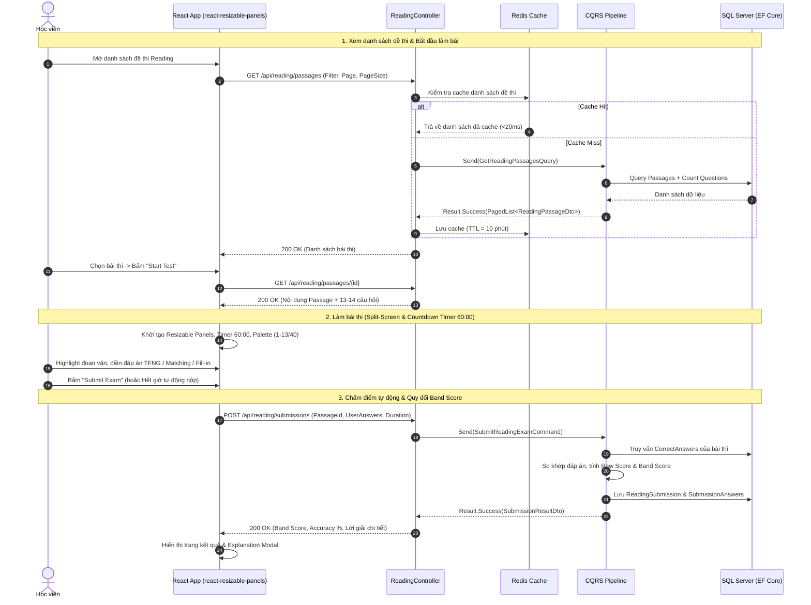

# Sprint 2: Reading Module & Split-View Dynamic Quiz Engine
## Chi Tiết Kế Hoạch Triển Khai Kỹ Thuật (Technical Execution Blueprint)

- **Thời gian thực hiện:** 1 tuần (7 ngày)
- **Mục tiêu cốt lõi:**
  1. **Backend:** Xây dựng trọn vẹn phân hệ **IELTS Reading** với các Entities (`ReadingPassage`, `ReadingQuestion`, `ReadingSubmission`, `ReadingSubmissionAnswer`), thuật toán chấm điểm tự động & quy đổi **Raw Score $\rightarrow$ IELTS Band Score chuẩn (1.0 - 9.0)**, bộ nhớ đệm **Redis Cache-Aside**, và CQRS Handlers.
  2. **Frontend:** Xây dựng màn hình thi mô phỏng chuẩn kỳ thi quốc tế **Computer-delivered IELTS** sử dụng **`react-resizable-panels`** (chia đôi màn hình co giãn mượt mà: văn bản đọc bên trái vs bảng câu hỏi bên phải), bảng ngân hàng đề thi lọc nâng cao với **`@tanstack/react-table`**, đồng hồ đếm ngược 60 phút, Question Palette 1-40, và trang hiển thị kết quả phân tích điểm chi tiết.
- **Trạng thái:** Ready for Execution (Sẵn sàng triển khai)

---

## 1. Kiến Trúc & Sơ Đồ Luồng Làm Bài Thi (Exam Flow & Scoring Lifecycle)



---

## 2. Bảng Quy Đổi Điểm Chuẩn IELTS Reading (Academic)

Hệ thống Backend áp dụng thuật toán chuẩn của Cambridge IELTS:

| Raw Score (trên 40 câu) | Tỷ Lệ % (trên 1 passage ~13-14 câu) | IELTS Band Score |
| :---: | :---: | :---: |
| **39 – 40** | 95% – 100% | **Band 9.0** |
| **37 – 38** | 90% – 94% | **Band 8.5** |
| **35 – 36** | 85% – 89% | **Band 8.0** |
| **33 – 34** | 80% – 84% | **Band 7.5** |
| **30 – 32** | 72% – 79% | **Band 7.0** |
| **27 – 29** | 65% – 71% | **Band 6.5** |
| **23 – 26** | 55% – 64% | **Band 6.0** |
| **19 – 22** | 45% – 54% | **Band 5.5** |
| **15 – 18** | 35% – 44% | **Band 5.0** |
| **< 15** | < 35% | **Band 4.5 hoặc thấp hơn** |

---

## 3. Chi Tiết Các Thành Phần Cần Xây Dựng

### 3.1 Backend (.NET 8 Clean Architecture)

```
backend/
├── src/
│   ├── EduSphere.Domain/
│   │   ├── Entities/
│   │   │   ├── ReadingPassage.cs              # Id, Title, Topic, Difficulty, Content, EstimatedTime
│   │   │   ├── ReadingQuestion.cs             # Id, PassageId, QuestionNumber, QuestionType, Prompt, OptionsJson, CorrectAnswer, Explanation
│   │   │   ├── ReadingSubmission.cs           # Id, UserId, PassageId, RawScore, TotalQuestions, BandScore, DurationSeconds
│   │   │   └── ReadingSubmissionAnswer.cs     # Id, SubmissionId, QuestionId, UserAnswer, IsCorrect
│   │   └── Enums/
│   │       ├── QuestionType.cs                # TrueFalseNotGiven, YesNoNotGiven, MultipleChoice, MatchingHeadings, SummaryCompletion, SentenceCompletion
│   │       └── DifficultyLevel.cs             # Easy, Medium, Hard
│   │
│   ├── EduSphere.Application/
│   │   ├── Common/Interfaces/
│   │   │   ├── IApplicationDbContext.cs       # Đăng ký DbSet<ReadingPassage>, DbSet<ReadingQuestion>, DbSet<ReadingSubmission>
│   │   │   └── IReadingScoringService.cs      # Interface tính điểm & quy đổi Band Score
│   │   └── Features/Reading/
│   │       ├── Models/
│   │       │   ├── ReadingPassageDto.cs       # DTO danh sách bài đọc
│   │       │   ├── ReadingPassageDetailDto.cs # DTO chi tiết kèm câu hỏi
│   │       │   ├── ReadingQuestionDto.cs      # DTO câu hỏi (ẩn CorrectAnswer khi làm bài)
│   │       │   ├── ReadingSubmissionDto.cs    # DTO nộp bài (UserAnswers[])
│   │       │   └── ReadingResultDto.cs        # DTO kết quả (BandScore, CorrectAnswers, Explanations)
│   │       ├── Queries/
│   │       │   ├── GetReadingPassages/        # GetReadingPassagesQuery + Redis Cache
│   │       │   ├── GetReadingPassageById/     # GetReadingPassageByIdQuery + Handler
│   │       │   └── GetReadingSubmissionById/  # GetReadingSubmissionByIdQuery + Handler
│   │       └── Commands/
│   │           └── SubmitReadingExam/         # SubmitReadingExamCommand + Handler + Validator
│   │
│   ├── EduSphere.Infrastructure/
│   │   ├── Data/
│   │   │   ├── Configurations/
│   │   │   │   ├── ReadingPassageConfiguration.cs
│   │   │   │   ├── ReadingQuestionConfiguration.cs
│   │   │   │   └── ReadingSubmissionConfiguration.cs
│   │   │   ├── Migrations/                    # Migration Add_Reading_Module
│   │   │   └── Seeders/                       # ReadingDataSeeder (Bài đọc & câu hỏi chuẩn Cambridge)
│   │   └── Services/
│   │       └── ReadingScoringService.cs       # Cài đặt IReadingScoringService
│   │
│   └── EduSphere.API/
│       └── Controllers/
│           └── ReadingController.cs           # /api/reading/* REST endpoints
│
└── tests/
    └── EduSphere.UnitTests/
        └── Features/Reading/
            ├── ReadingScoringServiceTests.cs  # Test toàn bộ thang điểm 0-40 -> Band 1.0-9.0
            ├── SubmitReadingExamCommandHandlerTests.cs
            └── GetReadingPassagesQueryHandlerTests.cs
```

---

### 3.2 Frontend (React 18 + TypeScript + react-resizable-panels + TanStack Table)

```
frontend/src/features/reading/
├── api/
│   └── readingApi.ts                          # Axios calls (getPassages, getPassageById, submitExam, getSubmissionResult)
├── components/
│   ├── ExamTable.tsx                          # TanStack Table danh sách đề thi với bộ lọc dạng bài & độ khó
│   ├── ReadingWorkspace.tsx                   # react-resizable-panels chứa PassagePanel & QuizPanel
│   ├── PassagePanel.tsx                       # Hiển thị văn bản, đánh dấu đoạn [A], [B], [C], bộ chỉnh cỡ chữ
│   ├── QuestionPalette.tsx                    # Bảng điều hướng câu 1-40 (Trạng thái: Đã làm / Chưa làm / Cờ xem lại)
│   ├── ExamTimer.tsx                          # Đồng hồ đếm ngược 60 phút có âm thanh cảnh báo 5 phút cuối
│   ├── renderers/                             # Bộ Renderers từng dạng câu hỏi IELTS:
│   │   ├── TrueFalseNotGivenRenderer.tsx      # T/F/NG & Y/N/NG radio buttons
│   │   ├── MatchingHeadingsRenderer.tsx       # Dropdown chọn Heading (i, ii, iii, iv...) cho đoạn văn
│   │   ├── MultipleChoiceRenderer.tsx         # Radio / Checkbox A, B, C, D
│   │   └── SummaryCompletionRenderer.tsx      # Điền từ vào ô trống với giới hạn từ (NO MORE THAN TWO WORDS)
│   └── ExplanationModal.tsx                   # Modal hiển thị lời giải chi tiết và trích dẫn đoạn văn chứng minh
├── pages/
│   ├── ReadingListPage.tsx                    # Màn hình danh sách đề thi IELTS Reading
│   ├── ReadingExamPage.tsx                    # Màn hình làm bài thi Split-screen toàn màn hình
│   └── ReadingResultPage.tsx                  # Màn hình báo cáo kết quả & review từng câu hỏi
└── types/
    └── reading.types.ts                       # Type definitions cho Reading module
```

---

## 4. Đặc Tả Chi Tiết API Contracts

### 4.1 `GET /api/reading/passages`
- **Mục đích:** Lấy danh sách bài đọc phân trang có bộ lọc topic và difficulty (Cache trong Redis).
- **Query Params:** `?page=1&pageSize=10&topic=Science&difficulty=Medium&search=computer`
- **Response `200 OK`:**
  ```json
  {
    "items": [
      {
        "id": "7b8f9c12-3456-4789-abcd-0123456789ab",
        "title": "The Secret History of the Antikythera Mechanism",
        "topic": "History & Technology",
        "difficulty": "Hard",
        "estimatedTimeMinutes": 20,
        "totalQuestions": 13,
        "questionTypes": ["MatchingHeadings", "TrueFalseNotGiven", "SummaryCompletion"]
      }
    ],
    "page": 1,
    "pageSize": 10,
    "totalCount": 24,
    "totalPages": 3,
    "hasPreviousPage": false,
    "hasNextPage": true
  }
  ```

---

### 4.2 `GET /api/reading/passages/{id}`
- **Mục đích:** Lấy toàn bộ nội dung bài đọc và danh sách câu hỏi để bắt đầu thi (Ẩn đáp án đúng).
- **Response `200 OK`:**
  ```json
  {
    "id": "7b8f9c12-3456-4789-abcd-0123456789ab",
    "title": "The Secret History of the Antikythera Mechanism",
    "topic": "History & Technology",
    "difficulty": "Hard",
    "estimatedTimeMinutes": 20,
    "content": "### Paragraph A\nIn 1900, sponge divers off the Greek island of Antikythera...",
    "questions": [
      {
        "id": "11111111-2222-3333-4444-555555555555",
        "questionNumber": 1,
        "questionType": "TrueFalseNotGiven",
        "prompt": "The Antikythera Mechanism was discovered by archaeological researchers on land.",
        "options": ["TRUE", "FALSE", "NOT GIVEN"]
      },
      {
        "id": "22222222-3333-4444-5555-666666666666",
        "questionNumber": 2,
        "questionType": "MatchingHeadings",
        "prompt": "Choose the correct heading for Paragraph A",
        "options": ["i. An unexpected undersea discovery", "ii. Modern CT scanning reveals the gears", "iii. The astronomical calendar"]
      }
    ]
  }
  ```

---

### 4.3 `POST /api/reading/submissions`
- **Mục đích:** Nộp bài thi, hệ thống tự động chấm và lưu kết quả.
- **Request Body:**
  ```json
  {
    "passageId": "7b8f9c12-3456-4789-abcd-0123456789ab",
    "durationSeconds": 1045,
    "answers": [
      { "questionId": "11111111-2222-3333-4444-555555555555", "userAnswer": "FALSE" },
      { "questionId": "22222222-3333-4444-5555-666666666666", "userAnswer": "i. An unexpected undersea discovery" }
    ]
  }
  ```
- **Response `200 OK`:**
  ```json
  {
    "submissionId": "8c9d0e1f-4567-489a-bcde-1234567890cd",
    "passageId": "7b8f9c12-3456-4789-abcd-0123456789ab",
    "rawScore": 11,
    "totalQuestions": 13,
    "accuracyPercentage": 84.6,
    "bandScore": 7.5,
    "durationSeconds": 1045,
    "submittedAt": "2026-08-24T01:30:00Z",
    "answers": [
      {
        "questionNumber": 1,
        "userAnswer": "FALSE",
        "correctAnswer": "FALSE",
        "isCorrect": true,
        "explanation": "Paragraph A states sponge divers found it underwater near the island, not archaeologists on land."
      }
    ]
  }
  ```

---

## 5. Phân Rã Kế Hoạch Thực Hiện 7 Ngày (Day-by-Day Plan)

### 📅 Ngày 1: Domain Entities, Enums & EF Core Migrations
- [ ] Xây dựng các Entities: `ReadingPassage.cs`, `ReadingQuestion.cs`, `ReadingSubmission.cs`, `ReadingSubmissionAnswer.cs`.
- [ ] Xây dựng Enums: `QuestionType.cs`, `DifficultyLevel.cs`.
- [ ] Viết Entity Configurations trong `EduSphere.Infrastructure/Data/Configurations/`.
- [ ] Chạy migration `dotnet ef migrations add Add_Reading_Module`.

### 📅 Ngày 2: Scoring Service, Cambridge Seed Data & Redis Caching
- [ ] Xây dựng `IReadingScoringService` và cài đặt `ReadingScoringService`:
  - Thuật toán so khớp đáp án (chuẩn hóa chữ thường, khoảng trắng, dấu câu).
  - Thuật toán quy đổi Raw Score sang IELTS Band Score 1.0 - 9.0.
- [ ] Tạo Seeder nạp 2 đề thi Reading mẫu chuẩn Cambridge (*The Antikythera Mechanism* & *Urban Agriculture*).
- [ ] Cấu hình Redis Cache-Aside cho danh sách và chi tiết bài đọc.

### 📅 Ngày 3: Application CQRS Handlers & ReadingController
- [ ] Xây dựng `GetReadingPassagesQuery` + Handler (hỗ trợ phân trang, lọc, cache).
- [ ] Xây dựng `GetReadingPassageByIdQuery` + Handler.
- [ ] Xây dựng `SubmitReadingExamCommand` + Handler (chấm điểm & lưu submission).
- [ ] Xây dựng `GetReadingSubmissionByIdQuery` + Handler.
- [ ] Xây dựng `ReadingController.cs` trong `EduSphere.API`.
- [ ] Viết bộ Unit Tests `ReadingScoringServiceTests` và Handlers tests.

### 📅 Ngày 4: Frontend TanStack Table & Reading List Explorer
- [ ] Xây dựng `readingApi.ts` trong `frontend/src/features/reading/api/`.
- [ ] Xây dựng `ExamTable.tsx` sử dụng `@tanstack/react-table` (sorting, search, filter theo dạng câu hỏi, badges).
- [ ] Xây dựng `ReadingListPage.tsx` hiển thị thống kê tổng số đề thi và nút "Start Practice".

### 📅 Ngày 5: Frontend Split-Screen Layout với `react-resizable-panels`
- [ ] Xây dựng `ReadingWorkspace.tsx` sử dụng `react-resizable-panels`:
  - Panel trái: `PassagePanel.tsx` (hiển thị văn bản, đánh dấu đoạn [A], [B], [C], thanh công cụ đổi font-size A+/A-).
  - Panel phải: Danh sách các câu hỏi tương ứng.
- [ ] Xây dựng `ExamTimer.tsx` (60 phút, đổi màu đỏ khi < 5 phút) và `QuestionPalette.tsx` (bảng câu 1-40 có cờ xem lại).

### 📅 Ngày 6: Dynamic Question Renderers & Client State
- [ ] Xây dựng `TrueFalseNotGivenRenderer.tsx`.
- [ ] Xây dựng `MatchingHeadingsRenderer.tsx`.
- [ ] Xây dựng `MultipleChoiceRenderer.tsx`.
- [ ] Xây dựng `SummaryCompletionRenderer.tsx` (kiểm soát số từ gõ vào).
- [ ] Xây dựng Dialog xác nhận nộp bài (Hiển thị số câu chưa làm trước khi submit).

### 📅 Ngày 7: Trang Kết Quả, Explanation Modal & E2E Verification
- [ ] Xây dựng `ReadingResultPage.tsx` hiển thị Band Score, Accuracy % và biểu đồ tiến độ.
- [ ] Xây dựng `ExplanationModal.tsx` trích dẫn chính xác đoạn văn chứng minh đáp án đúng.
- [ ] Chạy kiểm thử tự động toàn diện (`dotnet test` & `npm run build`).

---

## 6. Tiêu Chí Nghiệm Thu (Acceptance Criteria)

1. **Giao diện Split-Screen:** Kéo co giãn mượt mà giữa bài đọc và bài làm bằng `react-resizable-panels`; hỗ trợ đổi cỡ chữ và highlight đoạn văn.
2. **Chấm điểm chuẩn xác:** So khớp đáp án chính xác theo quy tắc IELTS và quy đổi ra Band Score (từ 1.0 đến 9.0) không sai lệch.
3. **Question Palette:** Bảng câu hỏi đổi màu trực quan (Xanh: Đã làm, Trắng: Chưa làm, Vàng: Đã cắm cờ xem lại).
4. **Hiệu năng & Cache:** Thời gian tải đề thi từ Redis dưới 50ms; kết quả nộp bài trả về dưới 500ms.
5. **Code Quality:** Đạt 100% test pass trên Backend và không có lỗi TypeScript trên Frontend.
