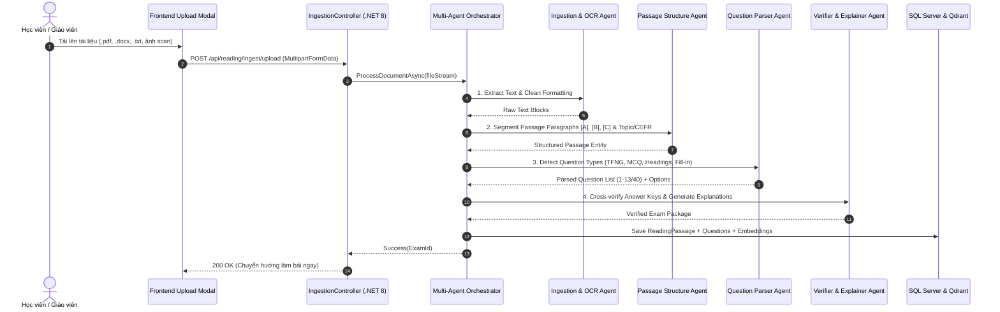

# Sprint 2: Phân Hệ IELTS Reading & Động Cơ Multi-Agent Ingestion + RAG AI Tutor

## 1. Tổng Quan Kiến Trúc & Các Luồng Nghiệp Vụ Chính

Sprint 2 mở rộng phân hệ **IELTS Reading** thành một nền tảng luyện thi toàn diện gồm 4 cấu phần:
1. **Interactive Band Roadmap (Lộ trình chinh phục theo từng Band điểm)**
2. **Multi-Repository Test Vaults (Kho đề hệ thống từ các nguồn nổi tiếng thế giới & Kho đề cá nhân)**
3. **Multi-Agent Document-to-Exam Pipeline (Bộ chuyển đổi tài liệu do người dùng upload thành đề thi tự động)**
4. **In-Exam RAG AI Tutor (Trợ lý AI giải thích, gợi ý phương pháp giải theo thời gian thực)**

---

## 2. Thiết Kế Chi Tiết 3 Trụ Cột

### 2.1. 🗺️ Trụ Cột 1: Lộ Trình Chinh Phục Từng Band (Roadmap Milestones)

```
[Start: Diagnostic Test] 
       │
       ▼
[Milestone 1: Foundation (Band 5.0 - 5.5)]
  ├── Skill: Skimming & Scanning Essentials, Word Forms
  ├── Passages: 4 General Training & Easy Academic Texts
  └── Target: Accuracy ≥ 65% → Unlock Milestone 2 🔓
       │
       ▼
[Milestone 2: Intermediate Competence (Band 6.0 - 6.5)]
  ├── Skill: True/False/Not Given Trap Handling, Sentence Completion
  ├── Passages: 6 Academic Scientific & Historical Passages
  └── Target: Accuracy ≥ 75% → Unlock Milestone 3 🔓
       │
       ▼
[Milestone 3: Advanced Proficiency (Band 7.0 - 7.5)]
  ├── Skill: Matching Headings, Complex Paraphrasing, Speed Reading (< 18m/passage)
  ├── Passages: 8 Cambridge Vol 15-20 Standard Passages
  └── Target: Accuracy ≥ 80% → Unlock Milestone 4 🔓
       │
       ▼
[Milestone 4: Mastery & Native-Level Inferences (Band 8.0 - 9.0)]
  ├── Skill: Abstract & Philosophical Inferences, Sub-text Tone Analysis
  ├── Passages: 10 Past Actual Hard Tests
  └── Target: Accuracy ≥ 90% → Award: Cambridge IELTS Reading Master 🏆
```

---

### 2.2. 📂 Trụ Cột 2: Multi-Agent Document Ingestion Pipeline & RAG AI Tutor

#### A. Multi-Agent Pipeline Kiến Trúc Xử Lý File Upload:


#### B. RAG AI Tutor (Trợ Lý Học Trong Phòng Thi):
- **Cơ chế**: Khi người dùng vào phòng thi, toàn bộ đoạn văn và câu hỏi được lập chỉ mục cục bộ trong bộ nhớ vector (Qdrant / Semantic Kernel Vector Store).
- **Tính năng**:
  - *Chế độ làm bài*: Gợi ý đoạn văn chứa manh mối ("Clue is in Paragraph C, look for synonyms of 'urban biodiversity'").
  - *Chế độ chấm bài*: Phân tích vì sao chọn False thay vì Not Given, bóc tách cấu trúc ngữ pháp phức tạp.

---

### 2.3. 📚 Trụ Cột 3: Danh Mục Các Kho Đề Thi IELTS Nổi Tiếng

Hệ thống cung cấp danh mục lọc phân loại theo nguồn:
1. **Cambridge IELTS Academic (Vol 10 – Vol 20)**: Nguồn chuẩn mực vàng chính thức từ NXB Đại học Cambridge.
2. **IELTS Past Actual Tests (2020 – 2026)**: Tổng hợp các đề thi thật đã từng xuất hiện tại hội đồng thi IDP và British Council toàn cầu.
3. **British Council & IDP Official Road to IELTS**: Bộ tài liệu ôn thi chính thức của 2 đơn vị đồng sở hữu kỳ thi.
4. **Collins English for IELTS (Reading for IELTS)**: Giáo trình phát triển kỹ năng bài bản từ NXB Collins danh tiếng.
5. **IELTS Recent Actual Tests (IOT Collection)**: Ngân hàng đề thi thực chiến phổ biến của cộng đồng IELTS quốc tế.
6. **AI Generative Adaptive Bank**: Kho đề thi tạo sinh liên tục bởi AI theo các chủ đề học thuật chuyên sâu (Biotechnology, Artificial Intelligence, Marine Archeology, Cognitive Psychology).

---

## 3. Database Schema Mở Rộng (EF Core Entities)

```csharp
public enum PassageSourceType
{
    OfficialCambridge = 1,
    PastActualTest = 2,
    BritishCouncilIdp = 3,
    PublisherSeries = 4,
    UserUploaded = 5,
    AIGenerated = 6
}

public class ReadingPassage : BaseEntity
{
    public string Title { get; set; } = string.Empty;
    public string Topic { get; set; } = string.Empty;
    public DifficultyLevel Difficulty { get; set; }
    public string Content { get; set; } = string.Empty;
    public int EstimatedTimeMinutes { get; set; } = 20;

    // Metadata Nguồn & Kho đề
    public PassageSourceType SourceType { get; set; } = PassageSourceType.OfficialCambridge;
    public string CollectionName { get; set; } = "Cambridge IELTS 18"; // e.g. "Past Actual 2025"
    public Guid? UploadedByUserId { get; set; }
    public bool IsCommunityShared { get; set; } = false;

    public ICollection<ReadingQuestion> Questions { get; set; } = new List<ReadingQuestion>();
}

public class ReadingMilestone : BaseEntity
{
    public float TargetBand { get; set; } // 5.0, 6.0, 7.0, 8.0, 9.0
    public int Order { get; set; }
    public string Title { get; set; } = string.Empty;
    public string Description { get; set; } = string.Empty;
    public int RequiredPassagesCount { get; set; } = 5;
    public float MinAccuracyPercentage { get; set; } = 75.0f;
}
```
