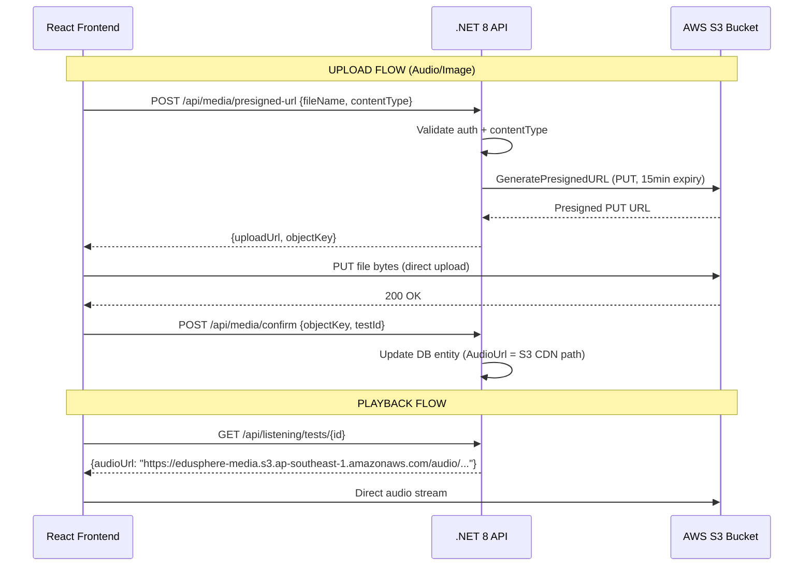

# Kế Hoạch Đại Tu Sprint 3: IELTS Listening — UI/UX Premium + AWS S3 + Advanced AI Features

> **Mục tiêu:** Giải quyết toàn bộ 5 điểm bạn đã nêu, biến phân hệ Listening từ MVP thô sơ thành trải nghiệm phòng thi IELTS **đẳng cấp chuyên nghiệp** với animations "wow", media lưu trữ cloud AWS S3, và các tính năng AI nâng cao.
> **Cam kết:** Chỉ lên kế hoạch — chờ bạn phê duyệt từng phần trước khi viết bất kỳ dòng code nào.

---

## 📋 Tổng Quan 5 Vấn Đề & Giải Pháp

| # | Vấn đề bạn nêu | Giải pháp đề xuất |
| :--- | :--- | :--- |
| 1 | Giao diện rối, bất đồng bộ giữa các Sprint | **Thiết lập Design System chuẩn hoá** (Brand Chrome, Color Tokens, Typography Scale) áp dụng thống nhất toàn bộ app |
| 2 | Phòng thi chưa chuẩn kỳ thi IELTS | **Tái thiết kế Exam Room** theo chuẩn giao diện Computer-Delivered IELTS của British Council/IDP |
| 3 | Features quá cơ bản, chưa tận dụng RAG & Multi-Agent | **Bổ sung 6 tính năng AI nâng cao** (Dictation Mode, Smart Transcript Highlight, AI Difficulty Advisor, ...) |
| 4 | File audio/ảnh đang lưu local `frontend/public/` | **Migrate sang AWS S3** với Presigned URL pattern — backend .NET 8 sinh URL, frontend upload trực tiếp S3 |
| 5 | UI thô xấu, thông tin dày đặc, thiếu animation wow | **Tích hợp Magic UI + Aceternity UI + Motion Primitives + React Bits** — animated cards, glassmorphism, micro-interactions |

---

## 🎨 1. Hệ Thống Thiết Kế Thống Nhất (Design System Overhaul)

### 1.1. Brand Color Palette Chuẩn Hoá

Tuân thủ quy tắc **80/20**: 80% nội dung học thuật (màu trung tính + semantic) / 20% brand chrome (Đỏ + Đen + Trắng).

```
┌─────────────────────────────────────────────────────────────┐
│  EDUSPHERE IELTS COLOR SYSTEM                               │
├─────────────────────────────────────────────────────────────┤
│                                                             │
│  🔴 BRAND CHROME (20% diện tích)                            │
│  ├── Primary Red     #DC2626  → Logo, CTA chính, Active nav │
│  ├── Deep Black      #0F0F0F  → Header text, Exam toolbar   │
│  └── Pure White      #FFFFFF  → Card background, Clean space │
│                                                             │
│  🎯 SEMANTIC COLORS (Phòng thi & Kết quả)                   │
│  ├── Correct Green   #16A34A  → Đáp án đúng, Pass indicator │
│  ├── Incorrect Red   #EF4444  → Đáp án sai, Error states    │
│  ├── Warning Amber   #F59E0B  → Flagged questions, Low time │
│  ├── Info Blue       #2563EB  → Audio active, Focused state  │
│  └── Neutral Slate   #64748B  → Secondary text, Borders     │
│                                                             │
│  🎧 4-SKILL ACCENT COLORS (Sidebar & Dashboard)             │
│  ├── Reading         #0284C7  (Sky Blue)                     │
│  ├── Listening       #7C3AED  (Purple)                       │
│  ├── Writing         #D97706  (Warm Amber)                   │
│  └── Speaking        #059669  (Emerald)                      │
│                                                             │
└─────────────────────────────────────────────────────────────┘
```

### 1.2. Typography Hierarchy
- **Display/Hero:** Plus Jakarta Sans 800 (Extra Bold) — tiêu đề trang, Band Score
- **Heading:** Plus Jakarta Sans 700 (Bold) — Section title, Card title  
- **Body:** Plus Jakarta Sans 400/500 — Nội dung bài thi, transcript
- **Mono:** JetBrains Mono — Countdown timer, Question numbers
- **Bỏ hẳn:** Các `text-xs`, `text-[11px]`, `text-[10px]` quá nhỏ hiện tại → tối thiểu `text-sm` (14px) cho nội dung đọc

### 1.3. Spacing & Layout Principles
- **Breathing Room:** Tăng padding/margin giữa các section. Hiện tại mọi thứ quá "chật", gây cảm giác dày đặc choáng ngợp
- **Visual Hierarchy:** Sử dụng kích thước card không đều (Bento Grid) thay vì grid đều 3 cột phẳng hiện tại
- **Progressive Disclosure:** Ẩn bớt metadata (questionTypes tags, accent badges) vào tooltip hoặc hover state thay vì hiển thị tất cả cùng lúc

---

## 🏛️ 2. Tái Thiết Kế Giao Diện Listening (UI/UX Overhaul)

### 2.1. ListeningListPage — Từ Grid Phẳng → Premium Bento Hub

**Vấn đề hiện tại** (dựa trên screenshot bạn gửi):
- Grid 3 cột đều nhau, mọi card giống hệt nhau → nhàm chán, thiếu điểm nhấn
- Badges "American Accent", "Section 4" quá nhiều màu sắc → loạn mắt
- 4 metric cards phía trên (Exam Structure, Accent Diversity, ...) → thông tin không cần thiết, chiếm diện tích
- Nút "Start Test" màu xanh dương → **nên là Đỏ brand** (Red CTA chính thức)

**Đề xuất mới:**

```
┌──────────────────────────────────────────────────────────┐
│ ┌────────────────────────────────┐  ┌─────────────────┐  │
│ │  📊 YOUR LISTENING PROGRESS   │  │  🎯 BAND TREND  │  │
│ │  Band 6.5 → Target 7.5       │  │  [Recharts Line] │  │
│ │  ████████████░░░ 72%           │  │                 │  │
│ │  12 tests completed            │  │                 │  │
│ └────────────────────────────────┘  └─────────────────┘  │
│                                                          │
│ ┌──────────────────────────────────────────────────────┐  │
│ │  🔍 Search  │ ⏸ Filters (collapsible)  │ Grid/List  │  │
│ └──────────────────────────────────────────────────────┘  │
│                                                          │
│ ┌─────────────┐ ┌─────────────┐ ┌─────────────────────┐  │
│ │ Cambridge   │ │ Cambridge   │ │                     │  │
│ │ IELTS 18    │ │ IELTS 19    │ │   ★ FEATURED       │  │
│ │ Full Test   │ │ Section 4   │ │   Cambridge 17      │  │
│ │             │ │             │ │   Section 1          │  │
│ │  [▶ START]  │ │  [▶ START]  │ │   [▶ START]         │  │
│ │ ⏱30min 40Q  │ │ ⏱8min 10Q  │ │   ⏱6min 10Q        │  │
│ └─────────────┘ └─────────────┘ └─────────────────────┘  │
└──────────────────────────────────────────────────────────┘
```

**Thư viện mới sẽ dùng:**
- **Magic UI Bento Grid** — Layout card không đều, card nổi bật (Full Test) chiếm 2 cột
- **Motion Primitives** — Entrance animation staggered fade-in khi scroll
- **React Bits AnimatedCard** — Hover effect border glow (spotlight)

---

### 2.2. ListeningExamPage — Phòng Thi Chuẩn IELTS Computer-Delivered

**Vấn đề hiện tại:**
- Header quá nhiều thông tin (accent badge, collection name, timer, submit) → choáng
- Audio waveform chiếm 1 dải ngang rộng nhưng không phải là trọng tâm phòng thi
- Khu vực câu hỏi và Palette nằm cạnh nhau nhưng không có phân tách rõ ràng
- Thiếu cảm giác "phòng thi nghiêm túc" — hiện giống 1 form bài tập

**Tham khảo chuẩn Computer-Delivered IELTS (British Council/IDP):**
- Thanh toolbar đen phía trên: Timer, Question Palette, Help
- Khu vực chính chia 2 panel rõ ràng  
- Không có decoration thừa — tập trung tối đa vào nội dung thi

**Đề xuất thiết kế mới:**

```
┌──────────────────────────────────────────────────────────┐
│ 🔲 IELTS LISTENING · Cambridge 18 Test 1     ⏱ 07:52   │ ← Toolbar đen tối giản
│ [← Exit]                         [Finish & Submit ▶]   │
├──────────────────────────────────────────────────────────┤
│                                                          │
│  ┌──────────────────────────────────────────────────┐    │
│  │ ▶ ██████████████████░░░░░░░░  00:08 / 01:22     │    │ ← Audio bar nhỏ gọn hơn
│  │   0.75x  0.8x  [1x]  1.2x  1.5x    🔊 ━━━━━━  │    │
│  └──────────────────────────────────────────────────┘    │
│                                                          │
│  ┌──────────────────────┐  ┌────────────────────────┐    │
│  │                      │  │  QUESTION PALETTE      │    │
│  │  SECTION 4           │  │  ┌─┬─┬─┬─┬─┬─┬─┬─┬─┬─┐│    │
│  │  Academic Lecture     │  │  │31│32│33│34│35│36│37│38│39│40││    │
│  │                      │  │  └─┴─┴─┴─┴─┴─┴─┴─┴─┴─┘│    │
│  │  31. Subsea geo...   │  │                        │    │
│  │  [_______________]   │  │  ─────────────────── │    │
│  │                      │  │  📝 Transcript        │    │
│  │  32. High mineral... │  │  ✏️ Scratchpad        │    │
│  │  [_______________]   │  │                        │    │
│  │                      │  │                        │    │
│  └──────────────────────┘  └────────────────────────┘    │
│                                                          │
└──────────────────────────────────────────────────────────┘
```

**Nguyên tắc thiết kế Exam Room:**
- **Toolbar đen** (`bg-zinc-950`) — nghiêm túc, tập trung, chuyên nghiệp
- **Nền trung tính** (`bg-zinc-100 dark:bg-zinc-950`) — không gây mỏi mắt
- **Input fields** — viền dashed mỏng, focus state đậm hơn (ring-red-500)
- **Timer** — font Mono đỏ nhấp nháy khi < 5 phút (`animate-pulse text-red-600`)
- **Submit button** — Đỏ brand (`bg-red-600 hover:bg-red-700`)

---

### 2.3. ListeningResultPage — Diagnostic Dashboard Premium

**Đề xuất:**
- Band Score hiển thị dạng **animated counter** (0.0 → 6.5 trong 1.5s) bằng Motion Primitives
- Section breakdown dạng **horizontal bar chart** (Recharts) thay vì text thuần
- Câu đúng: nền `bg-emerald-50` viền `border-emerald-200` + icon ✅
- Câu sai: nền `bg-red-50` viền `border-red-200` + icon ❌ + nút "AI Explain"
- **Confetti animation** (`canvas-confetti`) khi đạt Band ≥ 7.0

---

## ☁️ 3. Tích Hợp AWS S3 — Cloud Media Storage

### 3.1. Trạng Thái Hiện Tại

| Loại file | Vị trí hiện tại | Kích thước |
| :--- | :--- | :--- |
| Audio MP3 (4 files) | `frontend/public/audio/` | 1.5MB tổng |
| Diagram Images | Chưa có file thực — field `DiagramImageUrl` trong DB để `null` | N/A |

> [!WARNING]
> Hiện tại audio đang nằm trong `frontend/public/audio/` → được đóng gói vào Vite build bundle → tăng bundle size và không scalable.

### 3.2. Kiến Trúc AWS S3 Đề Xuất



### 3.3. Backend Changes

#### [NEW] `IMediaStorageService.cs`
```csharp
public interface IMediaStorageService
{
    Task<PresignedUploadResult> GenerateUploadUrlAsync(string fileName, string contentType, CancellationToken ct);
    Task<string> GetPublicUrlAsync(string objectKey, CancellationToken ct);
    Task DeleteAsync(string objectKey, CancellationToken ct);
}
```

#### [NEW] `S3MediaStorageService.cs`
- Sử dụng `AWSSDK.S3` NuGet package
- Bucket: `edusphere-media` (hoặc tên bạn chọn)
- Cấu trúc key: `audio/{testId}/{filename}`, `images/{testId}/{filename}`
- Presigned URL expiry: 15 phút
- CloudFront CDN (tùy chọn sau) để tối ưu latency playback audio

#### [NEW] `MediaController.cs`
```
POST /api/media/presigned-url [Authorize]
POST /api/media/confirm       [Authorize]
DELETE /api/media/{objectKey}  [Authorize(Roles = "Admin")]
```

### 3.4. Thông Tin Cần Bạn Cung Cấp

> [!IMPORTANT]
> Để triển khai AWS S3, tôi cần bạn cung cấp:
> 1. **AWS Access Key ID**
> 2. **AWS Secret Access Key**  
> 3. **AWS Region** (ví dụ: `ap-southeast-1` cho Singapore)
> 4. **S3 Bucket Name** (nếu đã tạo, hoặc tôi sẽ hướng dẫn tạo)
> 
> Các key này sẽ được lưu trong file `.env` (đã có trong `.gitignore`) và KHÔNG bao giờ commit lên GitHub.

---

## 🤖 4. Tính Năng AI Nâng Cao Cho Listening (Tận Dụng RAG & Multi-Agent)

### Phân loại theo mức ưu tiên:

### 🔴 Critical — Phải có ngay Sprint 3

| Feature | Mô tả | Thành phần |
| :--- | :--- | :--- |
| **AI Post-Exam Explainer** | Mỗi câu sai có nút "AI Explain" → RAG trích transcript segment + phân tích bẫy đề thi | Backend: `ExplainListeningAnswerCommand` kích hoạt `DeepDiagnosticReviewChain` → Qdrant retrieval transcript → LLM analysis. Frontend: Streaming panel `@assistant-ui/react` |
| **Smart Transcript-Question Linking** | Khi focus câu Q15, transcript tự động highlight đoạn chứa đáp án Q15 (bi-directional) | Frontend: Sử dụng field `LinkedQuestionNumber` đã có trong Domain nhưng chưa dùng |

### 🟠 High — Sprint 3.5 Extension  

| Feature | Mô tả | Thành phần |
| :--- | :--- | :--- |
| **Dictation Mode** | Chế độ luyện nghe chép (Dictation): Audio phát từng câu ngắn, học viên gõ lại → AI so khớp và chấm | Frontend: Chế độ mới trong `ListeningExamPage`, Backend: Sử dụng `ListeningScoringService` + fuzzy matching |
| **AI Difficulty Advisor** | Trước khi bắt đầu test, AI gợi ý bài thi phù hợp dựa trên lịch sử band score | Backend: `GetPersonalizedRecommendationsQuery` → phân tích `ListeningHistory` + band pattern |
| **Accent Strength Analysis** | Sau khi thi xong, AI phân tích: "Bạn yếu nhất với giọng Australian ở Part 3" | Backend: Aggregate accent-wise scores từ `ListeningSubmission` history |

### 🟡 Medium — Sprint 4+ Bridge

| Feature | Mô tả |
| :--- | :--- |
| **Real-time Speech-to-Text Overlay** | Hiển thị live transcript trên audio player như YouTube subtitle (cần Google STT / Whisper API) |
| **Vocabulary Extraction from Transcript** | Cho phép bôi đen từ trong transcript → "Add to SM-2 Flashcard Deck" (bridge sang Sprint 5) |

---

## 🎬 5. Thư Viện UI Animation "WOW" — Mã Nguồn Mở Đề Xuất Tích Hợp

### 5.1. Bảng so sánh thư viện

| Thư viện | URL | Dùng cho | Ưu điểm |
| :--- | :--- | :--- | :--- |
| **Magic UI** | [magicui.design](https://magicui.design) | Bento Grid, Animated Numbers, Shimmer Border | Premium SaaS feel, shadcn-compatible |
| **Aceternity UI** | [ui.aceternity.com](https://ui.aceternity.com) | Aurora backgrounds, Spotlight Cards, 3D effects | High-impact visual "wow" |
| **Motion Primitives** | [motion-primitives.com](https://motion-primitives.com) | Text reveal, Stagger animations, Counter | Lightweight, Framer Motion native |
| **React Bits** | [reactbits.dev](https://reactbits.dev) | Interactive buttons, Animated inputs, Toast | Comprehensive micro-interactions |
| **Animata** | [animata.com](https://animata.com) | Card flip, Skeleton loading, Progress bars | Hand-crafted motion snippets |

### 5.2. Áp dụng cụ thể trong Listening Module

| Vị trí | Effect đề xuất | Thư viện |
| :--- | :--- | :--- |
| **ListeningListPage cards** | Spotlight hover border glow + stagger entrance | Aceternity + Motion Primitives |
| **Band Score display** | Animated number counter (0→6.5 smooth) | Magic UI `AnimatedCounter` |
| **Section completion** | Confetti burst khi hoàn thành 1 Section | `canvas-confetti` (đã có) |
| **Audio progress** | Shimmer gradient trên progress bar | Magic UI `ShimmerBorder` |
| **Question answered** | Micro pulse + check animation | React Bits `AnimatedCheckmark` |
| **Exam timer warning** | Red pulse glow khi < 2 phút | Framer Motion `animate` |
| **Result page** | Trophy card entrance 3D flip | Framer Motion `rotateY` |
| **Loading states** | Skeleton shimmer thay vì spinner | Magic UI `Shimmer` |

### 5.3. Tham Khảo Mã Nguồn Mở IELTS

| Project | URL | Điểm mạnh tham khảo |
| :--- | :--- | :--- |
| **Examinai** | [github.com/lengvietcuong/examinai](https://github.com/lengvietcuong/examinai) | Next.js 16, React 19, shadcn/ui, AI Writing/Speaking — UI/UX hiện đại nhất |
| **ieltstrek** | [github.com/nvtai040502/ieltstrek](https://github.com/nvtai040502/ieltstrek) | Reading/Listening simulation, exam navigation UX |
| **ielts-reading-mock-test** | [github.com/sifu-ewu/ielts-reading-mock-test](https://github.com/sifu-ewu/ielts-reading-mock-test) | React 19, Vite, timer UX, text highlighting, band calculation |

---

## 📐 6. Lộ Trình Triển Khai Đề Xuất

### Phase 1: Design System & Color Overhaul (1–2 ngày)
- [ ] Chuẩn hoá `index.css` color tokens theo bảng màu Brand mới
- [ ] Cập nhật `Sidebar.tsx` — CTA buttons từ xanh → đỏ brand
- [ ] Cập nhật `Layout.tsx`, `Header.tsx` — nhất quán hoá typography
- [ ] Cài đặt Magic UI + Motion Primitives vào project

### Phase 2: ListeningListPage Premium Redesign (2–3 ngày)
- [ ] Loại bỏ 4 metric cards thừa, thay bằng Band Progress Card + Trend Chart
- [ ] Bento Grid layout thay thế grid đều 3 cột
- [ ] Animated entrance stagger + spotlight hover effect trên test cards
- [ ] Nút "Start Test" → Red CTA + hover scale animation
- [ ] Filters thu gọn (collapsible) — mặc định ẩn, click mở ra

### Phase 3: ListeningExamPage — Authentic Exam Room (2–3 ngày)
- [ ] Toolbar đen (`bg-zinc-950`) tối giản: chỉ Exit, Title, Timer, Submit
- [ ] Audio player thu gọn hơn, bỏ bớt visual noise
- [ ] Timer font mono đỏ + pulse animation khi < 5 phút
- [ ] Submit button Red brand + confirmation modal premium
- [ ] Section dividers rõ ràng hơn, question card spacing tăng

### Phase 4: AWS S3 Media Storage Integration (1–2 ngày)
- [ ] Install `AWSSDK.S3` NuGet package
- [ ] Implement `IMediaStorageService` + `S3MediaStorageService`
- [ ] Implement `MediaController` (presigned URL + confirm)
- [ ] Migrate 4 file audio hiện tại lên S3
- [ ] Cập nhật Seeder data AudioUrl trỏ sang S3 CDN URL
- [ ] Frontend: AudioWaveformPlayer nhận URL S3 thay vì local path

### Phase 5: ListeningResultPage + AI Features (2–3 ngày)
- [ ] Animated Band Score counter
- [ ] Section accuracy bar chart (Recharts)
- [ ] Câu đúng/sai color coding (green/red)
- [ ] "AI Explain" button per wrong answer → RAG streaming panel
- [ ] Smart Transcript-Question bi-directional highlighting
- [ ] Confetti celebration khi đạt Band ≥ 7.0

### Phase 6: Cross-Sprint Consistency Audit (1 ngày)
- [ ] Kiểm tra và cập nhật Reading pages để đồng bộ Design System mới
- [ ] Dashboard page cập nhật Listening metrics
- [ ] Xác nhận 100% tiếng Anh trên toàn bộ UI

---

## ❓ Câu Hỏi Cần Bạn Trả Lời Trước Khi Bắt Đầu

1. **AWS S3 Credentials:** Bạn vui lòng cung cấp Access Key ID, Secret Key, Region, và tên Bucket (hoặc xác nhận để tôi hướng dẫn tạo)?

2. **Thứ tự ưu tiên triển khai:** Bạn muốn bắt đầu từ Phase nào trước?
   - **(A)** Design System & Color overhaul trước (nền tảng cho mọi thứ)
   - **(B)** AWS S3 trước (giải quyết vấn đề kỹ thuật media storage)
   - **(C)** Exam Room redesign trước (impact trực quan nhất)

3. **Mức độ animation:** Bạn muốn animation ở mức:
   - **(A)** Tinh tế (micro-interactions nhẹ nhàng, entrance fade-in) — phù hợp phòng thi nghiêm túc
   - **(B)** Ấn tượng (spotlight borders, 3D flip, shimmer) — wow factor cao nhưng phù hợp trang hub/kết quả
   - **(C)** Kết hợp: Phòng thi → tinh tế, Hub/Result → ấn tượng

4. **Thêm dependency mới:** Bạn có đồng ý cài thêm các package sau (tất cả đều miễn phí, MIT license)?
   - `AWSSDK.S3` (NuGet — backend)
   - Các animated components sẽ được **copy-paste source code** (không phải npm package) từ Magic UI / Motion Primitives

Xin mời bạn review kế hoạch và phản hồi để tôi bắt đầu triển khai từng phase!
