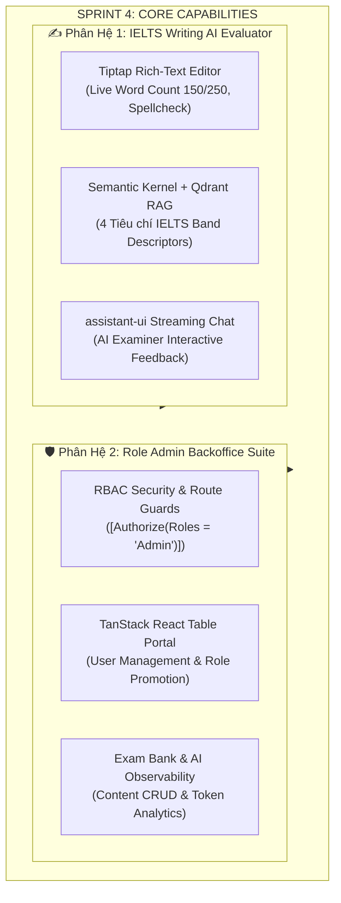

# Kế Hoạch Triển Khai Toàn Diện Sprint 4: IELTS Writing AI Evaluator & Role Admin Backoffice Suite

> **Phiên bản:** 4.0 (Tích hợp Semantic Kernel RAG, Tiptap Live Word Count, `@assistant-ui/react` Streaming Tutor, và Phân Hệ Quản Trị Role Admin)  
> **Thời gian dự kiến:** 1 tuần  
> **Phân hệ:** IELTS Writing AI Engine + RAG Vector Knowledge Base + Backoffice Enterprise Admin Portal + User & Exam Bank Management  

---

## 🎯 1. Tầm Nhìn & Các Trụ Cột Đột Phá



### 1.1. ✍️ Trụ Cột 1: IELTS Writing Rich-Text Workspace (`@tiptap/react`)
- **Môi trường thi mô phỏng chuẩn Computer-Delivered IELTS (CD-IELTS):**
  - Màn hình chia đôi co giãn (`react-resizable-panels`): Bên trái hiển thị đề bài, hình ảnh biểu đồ Task 1 (Line graph, Bar chart, Pie chart, Table, Process, Map) hoặc câu hỏi luận điểm Task 2. Bên phải là trình soạn thảo chuyên dụng.
- **Bộ đếm từ thời gian thực (Real-time Word Counter):**
  - Tích hợp `@tiptap/extension-character-count` tính toán tức thì số lượng từ hợp lệ.
  - Thanh tiến độ trực quan: Cảnh báo màu hổ phách/đỏ khi chưa đạt tối thiểu (150 từ đối với Task 1; 250 từ đối với Task 2) và tự động chuyển sang màu xanh ngọc (Emerald Green) khi đủ chỉ tiêu.
- **Tính năng học thuật hỗ trợ:**
  - Tự động lưu bản nháp vào LocalStorage mỗi 5 giây, bảo vệ thí sinh khỏi rủi ro mất điện hoặc tải lại trang ngoài ý muốn.

### 1.2. 🧠 Trụ Cột 2: Semantic Kernel RAG Engine Chấm Điểm 4 Tiêu Chí IELTS
- **Vector Knowledge Base (Qdrant):**
  - Nạp và nhúng toàn bộ tài liệu **Official Cambridge IELTS Band Descriptors** (Task 1 & Task 2) từ Band 1.0 đến 9.0 vào Qdrant Vector Store.
  - Sử dụng Hybrid Search / Cosine Similarity để trích xuất chính xác tiêu chuẩn chấm khớp với thể loại đề bài và bài nộp của thí sinh.
- **Quy trình chấm điểm 4 tiêu chí cốt lõi:**
  1. **Task Achievement / Task Response (TA/TR):** Đo lường mức độ phản hồi đề bài, tổng quan xu hướng chính (Overview), và dẫn chứng số liệu.
  2. **Coherence and Cohesion (CC):** Đánh giá cấu trúc đoạn văn, mạch lạc ý tưởng và việc sử dụng các từ nối liên kết (Cohesive devices).
  3. **Lexical Resource (LR):** Phân tích độ phong phú của từ vựng, từ học thuật C1/C2, collocations và lỗi chính tả/dùng từ.
  4. **Grammatical Range and Accuracy (GRA):** Đánh giá sự kết hợp câu đơn/câu ghép/câu phức, thì thời và mức độ chính xác của ngữ pháp.
- **Công thức làm tròn Band điểm chuẩn Cambridge:**
  $$\text{Overall Band} = \text{Round}_{0.25/0.75}\left(\frac{\text{TA} + \text{CC} + \text{LR} + \text{GRA}}{4}\right)$$

### 1.3. 💬 Trụ Cột 3: Trợ Lý AI Tương Tác Sâu (`@assistant-ui/react`)
- Sau khi có kết quả chấm điểm, học viên có thể trao đổi trực tiếp với AI Examiner trong giao diện chat streaming thời gian thực.
- Học viên có thể đặt câu hỏi: *"Làm thế nào để nâng tiêu chí Lexical Resource lên Band 7.5?"*, *"Hãy viết lại đoạn Body Paragraph 1 theo phong cách Band 8.0"*.
- Hiển thị so sánh Before/After trực quan (Diff View) giữa câu gốc của thí sinh và câu văn được AI nâng cấp.

### 1.4. 🛡️ Trụ Cột 4: Role Admin & Phân Quyền Bảo Mật (RBAC)
- **Bảo mật đa tầng:**
  - Backend: Toàn bộ controller và endpoint quản trị được bảo vệ bởi thuộc tính `[Authorize(Roles = "Admin")]`.
  - Frontend: `AdminRoute.tsx` chặn điều hướng của học viên thông thường (`Student`), tự động chuyển hướng về `/dashboard` kèm thông báo cảnh báo.
- **Dynamic Navigation:**
  - Sidebar tự động hiển thị nhóm chức năng "Administration" chỉ khi người dùng hiện tại có vai trò `Admin`.

### 1.5. 📊 Trụ Cột 5: Backoffice Management Suite (`@tanstack/react-table` + `recharts`)
- **Quản lý học viên (User Management):**
  - Bảng dữ liệu người dùng hiệu năng cao: Tìm kiếm theo tên/email, lọc theo vai trò (`Student` / `Admin`), sắp xếp theo ngày đăng ký.
  - Phân quyền động: Thăng cấp học viên thành Quản trị viên (Promote to Admin) hoặc giáng cấp (Demote to Student).
  - Khóa/mở khóa tài khoản người dùng vi phạm.
- **Quản lý ngân hàng đề thi (Exam Bank Management):**
  - Giao diện tập trung quản lý đề thi cho cả 3 kỹ năng: Reading Passages, Listening Tests, Writing Prompts.
  - Hỗ trợ thêm mới đề Writing Task 1 (tải lên biểu đồ) và Task 2 (chủ đề, câu hỏi, bài văn mẫu Band 8+).
- **Giám sát hệ thống & AI (System Observability):**
  - Thống kê số lượng bài nộp theo thời gian, điểm thi trung bình theo kỹ năng.
  - Theo dõi mức độ tiêu thụ Token và chi phí của AI Scoring Engine.

---

## 🏗️ 2. Cấu Trúc Mã Nguồn

### 2.1. Backend (.NET 8 Clean Architecture)

```
backend/src/
├── EduSphere.Domain/
│   ├── Entities/
│   │   ├── WritingPrompt.cs              # Đề thi Writing (Task 1 / Task 2, Topic, Hình ảnh, Bài mẫu)
│   │   ├── WritingSubmission.cs          # Bài nộp (Content, WordCount, 4 Điểm tiêu chí, Feedback JSON)
│   │   └── User.cs                       # Bổ sung domain methods: UpdateRole, SetActiveStatus
│   └── Enums/
│       ├── WritingTaskType.cs            # Task1, Task2
│       └── WritingEvaluationStatus.cs    # Pending, Evaluating, Completed, Failed
│
├── EduSphere.Infrastructure/
│   ├── Data/
│   │   ├── Configurations/
│   │   │   └── WritingConfigurations.cs  # EF Core mapping cho WritingPrompt & WritingSubmission
│   │   ├── Seeders/
│   │   │   ├── WritingDataSeeder.cs      # Khởi tạo đề thi mẫu Cambridge 18 & Band 8.5 Model Answers
│   │   │   └── AdminUserSeeder.cs        # Khởi tạo tài khoản Quản trị mặc định (admin@edusphere.io)
│   │   └── Migrations/                   # Migration EF Core Add_Writing_And_Admin_Features
│   └── Services/
│       ├── SemanticKernelWritingScorer.cs# Dịch vụ chấm bài Writing sử dụng Microsoft Semantic Kernel
│       └── QdrantBandDescriptorService.cs# Dịch vụ truy vấn RAG tiêu chí chấm điểm từ Qdrant
│
├── EduSphere.Application/
│   ├── Common/Interfaces/
│   │   ├── IWritingScorerService.cs      # Interface chấm điểm Writing
│   │   └── IQdrantKnowledgeBase.cs       # Interface truy vấn Vector Store
│   └── Features/
│       ├── Writing/                      # CQRS cho phân hệ Writing
│       │   ├── Queries/
│       │   │   ├── GetWritingPrompts/    # Lấy danh sách đề thi Writing (Lọc Task 1 / Task 2)
│       │   │   ├── GetWritingPromptById/ # Chi tiết đề thi & biểu đồ đính kèm
│       │   │   └── GetWritingSubmissionById/ # Chi tiết kết quả chấm điểm & radar chart data
│       │   └── Commands/
│       │       ├── SubmitWritingForEvaluation/ # Nộp bài & kích hoạt AI Scorer
│       │       └── ChatWithWritingAiTutor/     # Luồng chat hỏi đáp tương tác qua SSE
│       └── Admin/                        # CQRS cho phân hệ Quản trị viên (Role Admin)
│           ├── Queries/
│           │   ├── GetAdminDashboardStats/     # Thống kê KPI hệ thống & AI Token usage
│           │   ├── GetUsersPaged/              # Danh sách người dùng phân trang cho TanStack Table
│           │   ├── GetUserDetailById/          # Chi tiết hồ sơ và lịch sử làm bài thi
│           │   └── GetAdminExamBankOverview/   # Thống kê tổng số bài thi 3 kỹ năng
│           └── Commands/
│               ├── UpdateUserRole/             # Cập nhật vai trò (Student <-> Admin)
│               ├── ToggleUserStatus/           # Khóa / Mở khóa tài khoản học viên
│               ├── CreateWritingPrompt/        # Thêm mới đề thi Writing
│               ├── UpdateWritingPrompt/        # Chỉnh sửa đề thi Writing
│               └── DeleteWritingPrompt/        # Xóa đề thi Writing
│
└── EduSphere.API/
    └── Controllers/
        ├── WritingController.cs          # Endpoints cho học viên luyện Writing
        ├── AdminDashboardController.cs   # [Authorize(Roles = "Admin")] - KPIs & Observability
        ├── AdminUsersController.cs       # [Authorize(Roles = "Admin")] - Quản lý học viên
        └── AdminContentController.cs     # [Authorize(Roles = "Admin")] - Quản lý ngân hàng đề thi
```

### 2.2. Frontend (React 19 + TypeScript + Tiptap + Assistant-UI + TanStack Table)

```
frontend/src/
├── features/
│   ├── writing/                          # Phân hệ IELTS Writing AI
│   │   ├── api/
│   │   │   └── writingApi.ts             # REST client gọi API Writing
│   │   ├── types/
│   │   │   └── writing.types.ts          # Type definitions cho Prompt, Submission, Scorecard
│   │   ├── components/
│   │   │   ├── WritingWorkspace.tsx      # Split-screen layout (react-resizable-panels)
│   │   │   ├── WritingEditor.tsx         # Tiptap Editor + Live Word Count Progress Bar
│   │   │   ├── WritingPromptViewer.tsx   # Hiển thị câu hỏi & biểu đồ Task 1
│   │   │   ├── WritingScorecard.tsx      # Bảng điểm 4 tiêu chí + Before/After Diff
│   │   │   ├── WritingRadarChart.tsx     # Biểu đồ Radar 4 tiêu chí (Recharts)
│   │   │   └── WritingAITutorChat.tsx    # Giao diện chat streaming @assistant-ui/react
│   │   └── pages/
│   │       ├── WritingListPage.tsx       # Khám phá ngân hàng đề Writing Task 1 & Task 2
│   │       ├── WritingExamPage.tsx       # Môi trường làm bài thi Writing tập trung
│   │       └── WritingResultPage.tsx     # Trang kết quả chấm điểm & phân tích AI
│   │
│   └── admin/                            # Phân hệ Quản trị Role Admin
│       ├── api/
│       │   └── adminApi.ts               # REST client cho các API /api/admin/*
│       ├── types/
│       │   └── admin.types.ts            # Type definitions cho User Table, Stats, Exam Bank
│       ├── components/
│       │   ├── AdminStatCard.tsx         # Thẻ hiển thị chỉ số KPI
│       │   ├── UserManagementTable.tsx   # TanStack Data Table với filter/sort/pagination
│       │   ├── UserRoleChangeModal.tsx   # Modal xác nhận nâng/hạ quyền hạn
│       │   ├── ExamBankList.tsx          # Danh sách quản lý đề thi Reading/Listening/Writing
│       │   └── CreateWritingPromptModal.tsx # Modal thêm đề thi Writing mới
│       └── pages/
│           ├── AdminDashboardPage.tsx    # Dashboard tổng quan chỉ số hệ thống
│           ├── AdminUsersPage.tsx        # Quản lý học viên
│           └── AdminExamBankPage.tsx     # Quản lý ngân hàng đề thi 3 kỹ năng
│
└── shared/
    ├── components/
    │   ├── AdminRoute.tsx                # Guard kiểm tra quyền Admin
    │   └── Sidebar.tsx                   # Bổ sung menu Quản trị viên
    └── lib/
        └── axios.ts                      # Đảm bảo Bearer Token đính kèm mọi request
```

---

## 🗄️ 3. Thiết Kế Thực Thể & Cơ Sở Dữ Liệu (Domain Models)

### 3.1. Thực Thể `WritingPrompt`
```csharp
public class WritingPrompt : BaseEntity
{
    public WritingTaskType TaskType { get; private set; } // Task1, Task2
    public string Title { get; private set; } = string.Empty;
    public string Topic { get; private set; } = string.Empty;
    public string PromptText { get; private set; } = string.Empty;
    public string? ImageUrl { get; private set; } // Dành cho biểu đồ Task 1
    public int RecommendedTimeMinutes { get; private set; } // 20 min (Task 1) | 40 min (Task 2)
    public int MinWordCount { get; private set; } // 150 (Task 1) | 250 (Task 2)
    public string? SampleBand8Answer { get; private set; }
    public bool IsActive { get; private set; } = true;

    // Constructors & Domain methods...
}
```

### 3.2. Thực Thể `WritingSubmission`
```csharp
public class WritingSubmission : BaseEntity
{
    public Guid UserId { get; private set; }
    public Guid PromptId { get; private set; }
    public string Content { get; private set; } = string.Empty;
    public int WordCount { get; private set; }
    public int TimeSpentSeconds { get; private set; }

    // Điểm số 4 tiêu chí chuẩn IELTS (Thang điểm 0.0 - 9.0)
    public float TaskAchievementScore { get; private set; }
    public float CoherenceCohesionScore { get; private set; }
    public float LexicalResourceScore { get; private set; }
    public float GrammaticalRangeScore { get; private set; }
    public float OverallBandScore { get; private set; }

    // JSON chi tiết lưu trữ nhận xét, lỗi câu và gợi ý nâng band
    public string CriteriaBreakdownJson { get; private set; } = string.Empty;
    public string GrammarErrorsJson { get; private set; } = string.Empty;
    public string VocabularySuggestionsJson { get; private set; } = string.Empty;
    public WritingEvaluationStatus Status { get; private set; }

    // Navigation properties...
}
```

### 3.3. Mở Rộng Thực Thể `User`
```csharp
public class User : BaseEntity
{
    // Các thuộc tính sẵn có từ Sprint 1...
    public UserRole Role { get; private set; } = UserRole.Student;
    public bool IsActive { get; private set; } = true;

    // Bổ sung Domain Methods cho Admin Management
    public void UpdateRole(UserRole newRole)
    {
        Role = newRole;
        UpdatedAt = DateTime.UtcNow;
    }

    public void ToggleActiveStatus(bool isActive)
    {
        IsActive = isActive;
        UpdatedAt = DateTime.UtcNow;
    }
}
```

---

## 🔌 4. Đặc Tả REST API

### 4.1. Phân Hệ Writing
| Phương thức | Đường dẫn | Quyền hạn | Mục đích |
| :--- | :--- | :--- | :--- |
| `GET` | `/api/writing/prompts` | `Student, Admin` | Lấy danh sách đề thi (hỗ trợ lọc Task 1 / Task 2) |
| `GET` | `/api/writing/prompts/{id}` | `Student, Admin` | Xem chi tiết đề bài thi và biểu đồ đính kèm |
| `POST` | `/api/writing/submissions` | `Student, Admin` | Nộp bài luận và nhận kết quả chấm điểm AI |
| `GET` | `/api/writing/submissions/{id}` | `Student, Admin` | Lấy kết quả bài thi chi tiết và bảng điểm 4 tiêu chí |
| `POST` | `/api/writing/submissions/{id}/chat`| `Student, Admin` | Trò chuyện streaming với AI Examiner về bài viết |

### 4.2. Phân Hệ Role Admin
| Phương thức | Đường dẫn | Quyền hạn | Mục đích |
| :--- | :--- | :--- | :--- |
| `GET` | `/api/admin/dashboard/stats` | `Admin` | Thống kê số liệu người dùng, bài thi, và token AI |
| `GET` | `/api/admin/users` | `Admin` | Danh sách học viên phân trang, tìm kiếm, lọc vai trò |
| `GET` | `/api/admin/users/{id}` | `Admin` | Xem chi tiết hồ sơ và lịch sử làm bài của học viên |
| `PUT` | `/api/admin/users/{id}/role` | `Admin` | Cập nhật vai trò (`Student` $\leftrightarrow$ `Admin`) |
| `PATCH`| `/api/admin/users/{id}/status` | `Admin` | Khóa hoặc kích hoạt lại tài khoản người dùng |
| `GET` | `/api/admin/exam-bank/overview` | `Admin` | Thống kê số lượng đề thi của 3 kỹ năng |
| `POST`| `/api/admin/writing/prompts` | `Admin` | Tạo mới đề thi Writing Task 1 hoặc Task 2 |
| `PUT` | `/api/admin/writing/prompts/{id}` | `Admin` | Chỉnh sửa nội dung đề thi hoặc bài văn mẫu |
| `DELETE`| `/api/admin/writing/prompts/{id}`| `Admin` | Xóa đề thi khỏi ngân hàng đề |

---

## 🎨 5. Thiết Kế Giao Diện Frontend (100% English Academic Standard)

### 5.1. IELTS Writing Workspace (`WritingWorkspace.tsx`)
- **Header:**
  - Tên đề thi, phân loại `Task 1: Academic Report` hoặc `Task 2: Academic Essay`.
  - Đồng hồ đếm ngược thông minh (20 phút / 40 phút).
  - Nút nộp bài `Submit Essay for AI Evaluation` (Chỉ kích hoạt khi số từ đạt chuẩn tối thiểu).
- **Split Panels:**
  - **Left Panel (Question & Prompt):** Hiển thị văn bản đề thi chuẩn Cambridge, khung phóng to biểu đồ (Zoom Modal) cho Task 1, danh mục các điểm cần lưu ý.
  - **Right Panel (Tiptap Rich-Text Editor):**
    - Thanh công cụ định dạng học thuật cơ bản (Bold, Italic, Bullet points).
    - Bộ đếm từ nổi (Floating Word Counter): `Word count: 265 / 250 words` kèm thanh tiến độ màu xanh ngọc.
- **Scorecard Modal & Radar Chart:**
  - Hiển thị Overall Band (ví dụ: `Band 7.5`).
  - Radar Chart 4 đỉnh tương ứng với 4 tiêu chí.
  - Tabs chi tiết: `Task Response`, `Coherence & Cohesion`, `Lexical Resource`, `Grammatical Range`.
  - Tab `AI Grammar Inspector`: Highlight câu sai ngữ pháp và nút nhấn xem `Band 8.0 Paraphrased Version`.

### 5.2. Admin Portal (`UserManagementPage.tsx` & `AdminDashboardPage.tsx`)
- **Admin Dashboard:**
  - 4 Cards chỉ số: `Total Learners`, `Total Exams Submitted`, `Average System Band`, `AI Token Consumption`.
  - Biểu đồ đường thể hiện số bài thi nộp mỗi ngày trong 30 ngày gần nhất.
- **User Management Table:**
  - Cột: `Learner Name`, `Email Address`, `Current Role` (Badge: Student / Admin), `Target Band`, `Joined Date`, `Actions`.
  - Bộ lọc: Ô tìm kiếm tức thì theo tên/email, dropdown lọc theo Role.
  - Action Dropdown: `Promote to Admin` / `Demote to Student`, `View Submissions`, `Deactivate Account`.

---

## 📅 6. Lộ Trình Triển Khai Chi Tiết (Milestones)

| Giai Đoạn | Nội Dung Công Việc Chính | Mục Tiêu Nghiệm Thu |
| :--- | :--- | :--- |
| **Phase 1: Backend Domain & EF Core** | - Tạo entities `WritingPrompt`, `WritingSubmission`.<br>- Bổ sung domain methods vào `User`.<br>- Tạo cấu hình Fluent API và EF Core Migration.<br>- Seed dữ liệu đề thi mẫu và tài khoản Admin mặc định. | Migration chạy thành công; Database có bảng đề thi Writing và tài khoản Admin. |
| **Phase 2: RAG & Semantic Kernel** | - Nhúng bộ tiêu chuẩn IELTS Band Descriptors vào Qdrant.<br>- Xây dựng dịch vụ `SemanticKernelWritingScorer` với structured prompt output JSON.<br>- Viết Unit Tests kiểm tra thuật toán tính Band Score. | AI chấm điểm trả về đúng cấu trúc 4 tiêu chí; Unit test đạt 100% Pass. |
| **Phase 3: CQRS & Admin Endpoints** | - Hoàn thành các Query và Command cho Writing.<br>- Hoàn thành các Query và Command cho Role Admin.<br>- Cấu hình bảo mật `[Authorize(Roles = "Admin")]`. | Các endpoint API hoạt động chuẩn xác qua Swagger với đầy đủ xác thực JWT. |
| **Phase 4: Frontend Writing AI** | - Tích hợp `react-resizable-panels` và Tiptap editor.<br>- Xây dựng Live Word Count và thanh tiến độ chuẩn.<br>- Xây dựng Scorecard 4 tiêu chí, Recharts Radar và `@assistant-ui/react` chat. | Học viên có thể gõ bài viết, nộp bài, nhận điểm và chat hỏi đáp với AI Examiner. |
| **Phase 5: Frontend Admin Portal** | - Tạo `AdminRoute` và tích hợp menu Admin vào `Sidebar`.<br>- Xây dựng trang Admin Dashboard với biểu đồ KPI.<br>- Xây dựng trang User Management với `@tanstack/react-table`.<br>- Xây dựng modal quản lý ngân hàng đề thi. | Admin có thể quản trị học viên, đổi quyền hạn, và theo dõi hệ thống mượt mà. |
| **Phase 6: Kiểm Thử & Tối Ưu** | - Chạy toàn bộ Unit Tests backend và frontend build validation.<br>- Đảm bảo 100% ngôn ngữ giao diện là Tiếng Anh học thuật. | Hệ thống chạy trơn tru, không có lỗi runtime hay vi phạm bảo mật. |

---

## 🎯 7. Tiêu Chí Hoàn Thành Nghiệm Thu (Definition of Done)

1. **Writing AI Module:**
   - [ ] Trình soạn thảo Tiptap phản hồi gõ chữ tức thì, không giật lag.
   - [ ] Bộ đếm từ chính xác 100%, có cảnh báo trực quan khi chưa đủ 150/250 từ.
   - [ ] AI trả về bảng điểm đầy đủ 4 tiêu chí trong thời gian dưới 5 giây.
   - [ ] Chatbot AI tương tác sâu hoạt động streaming ổn định qua `@assistant-ui/react`.
2. **Role Admin Module:**
   - [ ] Học viên thường (`Student`) bị chặn 100% khi truy cập trang `/admin/*` hoặc gọi API Admin (HTTP 403 Forbidden).
   - [ ] Admin có thể tìm kiếm, phân trang và thay đổi vai trò của người dùng qua giao diện TanStack Table.
   - [ ] Admin có thể tạo mới, chỉnh sửa đề thi Writing Task 1/Task 2.
   - [ ] Toàn bộ UI tuân thủ chuẩn tiếng Anh học thuật Cambridge (100% English Standard).
