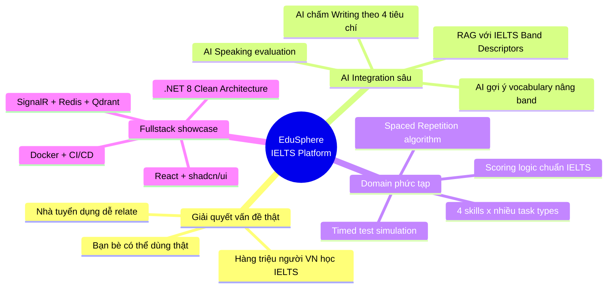
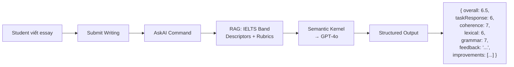
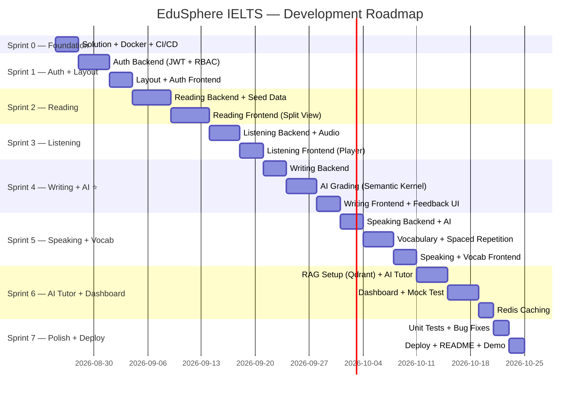
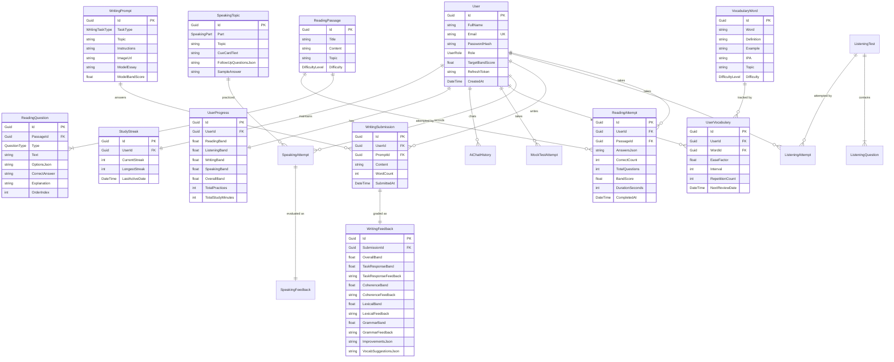
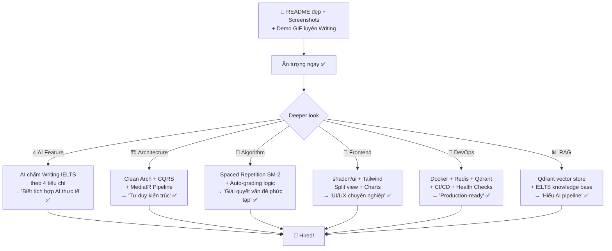

# Kế Hoạch Triển Khai EduSphere — IELTS Prep Platform

> **EduSphere** — AI-Powered IELTS Preparation Platform
> 
> Nền tảng luyện thi IELTS thông minh với AI chấm Writing, luyện 4 kỹ năng, và Vocabulary Builder.

---

## Tại Sao IELTS Platform Gây Ấn Tượng?



---

## Tech Stack

### Backend (.NET 8)

| Công nghệ | Package | Vai trò |
|---|---|---|
| **ASP.NET Core 8** | — | Web API |
| **MediatR** | `MediatR` | CQRS |
| **FluentValidation** | `FluentValidation.DependencyInjectionExtensions` | Validation |
| **EF Core 8** | `Microsoft.EntityFrameworkCore.SqlServer` | ORM |
| **SQL Server** | — | Database |
| **Redis** | `Microsoft.Extensions.Caching.StackExchangeRedis` | Caching |
| **Semantic Kernel** | `Microsoft.SemanticKernel` | AI Orchestration |
| **Qdrant** | `Microsoft.SemanticKernel.Connectors.Qdrant` | Vector Store (RAG) |
| **SignalR** | Built-in | Real-time |
| **Serilog** | `Serilog.AspNetCore` | Logging |
| **xUnit + Moq** | `xunit`, `Moq` | Testing |
| **Mapster** | `Mapster` | Mapping |
| **Swagger** | `Swashbuckle.AspNetCore` | API Docs |

### Frontend (React + TypeScript)

| Công nghệ | Package | Vai trò |
|---|---|---|
| **React 18+** (Vite) | `react`, `vite` | UI Framework |
| **TypeScript** (strict) | `typescript` | Type safety |
| **Tailwind CSS v4** | `tailwindcss`, `@tailwindcss/vite` | Styling |
| **shadcn/ui** | `npx shadcn@latest` | Component library |
| **TanStack Query** | `@tanstack/react-query` | Server state |
| **React Router v6** | `react-router-dom` | Routing |
| **Recharts** | `recharts` | Charts (band score, progress) |
| **SignalR Client** | `@microsoft/signalr` | Real-time |
| **React Markdown** | `react-markdown` | Render AI feedback |
| **Lucide React** | `lucide-react` | Icons |
| **React Timer Hook** | `react-timer-hook` | Countdown timer |

### Infrastructure

```yaml
# docker-compose.yml
services:
  api:
    build: ./src/EduSphere.API
    ports: ["5000:8080"]
    depends_on: [sqlserver, redis, qdrant]
    environment:
      - ConnectionStrings__DefaultConnection=Server=sqlserver;Database=EduSphere;...
      - ConnectionStrings__Redis=redis:6379
      - Qdrant__Endpoint=http://qdrant:6334
      - OpenAI__ApiKey=${OPENAI_API_KEY}

  client:
    build: ./client
    ports: ["3000:3000"]

  sqlserver:
    image: mcr.microsoft.com/mssql/server:2022-latest
    ports: ["1433:1433"]
    environment:
      SA_PASSWORD: "EduSphere@2026!"
      ACCEPT_EULA: "Y"
    volumes: [sqlserver-data:/var/opt/mssql]

  redis:
    image: redis:7-alpine
    ports: ["6379:6379"]
    volumes: [redis-data:/data]

  qdrant:
    image: qdrant/qdrant:latest
    ports: ["6333:6333", "6334:6334"]
    volumes: [qdrant-data:/qdrant/storage]

volumes:
  sqlserver-data:
  redis-data:
  qdrant-data:
```

---

## Features Theo 4 Skills IELTS

### ✍️ WRITING — ⭐ Star Feature (AI Grading)

> [!IMPORTANT]
> Đây là feature **giá trị nhất** — AI chấm bài Writing theo đúng 4 tiêu chí IELTS là điều khiến project nổi bật hoàn toàn.

#### Task Types:
- **Task 1 (Academic)**: Mô tả biểu đồ, bảng, quy trình (≥150 words)
- **Task 2**: Essay về topic cho trước (≥250 words)

#### Features:

| Feature | Mô tả | Kỹ năng showcase |
|---|---|---|
| **Writing Editor** | Rich text editor, word count real-time, timer | Frontend state management |
| **AI Band Score** | Chấm theo 4 tiêu chí: Task Response, Coherence & Cohesion, Lexical Resource, Grammatical Range | Semantic Kernel, structured output |
| **Detailed Feedback** | AI highlight lỗi, gợi ý cải thiện cho từng tiêu chí | Prompt engineering |
| **Vocabulary Suggestions** | AI gợi ý từ/cụm từ academic thay thế để nâng band | RAG + NLP |
| **Essay History** | Track band score theo thời gian, so sánh essays | Data visualization |
| **Model Answers** | Xem sample essays band 6/7/8/9 cho mỗi prompt | Content seeding |

#### AI Grading Flow:



#### AI Prompt Strategy (RAG):
```
System: You are an expert IELTS examiner. Grade this essay using official 
IELTS Band Descriptors provided below. Return structured JSON.

[RAG Context: IELTS Band Descriptors for Writing Task 2]

Student's Essay: {essay}
Task Prompt: {prompt}

Respond in JSON format:
{
  "overallBand": number,
  "taskResponse": { "band": number, "feedback": "..." },
  "coherenceCohesion": { "band": number, "feedback": "..." },
  "lexicalResource": { "band": number, "feedback": "...", "suggestions": [...] },
  "grammaticalRange": { "band": number, "feedback": "...", "corrections": [...] },
  "improvements": ["..."]
}
```

---

### 📖 READING

#### Task Types (chuẩn IELTS):
- True / False / Not Given
- Yes / No / Not Given
- Multiple Choice
- Matching Headings
- Matching Information
- Sentence Completion
- Summary Completion
- Short Answer Questions

#### Features:

| Feature | Mô tả |
|---|---|
| **Passage Viewer** | Đoạn văn bên trái, câu hỏi bên phải (split view) |
| **Timed Mode** | 20 phút / passage (countdown timer) |
| **Practice Mode** | Không giới hạn thời gian, có hints |
| **Auto Scoring** | Submit → tính điểm tự động |
| **Explanation** | Sau submit → hiện giải thích cho từng câu, highlight đáp án trong passage |
| **Vocab Highlight** | Click từ khó → popup nghĩa + phát âm + thêm vào flashcard |
| **Difficulty Filter** | Filter theo band level (5-6, 6-7, 7-8, 8-9) |
| **AI Generate** | AI tạo Reading passage + câu hỏi từ topic (nâng cao) |

---

### 🎧 LISTENING

#### Task Types (chuẩn IELTS):
- Multiple Choice
- Matching
- Plan/Map/Diagram Labelling
- Form/Note/Table Completion
- Sentence Completion

#### Features:

| Feature | Mô tả |
|---|---|
| **Audio Player** | Play/Pause, progress bar, speed control (0.75x, 1x, 1.25x) |
| **Section-based** | 4 sections như thi thật (Part 1-4) |
| **Timed Mode** | Nghe 1 lần (như thi thật) hoặc Practice (replay được) |
| **Auto Scoring** | Submit → tính điểm |
| **Transcript** | Hiện transcript sau khi submit, highlight đáp án |
| **Note-taking** | Notepad bên cạnh khi nghe |

> [!NOTE]
> Audio files sẽ dùng static files hoặc cloud storage. Seed data ban đầu cần chuẩn bị ~10-15 listening tests.

---

### 🗣️ SPEAKING

#### Parts (chuẩn IELTS):
- **Part 1**: Introduction & Interview (4-5 phút)
- **Part 2**: Long Turn / Cue Card (3-4 phút, 1 phút prep + 2 phút nói)
- **Part 3**: Discussion (4-5 phút)

#### Features:

| Feature | Mô tả | Độ phức tạp |
|---|---|---|
| **Topic Bank** | Danh sách topics Part 1/2/3 theo category | Easy |
| **Cue Card Generator** | Hiện cue card + 1 phút timer chuẩn bị | Easy |
| **Sample Answers** | Model answers cho từng topic (text) | Easy |
| **AI Text Practice** | Gõ câu trả lời → AI đánh giá fluency, vocabulary, grammar | Medium |
| **Voice Recording** | Record audio → Web Speech API transcript → AI evaluate | Medium-Hard |
| **AI Conversation** | AI hỏi follow-up questions như examiner thật | Medium |

#### AI Speaking Evaluation:
```
Input: User's answer (text hoặc transcript từ audio)
Output: {
  "fluencyCoherence": { "band": 6, "feedback": "..." },
  "lexicalResource": { "band": 7, "feedback": "..." },
  "grammaticalRange": { "band": 6, "feedback": "..." },
  "pronunciation": { "band": 6, "feedback": "..." },  // chỉ khi có audio
  "sampleAnswer": "..."
}
```

---

## Features Bổ Trợ

### 📊 Dashboard IELTS

```
┌─────────────────────────────────────────────────────────┐
│  EduSphere Dashboard                          👤 Tam    │
├────────────┬────────────────────────────────────────────┤
│            │  🎯 Target: 7.0    📈 Current: 6.0        │
│  Sidebar   │                                            │
│            │  ┌────────┬────────┬────────┬────────┐     │
│ 📊 Dashboard│  │ Listen │ Read  │ Write  │ Speak  │     │
│ 📖 Reading │  │  5.5   │  6.5  │  6.0   │  5.5   │     │
│ 🎧 Listening│  └────────┴────────┴────────┴────────┘     │
│ ✍️ Writing │                                            │
│ 🗣️ Speaking│  ┌──────────────────────────────────────┐  │
│ 📝 Vocab   │  │   Radar Chart (4 skills)             │  │
│ 📋 Mock Test│  │        Listening                     │  │
│ 🤖 AI Tutor│  │       /    \                          │  │
│ ⚙️ Settings│  │  Speaking --- Reading                 │  │
│            │  │       \    /                          │  │
│            │  │        Writing                        │  │
│            │  └──────────────────────────────────────┘  │
│            │                                            │
│            │  ┌──────────────────────────────────────┐  │
│            │  │  Band Score Progress (Line Chart)     │  │
│            │  │  📈 6.0 → 6.5 → 6.5 → 7.0           │  │
│            │  └──────────────────────────────────────┘  │
│            │                                            │
│            │  🔥 Study Streak: 12 days                  │
│            │  📚 This week: 15 practices               │
│            │  ⏱️ Total study time: 24h                  │
└────────────┴────────────────────────────────────────────┘
```

### 📝 Vocabulary Builder

| Feature | Mô tả |
|---|---|
| **Flashcards** | Front: English word → Back: definition + example + IPA |
| **Spaced Repetition** (SM-2) | Algorithm tự động lên lịch ôn tập dựa trên mức độ nhớ |
| **Topic Collections** | Environment, Education, Technology, Health, Crime... |
| **IELTS Word Lists** | Academic Word List, high-frequency IELTS words |
| **Add from Reading** | Click từ trong Reading passage → thêm vào flashcard |
| **Quiz Mode** | Ôn vocab theo dạng quiz (chọn đáp án, điền từ) |
| **AI Synonym Suggest** | AI gợi ý synonyms/collocations nâng band |

#### Spaced Repetition (SM-2 Algorithm):
```csharp
// Mỗi vocabulary card có: EaseFactor, Interval, RepetitionCount
public class SpacedRepetitionService
{
    public ReviewResult CalculateNext(VocabularyCard card, int quality)
    {
        // quality: 0-5 (0=complete blackout, 5=perfect recall)
        if (quality >= 3) // correct
        {
            card.Interval = card.RepetitionCount switch
            {
                0 => 1,      // 1 day
                1 => 6,      // 6 days
                _ => (int)(card.Interval * card.EaseFactor)
            };
            card.RepetitionCount++;
        }
        else // incorrect → reset
        {
            card.RepetitionCount = 0;
            card.Interval = 1;
        }
        
        card.EaseFactor = Math.Max(1.3, 
            card.EaseFactor + (0.1 - (5 - quality) * (0.08 + (5 - quality) * 0.02)));
        card.NextReviewDate = DateTime.UtcNow.AddDays(card.Interval);
        
        return new ReviewResult(card);
    }
}
```

### 📋 Mock Test

| Feature | Mô tả |
|---|---|
| **Full Test** | Listening (30 min) + Reading (60 min) + Writing (60 min) |
| **Mini Test** | 1 skill, timed |
| **Score Report** | Phân tích chi tiết sau thi, band score estimation |
| **History** | Lịch sử mock tests + band score trend |

### 🤖 AI Tutor (RAG)

RAG knowledge base chứa:
- **IELTS Band Descriptors** (chính thức từ British Council)
- **Common mistakes** theo band level
- **Writing templates** & strategies
- **Collocations database**
- **Speaking topic guides**

User hỏi AI bất cứ gì về IELTS → RAG tìm context phù hợp → GPT-4o trả lời chính xác.

---

## Cấu Trúc Project

### Backend — Clean Architecture

```
EduSphere.sln
│
src/
├── EduSphere.Domain/
│   ├── Entities/
│   │   ├── User.cs
│   │   ├── UserProgress.cs              # Overall band scores per skill
│   │   ├── StudyStreak.cs               # Gamification
│   │   │
│   │   ├── Reading/
│   │   │   ├── ReadingPassage.cs         # Title, Content, Difficulty, Topic
│   │   │   ├── ReadingQuestion.cs        # QuestionType, Text, Options, Answer
│   │   │   └── ReadingAttempt.cs         # UserId, PassageId, Answers, Score, Duration
│   │   │
│   │   ├── Listening/
│   │   │   ├── ListeningTest.cs          # Title, AudioUrl, Difficulty, Sections
│   │   │   ├── ListeningQuestion.cs      # Section, QuestionType, Text, Answer
│   │   │   └── ListeningAttempt.cs       # UserId, TestId, Answers, Score
│   │   │
│   │   ├── Writing/
│   │   │   ├── WritingPrompt.cs          # TaskType (1/2), Topic, Instructions, ModelEssay
│   │   │   ├── WritingSubmission.cs      # UserId, PromptId, Content, WordCount, SubmittedAt
│   │   │   └── WritingFeedback.cs        # SubmissionId, OverallBand, 4 criteria bands, Feedback
│   │   │
│   │   ├── Speaking/
│   │   │   ├── SpeakingTopic.cs          # Part (1/2/3), Topic, CueCard, FollowUpQuestions
│   │   │   ├── SpeakingAttempt.cs        # UserId, TopicId, UserAnswer, AudioUrl
│   │   │   └── SpeakingFeedback.cs       # AttemptId, 4 criteria bands, SampleAnswer
│   │   │
│   │   ├── Vocabulary/
│   │   │   ├── VocabularyWord.cs         # Word, Definition, Example, IPA, Topic, Difficulty
│   │   │   └── UserVocabulary.cs         # UserId, WordId, EaseFactor, Interval, NextReview
│   │   │
│   │   ├── MockTest/
│   │   │   ├── MockTest.cs              # Type (Full/Mini), Skills included
│   │   │   └── MockTestAttempt.cs       # UserId, Scores per skill, OverallBand
│   │   │
│   │   └── AiChat/
│   │       └── AiChatHistory.cs          # UserId, Question, Answer, CreatedAt
│   │
│   ├── Enums/
│   │   ├── SkillType.cs                 # Reading, Listening, Writing, Speaking
│   │   ├── QuestionType.cs              # TFNG, MultipleChoice, Matching, Completion...
│   │   ├── WritingTaskType.cs           # Task1, Task2
│   │   ├── SpeakingPart.cs              # Part1, Part2, Part3
│   │   ├── DifficultyLevel.cs           # Band5_6, Band6_7, Band7_8, Band8_9
│   │   └── UserRole.cs                  # Student, Admin
│   │
│   ├── ValueObjects/
│   │   ├── Email.cs
│   │   ├── BandScore.cs                 # Validation: 0-9, step 0.5
│   │   └── WritingCriteriaScore.cs      # 4 criteria scores
│   │
│   └── Common/
│       └── BaseEntity.cs
│
├── EduSphere.Application/
│   ├── Common/
│   │   ├── Interfaces/
│   │   │   ├── IApplicationDbContext.cs
│   │   │   ├── IJwtService.cs
│   │   │   ├── IAiGradingService.cs      # AI Writing/Speaking grading
│   │   │   ├── IAiTutorService.cs        # RAG chatbot
│   │   │   ├── ICacheService.cs          # Redis
│   │   │   ├── IVectorStoreService.cs    # Qdrant
│   │   │   └── IFileStorageService.cs    # Audio files
│   │   ├── Behaviors/
│   │   │   ├── ValidationBehavior.cs
│   │   │   └── LoggingBehavior.cs
│   │   └── Models/
│   │       ├── Result.cs
│   │       └── PagedList.cs
│   │
│   ├── Features/
│   │   ├── Auth/
│   │   │   ├── Commands/Register/
│   │   │   ├── Commands/Login/
│   │   │   └── Queries/GetProfile/
│   │   │
│   │   ├── Reading/
│   │   │   ├── Queries/GetPassages/           # List + filter + pagination + Redis cache
│   │   │   ├── Queries/GetPassageDetail/      # Passage + questions
│   │   │   ├── Commands/SubmitReading/        # Auto-grade, save attempt
│   │   │   └── Queries/GetReadingHistory/     # Past attempts + scores
│   │   │
│   │   ├── Listening/
│   │   │   ├── Queries/GetTests/
│   │   │   ├── Queries/GetTestDetail/
│   │   │   ├── Commands/SubmitListening/
│   │   │   └── Queries/GetListeningHistory/
│   │   │
│   │   ├── Writing/
│   │   │   ├── Queries/GetPrompts/
│   │   │   ├── Commands/SubmitWriting/        # Save essay → trigger AI grading
│   │   │   ├── Commands/GradeWriting/         # AI grading (Semantic Kernel)
│   │   │   ├── Queries/GetWritingHistory/
│   │   │   └── Queries/GetWritingFeedback/
│   │   │
│   │   ├── Speaking/
│   │   │   ├── Queries/GetTopics/
│   │   │   ├── Commands/SubmitSpeaking/       # Text/Audio → AI evaluate
│   │   │   ├── Commands/GradeSpeaking/
│   │   │   └── Queries/GetSpeakingHistory/
│   │   │
│   │   ├── Vocabulary/
│   │   │   ├── Queries/GetDueCards/           # Cards cần ôn hôm nay (spaced repetition)
│   │   │   ├── Commands/ReviewCard/           # SM-2 algorithm update
│   │   │   ├── Commands/AddToCollection/      # Thêm từ vào flashcard
│   │   │   └── Queries/GetCollections/        # Word lists by topic
│   │   │
│   │   ├── MockTest/
│   │   │   ├── Commands/StartMockTest/
│   │   │   ├── Commands/SubmitMockTest/
│   │   │   └── Queries/GetMockTestResults/
│   │   │
│   │   ├── Dashboard/
│   │   │   ├── Queries/GetDashboard/          # Overall stats, streak, progress
│   │   │   └── Queries/GetSkillProgress/      # Band score trend per skill
│   │   │
│   │   └── AiTutor/
│   │       ├── Commands/AskQuestion/          # RAG-powered Q&A
│   │       ├── Commands/SuggestVocab/         # AI suggest synonyms
│   │       └── Queries/GetChatHistory/
│   │
│   └── DependencyInjection.cs
│
├── EduSphere.Infrastructure/
│   ├── Data/
│   │   ├── ApplicationDbContext.cs
│   │   ├── Configurations/                    # Fluent API per entity
│   │   ├── Migrations/
│   │   └── Seeders/
│   │       ├── ReadingSeeder.cs               # 10-15 reading passages
│   │       ├── ListeningSeeder.cs             # 5-10 listening tests
│   │       ├── WritingPromptSeeder.cs          # 20+ writing prompts
│   │       ├── SpeakingTopicSeeder.cs          # 30+ speaking topics
│   │       └── VocabularySeeder.cs             # 500+ IELTS words
│   ├── Services/
│   │   ├── JwtService.cs
│   │   ├── AiGradingService.cs                # Semantic Kernel → Writing/Speaking grading
│   │   ├── AiTutorService.cs                  # RAG chatbot
│   │   ├── VectorStoreService.cs              # Qdrant
│   │   ├── CacheService.cs                    # Redis
│   │   ├── SpacedRepetitionService.cs         # SM-2 algorithm
│   │   └── FileStorageService.cs              # Audio files
│   └── DependencyInjection.cs
│
├── EduSphere.API/
│   ├── Controllers/
│   │   ├── AuthController.cs
│   │   ├── ReadingController.cs
│   │   ├── ListeningController.cs
│   │   ├── WritingController.cs
│   │   ├── SpeakingController.cs
│   │   ├── VocabularyController.cs
│   │   ├── MockTestController.cs
│   │   ├── DashboardController.cs
│   │   └── AiTutorController.cs
│   ├── Hubs/
│   │   └── NotificationHub.cs
│   ├── Middleware/
│   │   └── ExceptionHandlingMiddleware.cs
│   ├── Program.cs
│   └── Dockerfile
│
└── EduSphere.Shared/
    ├── DTOs/
    └── Constants/

tests/
├── EduSphere.UnitTests/
│   ├── Features/Writing/GradeWritingHandlerTests.cs
│   ├── Features/Reading/SubmitReadingHandlerTests.cs
│   ├── Features/Vocabulary/SpacedRepetitionTests.cs
│   └── Features/Auth/RegisterHandlerTests.cs
└── EduSphere.IntegrationTests/
```

### Frontend — Feature-based (React + shadcn/ui)

```
client/
├── src/
│   ├── app/
│   │   ├── App.tsx
│   │   ├── Router.tsx
│   │   └── providers.tsx
│   ├── components/ui/                     # shadcn/ui (auto-generated)
│   ├── features/
│   │   ├── auth/
│   │   │   ├── components/LoginForm.tsx
│   │   │   ├── components/RegisterForm.tsx
│   │   │   └── pages/LoginPage.tsx
│   │   ├── dashboard/
│   │   │   ├── components/SkillRadarChart.tsx
│   │   │   ├── components/BandScoreTrend.tsx
│   │   │   ├── components/StudyStreak.tsx
│   │   │   ├── components/SkillCards.tsx
│   │   │   └── pages/DashboardPage.tsx
│   │   ├── reading/
│   │   │   ├── components/PassageViewer.tsx      # Split view: passage | questions
│   │   │   ├── components/QuestionRenderer.tsx   # Render theo QuestionType
│   │   │   ├── components/Timer.tsx
│   │   │   ├── components/ResultsView.tsx
│   │   │   └── pages/ReadingPracticePage.tsx
│   │   ├── listening/
│   │   │   ├── components/AudioPlayer.tsx
│   │   │   ├── components/NotepadPanel.tsx
│   │   │   └── pages/ListeningPracticePage.tsx
│   │   ├── writing/
│   │   │   ├── components/WritingEditor.tsx       # Text area + word count
│   │   │   ├── components/FeedbackPanel.tsx       # AI feedback display
│   │   │   ├── components/BandScoreCard.tsx       # 4 criteria visual
│   │   │   ├── components/EssayComparison.tsx     # So sánh với model essay
│   │   │   └── pages/WritingPracticePage.tsx
│   │   ├── speaking/
│   │   │   ├── components/CueCard.tsx
│   │   │   ├── components/TopicList.tsx
│   │   │   ├── components/AnswerInput.tsx         # Text hoặc voice
│   │   │   └── pages/SpeakingPracticePage.tsx
│   │   ├── vocabulary/
│   │   │   ├── components/Flashcard.tsx           # Flip animation
│   │   │   ├── components/ReviewSession.tsx
│   │   │   ├── components/CollectionGrid.tsx
│   │   │   └── pages/VocabularyPage.tsx
│   │   ├── mock-test/
│   │   │   ├── components/TestTimer.tsx
│   │   │   └── pages/MockTestPage.tsx
│   │   └── ai-tutor/
│   │       ├── components/ChatInterface.tsx
│   │       ├── components/MessageBubble.tsx
│   │       └── pages/AiTutorPage.tsx
│   ├── shared/
│   │   ├── components/
│   │   │   ├── Layout.tsx                # Sidebar + Header
│   │   │   ├── ProtectedRoute.tsx
│   │   │   └── ThemeToggle.tsx           # Dark/Light
│   │   ├── hooks/
│   │   │   ├── useAuth.ts
│   │   │   ├── useTimer.ts
│   │   │   └── useDebounce.ts
│   │   ├── lib/
│   │   │   ├── axios.ts
│   │   │   └── utils.ts
│   │   └── types/
│   ├── index.css
│   └── main.tsx
├── components.json
├── package.json
├── tsconfig.json
└── vite.config.ts
```

---

## Lộ Trình — 8 Sprint (9 tuần)



---

## Chi Tiết Từng Sprint

### 🏗️ Sprint 0: Foundation (3 ngày)

| Task | Output |
|------|--------|
| .NET 8 Solution | 5 projects: Domain, Application, Infrastructure, API, Shared |
| Docker Compose | SQL Server + Redis + Qdrant chạy |
| GitHub Actions | Build + Test CI pipeline |
| Serilog + Exception Middleware | Structured logging, consistent error responses |
| Health Checks | `/health` (DB + Redis + Qdrant) |
| Swagger | JWT auth support trong Swagger UI |

**🎯**: *"Production-grade foundation từ ngày đầu"*

---

### 🔐 Sprint 1: Auth + Base Layout (1 tuần)

#### Backend:
| Endpoint | Mô tả |
|----------|-------|
| `POST /api/auth/register` | Register (Student/Admin) |
| `POST /api/auth/login` | Login → JWT + Refresh Token |
| `POST /api/auth/refresh-token` | Refresh token rotation |
| `GET /api/auth/me` | Get profile |
| `PUT /api/auth/profile` | Update target band score |

#### Frontend:
- Login/Register pages (shadcn Form + Card)
- Base Layout: Sidebar navigation (6 skills + Dashboard + AI Tutor)
- Auth Context + Protected Routes
- Dark/Light theme toggle
- Responsive sidebar (collapsible trên mobile)

**🎯**: *"JWT auth hoàn chỉnh + modern UI layout"*

---

### 📖 Sprint 2: Reading Practice (1.5 tuần)

#### Backend:
| Endpoint | Mô tả |
|----------|-------|
| `GET /api/reading/passages` | List passages (filter: difficulty, topic) |
| `GET /api/reading/passages/{id}` | Passage + Questions |
| `POST /api/reading/passages/{id}/submit` | Submit answers → auto-grade → save attempt |
| `GET /api/reading/history` | Past attempts + scores |

#### Seed Data:
- 10-15 reading passages với đa dạng question types
- Cover topics: Environment, Technology, Education, Health, History

#### Frontend:
- **Split View**: Passage (scrollable, left) | Questions (right)
- Question components render theo type (TFNG, MCQ, Matching, Completion)
- Countdown timer (20 min)
- Submit → Results view với explanations + score
- Click từ khó → popup dictionary

**🎯**: *"Complex UI với split view, dynamic question rendering, timed mode, auto-grading logic"*

---

### 🎧 Sprint 3: Listening Practice (1 tuần)

#### Backend:
| Endpoint | Mô tả |
|----------|-------|
| `GET /api/listening/tests` | List tests |
| `GET /api/listening/tests/{id}` | Test + Questions + Audio URL |
| `POST /api/listening/tests/{id}/submit` | Submit → auto-grade |
| `GET /api/listening/history` | Past attempts |

#### Frontend:
- Custom Audio Player (Play/Pause, progress, speed control)
- Questions bên dưới audio player
- Notepad panel (ghi chú khi nghe)
- Results + Transcript hiện sau submit

**🎯**: *"Audio handling, custom media player, multi-section test flow"*

---

### ✍️ Sprint 4: Writing + AI Grading ⭐ (1.5 tuần)

> [!IMPORTANT]
> Sprint quan trọng nhất. AI grading là feature tạo sự khác biệt.

#### Backend:
| Endpoint | Mô tả |
|----------|-------|
| `GET /api/writing/prompts` | List prompts (Task 1 / Task 2) |
| `POST /api/writing/submit` | Submit essay → AI grade |
| `GET /api/writing/submissions/{id}/feedback` | Get AI feedback |
| `GET /api/writing/history` | Past submissions + band trends |

#### AI Grading Implementation:
```csharp
public class GradeWritingCommandHandler
{
    private readonly Kernel _kernel;
    
    public async Task<WritingFeedback> Handle(GradeWritingCommand request, ...)
    {
        var prompt = $"""
            You are a certified IELTS examiner. Grade this IELTS Writing {request.TaskType} essay.
            
            Task Prompt: {request.Prompt}
            Student's Essay: {request.Essay}
            Word Count: {request.WordCount}
            
            Grade using official IELTS Band Descriptors:
            {bandDescriptorsContext}  // RAG từ Qdrant
            
            Return JSON:
            {{
              "overallBand": 6.5,
              "taskResponse": {{ "band": 6, "feedback": "..." }},
              "coherenceCohesion": {{ "band": 7, "feedback": "..." }},
              "lexicalResource": {{ "band": 6, "feedback": "...", "suggestions": [...] }},
              "grammaticalRange": {{ "band": 7, "feedback": "...", "corrections": [...] }},
              "improvements": ["tip1", "tip2", "tip3"]
            }}
            """;
        
        var result = await _kernel.InvokeAsync<string>(prompt);
        return JsonSerializer.Deserialize<WritingFeedback>(result);
    }
}
```

#### Frontend:
- Writing Editor (textarea + real-time word count + timer)
- Submit → loading animation → Feedback Panel
- **Band Score Visualization**: 4 bars cho 4 tiêu chí (animated)
- Detailed feedback per criteria (accordion/tabs)
- Vocabulary suggestions (highlight + alternatives)
- Essay History page với band score trend chart

**🎯**: *"AI integration production-grade: structured output parsing, RAG cho IELTS rubrics, beautiful feedback UI"*

---

### 🗣️ Sprint 5: Speaking + Vocabulary (1.5 tuần)

#### Speaking:
| Endpoint | Mô tả |
|----------|-------|
| `GET /api/speaking/topics` | Topics by Part (1/2/3) |
| `GET /api/speaking/topics/{id}` | Topic + Cue Card + Follow-ups |
| `POST /api/speaking/submit` | Text answer → AI evaluate |
| `GET /api/speaking/history` | Past attempts |

- Cue Card display + 1-min prep timer + 2-min answer timer
- Text input mode (MVP) + optional voice recording (Web Speech API)
- AI feedback cho Fluency, Lexical, Grammar
- Sample answers comparison

#### Vocabulary:
| Endpoint | Mô tả |
|----------|-------|
| `GET /api/vocabulary/due` | Cards cần ôn hôm nay |
| `POST /api/vocabulary/review` | SM-2 update |
| `POST /api/vocabulary/add` | Thêm từ mới |
| `GET /api/vocabulary/collections` | Word lists by topic |

- Flashcard UI với flip animation (CSS 3D transform)
- Review session: Show front → user đánh giá (Again/Hard/Good/Easy)
- Collection grid theo IELTS topics
- Spaced Repetition algorithm (SM-2)

**🎯**: *"Spaced Repetition algorithm implementation, CSS animations, multi-modal input (text + voice)"*

---

### 🤖 Sprint 6: AI Tutor + Dashboard + Mock Test + Redis (1.5 tuần)

#### AI Tutor (RAG):
- Index IELTS materials vào Qdrant (band descriptors, tips, common mistakes)
- Chat interface: user hỏi → RAG search → GPT-4o answer (streaming)
- Suggested questions: "How to write Task 2 introduction?", "Tips for Listening Part 4"

#### Dashboard:
- Skill Radar Chart (4 skills, Recharts)
- Band Score Trend (Line chart over time)
- Study Streak (🔥 consecutive days)
- Recent Activity feed
- Target vs Current band display

#### Mock Test:
- Start test → Reading (60min) → Writing (60min) → Submit all
- Score report card
- Mock test history

#### Redis Caching:
- Cache reading passages list, listening tests list
- Cache vocabulary collections
- Cache dashboard stats (TTL: 2 min)
- Cache invalidation on data changes

**🎯**: *"RAG pipeline, data visualization, caching strategy, gamification"*

---

### 🚀 Sprint 7: Testing + Polish + Deploy (4 ngày)

| Task | Details |
|------|---------|
| **Unit Tests** | ≥15 tests: Writing grading, Reading scoring, SM-2 algorithm, Auth |
| **Responsive** | Mobile + Tablet + Desktop check |
| **Dark Mode** | Consistent across all pages |
| **Deploy** | Azure/Railway/Render — live URL |
| **Seed Data** | Đủ content để demo (passages, prompts, topics, vocab) |
| **README** | Architecture diagram, screenshots, demo GIF, getting started |

---

## ERD



---

## Portfolio Impact

Khi nhà tuyển dụng mở project:



---

## API Endpoints Tổng Hợp

| Module | Method | Endpoint | Auth |
|--------|--------|----------|------|
| **Auth** | POST | `/api/auth/register` | Public |
| | POST | `/api/auth/login` | Public |
| | POST | `/api/auth/refresh-token` | Public |
| | GET | `/api/auth/me` | 🔒 |
| **Reading** | GET | `/api/reading/passages` | 🔒 |
| | GET | `/api/reading/passages/{id}` | 🔒 |
| | POST | `/api/reading/passages/{id}/submit` | 🔒 |
| | GET | `/api/reading/history` | 🔒 |
| **Listening** | GET | `/api/listening/tests` | 🔒 |
| | GET | `/api/listening/tests/{id}` | 🔒 |
| | POST | `/api/listening/tests/{id}/submit` | 🔒 |
| | GET | `/api/listening/history` | 🔒 |
| **Writing** | GET | `/api/writing/prompts` | 🔒 |
| | POST | `/api/writing/submit` | 🔒 |
| | GET | `/api/writing/submissions/{id}/feedback` | 🔒 |
| | GET | `/api/writing/history` | 🔒 |
| **Speaking** | GET | `/api/speaking/topics` | 🔒 |
| | POST | `/api/speaking/submit` | 🔒 |
| | GET | `/api/speaking/history` | 🔒 |
| **Vocabulary** | GET | `/api/vocabulary/due` | 🔒 |
| | POST | `/api/vocabulary/review` | 🔒 |
| | POST | `/api/vocabulary/add` | 🔒 |
| | GET | `/api/vocabulary/collections` | 🔒 |
| **Mock Test** | POST | `/api/mock-test/start` | 🔒 |
| | POST | `/api/mock-test/submit` | 🔒 |
| | GET | `/api/mock-test/results` | 🔒 |
| **Dashboard** | GET | `/api/dashboard` | 🔒 |
| | GET | `/api/dashboard/skill-progress` | 🔒 |
| **AI Tutor** | POST | `/api/ai-tutor/ask` | 🔒 |
| | GET | `/api/ai-tutor/history` | 🔒 |

---

## User Review Required

> [!IMPORTANT]
> ### Confirm để bắt đầu:
> 1. **OpenAI API Key** — Bạn đã có chưa? (Cần cho Sprint 4-6). Nếu chưa, Sprint 4 sẽ dùng mock AI response trước.
> 2. **Deploy target** — Azure (free tier) / Railway / Render?
> 3. **Listening audio** — Dùng audio files có sẵn từ internet (creative commons) hay tự record?
> 4. **Sẵn sàng bắt đầu Sprint 0?**

> [!TIP]
> **Seed Data quan trọng**: Project IELTS cần content thật (passages, prompts, topics, vocab) để demo convincing. Mình sẽ chuẩn bị seed data IELTS-realistic cho mỗi Sprint.
