# 🧠 EduSphere RAG Architecture (Retrieval-Augmented Generation Engine)

Phân hệ **RAG (Retrieval-Augmented Generation)** chịu trách nhiệm cung cấp năng lực **Trợ lý AI thông minh trong phòng thi (Reading AI Tutor)**, **Bộ chấm điểm Writing & Speaking chuẩn Cambridge**, và **Bộ lập chỉ mục kiến thức chuyên sâu (Vector Indexing & Hybrid Retrieval)**.

---

## 🏛️ Cấu Trúc Thư Mục `rag/`:

```
rag/
├── README.md                          # Tài liệu kiến trúc & Đặc tả kỹ thuật RAG Engine
│
├── vector_stores/                     # Bộ chuyển đổi & kết nối Vector Database
│   ├── QdrantVectorStore.cs           # Kết nối Qdrant Vector DB (Docker port 6333)
│   ├── InMemoryVectorStore.cs         # Vector store cục bộ cho unit tests & dev nhanh
│   └── VectorStoreFactory.cs          # Factory khởi tạo Vector Store động theo môi trường
│
├── embeddings/                        # Bộ sinh Vector Embeddings
│   ├── IEmbeddingGenerator.cs         # Interface chuẩn hóa cho mô hình Embedding
│   ├── OpenAIEmbeddingGenerator.cs    # OpenAI text-embedding-3-small (1536 dims)
│   └── GeminiEmbeddingGenerator.cs    # Google Gemini text-embedding-004 (768 dims)
│
├── indexing/                          # Bộ phân tách & lập chỉ mục văn bản (Chunking & Indexing)
│   ├── IELTSPassageChunker.cs         # Phân đoạn giữ nguyên định dạng đoạn [A], [B], [C]
│   ├── QuestionContextIndexer.cs      # Lập chỉ mục câu hỏi, phương án & giải thích
│   └── RubricBandIndexer.cs           # Lập chỉ mục tiêu chí chấm điểm IELTS chính thức
│
├── retrievers/                        # Bộ truy xuất dữ liệu thông minh (Hybrid Search)
│   ├── DenseVectorRetriever.cs        # Tìm kiếm theo khoảng cách Cosine Similarity
│   ├── SparseKeywordRetriever.cs      # Tìm kiếm theo từ khóa BM25 / Full-text
│   └── HybridRRFRetriever.cs          # Kết hợp Dense + Sparse qua Reciprocal Rank Fusion
│
├── chains/                            # Chuỗi xử lý tác vụ thông minh (RAG Chains)
│   ├── SocraticExamTutorChain.cs      # 1. Trợ lý gợi ý manh mối trong phòng thi (Không lộ đáp án)
│   ├── DeepDiagnosticReviewChain.cs   # 2. Phân tích lỗi sai, ngữ pháp câu khó & từ vựng sau khi nộp bài
│   └── WritingSpeakingGraderChain.cs  # 3. Chấm điểm tự luận theo Band Descriptors chính thức
│
├── rubrics/                           # Dữ liệu tiêu chí chấm điểm chính thức của Cambridge / IDP
│   ├── reading_question_types.json    # Quy tắc phân tích 5 dạng câu hỏi IELTS Reading
│   ├── writing_task1_rubric.json      # Tiêu chí chấm Writing Task 1 (Band 1.0 - 9.0)
│   ├── writing_task2_rubric.json      # Tiêu chí chấm Writing Task 2 (Band 1.0 - 9.0)
│   └── speaking_rubric.json           # Tiêu chí chấm Speaking (FC, LR, GRA, PR)
│
└── configs/                           # Cấu hình RAG & Template biến môi trường
    └── rag_config.json                # Tham số TopK, SimilarityThreshold, Model Names
```

---

## ⚡ 3 Luồng Xử Lý RAG Cốt Lõi (Core RAG Workflows):

```mermaid
graph TB
    subgraph Workflow1 ["1. In-Exam Socratic AI Tutor"]
        StudentQ["Câu hỏi của học viên<br/>('Đoạn nào nói về chi phí vận hành?')"]
        Retriever1["Hybrid Retriever (Passage Chunks)"]
        LLM1["Socratic Prompt Engine<br/>(Chỉ định vị đoạn văn & từ đồng nghĩa)"]
        HintOutput["Gợi ý thông minh: 'Xem đoạn C, dòng 3-5...'"]
        
        StudentQ --> Retriever1
        Retriever1 --> LLM1
        LLM1 --> HintOutput
    end

    subgraph Workflow2 ["2. Post-Exam Deep Review"]
        WrongAnswer["Câu làm sai + Đáp án của User"]
        Retriever2["Retriever (Passage Context + Explanation)"]
        LLM2["Diagnostic Prompt Engine<br/>(Mổ xẻ bẫy Distractor & Ngữ pháp)"]
        DiagnosticOutput["Phân tích chi tiết: Vì sao chọn False thay vì Not Given"]
        
        WrongAnswer --> Retriever2
        Retriever2 --> LLM2
        LLM2 --> DiagnosticOutput
    end

    subgraph Workflow3 ["3. Rubric-Grounded Evaluation"]
        Essay["Bài viết Essay Task 2"]
        Retriever3["Retriever (Official Band Rubrics from Qdrant)"]
        LLM3["Grader Engine (4 Criteria TR, CC, LR, GRA)"]
        ScoreOutput["Band Score + Nhận xét chi tiết từng câu"]
        
        Essay --> Retriever3
        Retriever3 --> LLM3
        LLM3 --> ScoreOutput
    end
```



---

## 🔑 Yêu Cầu Cấu Hình API Keys & Dịch Vụ:

Để phân hệ RAG hoạt động với hiệu năng cao nhất, hệ thống hỗ trợ 2 tùy chọn linh hoạt:

1. **Tùy chọn 1 (Khuyên Dùng): OpenAI API**:
   - `OPENAI_API_KEY`: Dùng cho model LLM (`gpt-4o`, `gpt-4o-mini`) và mô hình Embedding (`text-embedding-3-small`).
2. **Tùy chọn 2: Google Gemini API**:
   - `GEMINI_API_KEY`: Dùng cho model `gemini-1.5-flash` và Embedding `text-embedding-004`.
3. **Vector Database (Local Docker - Sẵn Sàng)**:
   - `QDRANT_URL=http://localhost:6333` (Đã cấu hình sẵn qua Docker Compose, không cần API Key bên ngoài).
